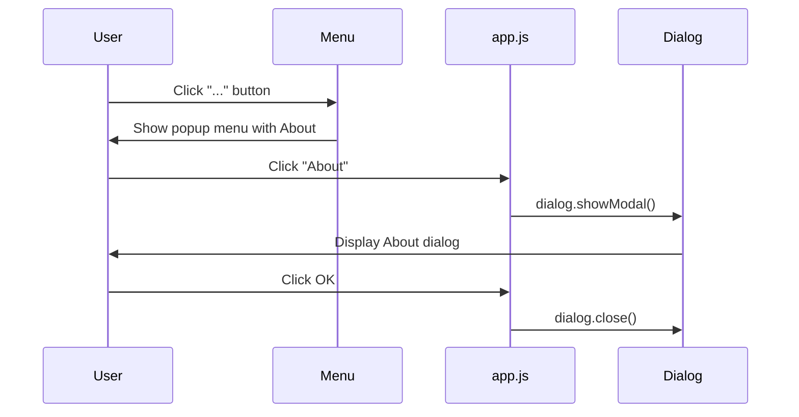

# Design Document

## Overview
MDLumaの"..."メニューにAbout項目を追加し、アプリ名・バージョン・ビルド番号・Sciter帰属テキストを表示するモーダルダイアログを実装する。ビルド番号は`build.rs`でgit commit hash短縮版を取得し、テンプレート置換を通じてHTMLに埋め込む。

**Purpose**: ユーザーがアプリのバージョン情報とビルド情報を確認できるようにする。
**Users**: MDLumaの全ユーザー。バージョン報告やトラブルシューティングの際に利用。
**Impact**: "..."メニューにAbout項目が追加され、Aboutダイアログが新たに表示可能になる。

### Goals
- "..."メニューの末尾にAbout項目を追加する
- Aboutダイアログをモーダルとして表示する
- バージョン番号・ビルド番号・Sciter帰属テキストを正しく表示する
- ビルドごとに一意のビルド番号を付与する

### Non-Goals
- 自動アップデート機能
- ライセンス情報ページ
- サードパーティライブラリの一覧表示

## Boundary Commitments

### This Spec Owns
- "..."メニューへのAbout項目追加
- AboutダイアログのHTML/CSS/JS実装
- `build.rs`でのビルド番号生成
- `html_shell.rs`でのバージョン・ビルド番号テンプレート置換

### Out of Boundary
- バージョンの自動更新確認
- 他のメニュー項目の順序変更や動作変更
- 新たなRust→Sciter通信仕組みの導入

### Allowed Dependencies
- 既存のテンプレート置換パターン（`html_shell.rs`）
- 既存の`data-action`イベント委譲パターン（`app.js`）
- Sciterの`<dialog>`要素と`showModal()`API
- gitコマンド（ビルド番号取得用）

### Revalidation Triggers
- テンプレート置換パターンの変更
- "..."メニュー構造の変更

## Architecture

### Existing Architecture Analysis
- `html_shell.rs`でHTMLテンプレートに`{{PLACEHOLDER}}`の文字列置換を行いRust→Sciter間でデータを渡す
- `app.js`で`data-action`属性によるイベント委譲パターンを使用
- 検索パネルはvisibility toggleパターンで表示切替

### Architecture Pattern & Boundary Map
**Architecture Integration**:
- Selected pattern: 既存パターンの拡張（テンプレート置換 + data-action委譲）
- 既存パターンを維持し、新たな抽象化や通信仕組みは導入しない

### Technology Stack

| Layer | Choice / Version | Role in Feature | Notes |
|-------|------------------|-----------------|-------|
| Build | build.rs + git | ビルド番号生成 | `cargo:rustc-env`で環境変数を設定 |
| HTML | Sciter `<dialog>` | Aboutダイアログ表示 | Sciter標準のモーダル要素 |
| Template | `{{VERSION}}` / `{{BUILD_NUMBER}}` | バージョン情報の埋め込み | 既存のテンプレート置換パターン。`{{APP_ICON}}`は既存（html_shell.rs:93） |

## File Structure Plan

### Modified Files
- `build.rs` — git commit hashを取得し`GIT_COMMIT_HASH`環境変数を設定する処理を追加
- `src/html_shell.rs` — `{{VERSION}}`と`{{BUILD_NUMBER}}`のテンプレート置換を追加
- `src/ui/index.html` — "..."メニューにAbout項目を追加、AboutダイアログのHTML要素を追加
- `src/ui/app.js` — `handleClick()`にabout actionの分岐を追加、Aboutダイアログの表示/非表示ロジックを追加
- `src/ui/app.css` — Aboutダイアログのスタイルを追加（app.cssが存在する場合。存在しない場合はindex.html内の`<style>`に追加）

## System Flows

## Requirements Traceability

| Requirement | Summary | Components | Interfaces | Flows |
|-------------|---------|------------|------------|-------|
| 1.1 | "..."メニュー末尾にAbout項目表示 | index.html | data-action属性 | Menu flow |
| 2.1 | Aboutクリックでモーダル表示 | app.js, index.html | dialog.showModal() | About flow |
| 2.2 | ダイアログ表示中は背面操作無効 | index.html | `<dialog>` backdrop | About flow |
| 3.1 | アプリのアイコン表示 | index.html | ``要素 | About flow |
| 3.2 | アプリ名"MDLuma"表示 | index.html | テキスト要素 | About flow |
| 3.3 | バージョン番号表示 | html_shell.rs, index.html | `{{VERSION}}` | Build + About flow |
| 3.4 | ビルド番号表示 | build.rs, html_shell.rs, index.html | `{{BUILD_NUMBER}}` | Build + About flow |
| 4.1 | Sciter帰属テキスト表示 | index.html | テキスト要素 | About flow |
| 5.1 | git hash短縮版をビルド番号に設定 | build.rs | `cargo:rustc-env` | Build flow |
| 5.2 | git不可時に"unknown"を設定 | build.rs | フォールバックロジック | Build flow |
| 6.1 | OKボタンでダイアログを閉じる | app.js, index.html | dialog.close() | About flow |

## Components and Interfaces

| Component | Domain/Layer | Intent | Req Coverage | Key Dependencies (P0/P1) | Contracts |
|-----------|--------------|--------|--------------|--------------------------|-----------|
| Build Number Generator | Build | git hash取得・環境変数設定 | 5.1, 5.2 | git (P1) | State |
| Version Template Substitution | HTML Shell | VERSION/BUILD_NUMBER置換 | 3.3, 3.4 | build.rs (P0) | State |
| About Menu Item | UI (HTML) | "..."メニューにAbout項目追加 | 1.1 | なし | Event |
| About Dialog | UI (HTML/CSS/JS) | モーダルダイアログの表示と内容 | 2.1, 2.2, 3.1, 3.2, 3.3, 3.4, 4.1, 6.1 | Version Template (P0) | Event, State |

### Build

#### Build Number Generator (build.rs)

| Field | Detail |
|-------|--------|
| Intent | ビルド時にgit commit hash短縮版を取得し環境変数に設定する |
| Requirements | 5.1, 5.2 |

**Responsibilities & Constraints**
- `main()`関数内で`git rev-parse --short HEAD`を実行
- 結果を`cargo:rustc-env=GIT_COMMIT_HASH=<hash>`として設定
- gitが利用できない場合は`cargo:rustc-env=GIT_COMMIT_HASH=unknown`を設定しpanicしない

**Dependencies**
- External: git CLI — commit hash取得 (P1)

**Contracts**: State [x]

##### State Management
- State model: ビルド時点の環境変数`GIT_COMMIT_HASH`
- Persistence: `env!("GIT_COMMIT_HASH")`マクロでRustコードから参照可能

### HTML Shell

#### Version Template Substitution (html_shell.rs)

| Field | Detail |
|-------|--------|
| Intent | テンプレート内の`{{VERSION}}`と`{{BUILD_NUMBER}}`を置換する |
| Requirements | 3.3, 3.4 |

**Responsibilities & Constraints**
- `{{VERSION}}`を`env!("CARGO_PKG_VERSION")`の値で置換
- `{{BUILD_NUMBER}}`を`env!("GIT_COMMIT_HASH")`の値で置換
- 既存の置換チェーンに追加するのみ

**Dependencies**
- Inbound: build.rs — `GIT_COMMIT_HASH`環境変数 (P0)

### UI

#### About Menu Item (index.html)

| Field | Detail |
|-------|--------|
| Intent | "..."メニューの末尾にAbout項目を追加する |
| Requirements | 1.1 |

**Implementation Notes**
- `<menu.popup>`内の既存項目（Font, External Editor）の後に`<li data-action="about">About</li>`を追加
- 既存の`data-action`委譲パターンに従う

#### About Dialog (index.html + app.js + CSS)

| Field | Detail |
|-------|--------|
| Intent | アプリ情報を表示するモーダルダイアログ |
| Requirements | 2.1, 2.2, 3.1, 3.2, 3.3, 3.4, 4.1, 6.1 |

**Responsibilities & Constraints**
- `<dialog>`要素を使用してモーダルダイアログを実装
- `showModal()`で表示、`close()`で非表示
- ダイアログ内にアイコン・アプリ名・バージョン・ビルド番号・帰属テキスト・OKボタンを配置

**Dependencies**
- Inbound: Version Template — `{{VERSION}}`, `{{BUILD_NUMBER}}` (P0)

**Contracts**: Event [x], State [x]

##### State Management
- 表示状態: `<dialog>`要素の`open`属性で管理（Sciter標準）

**Implementation Notes**
- Integration: `handleClick()`に`about` actionの分岐を追加
- Validation: なし（静的表示のみ）
- Risks: `<dialog>`要素のSciter対応度 — Sciter SDKがHTML5 `<dialog>`をサポートすることを前提とするが、SDK docs/samplesで確認済み

## Testing Strategy

### Unit Tests
- `build.rs`: git hash取得ロジックは`build.rs`単体ではテスト困難。ビルド番号の確認は統合テストでカバー
- HTML Shell: テンプレート置換で`{{VERSION}}`と`{{BUILD_NUMBER}}`が正しく置換されることをテスト（既存のテンプレート置換テストに追加）

### Integration Tests
- ビルド生成: `cargo build`後に生成バイナリがバージョン情報を含むことを確認
- ビルド番号: gitリポジトリ内でビルドした場合にgit hashが含まれること、リポジトリ外でビルドした場合に"unknown"が含まれることを確認

### Manual UI Tests
- "..."メニューを開きAbout項目が末尾に表示されること
- Aboutをクリックするとモーダルダイアログが表示されること
- ダイアログ背面が操作不可であること
- OKボタンでダイアログが閉じること
- アイコン・アプリ名・バージョン・ビルド番号・帰属テキストが正しく表示されること
