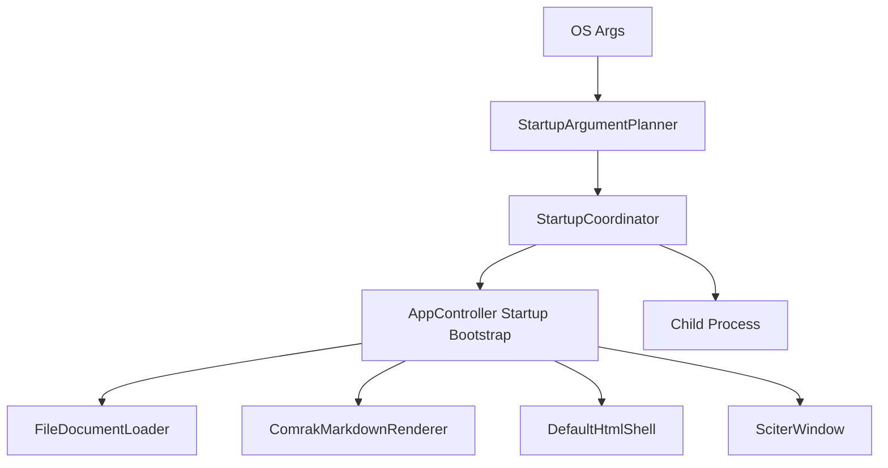
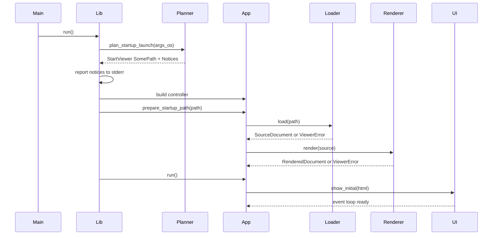
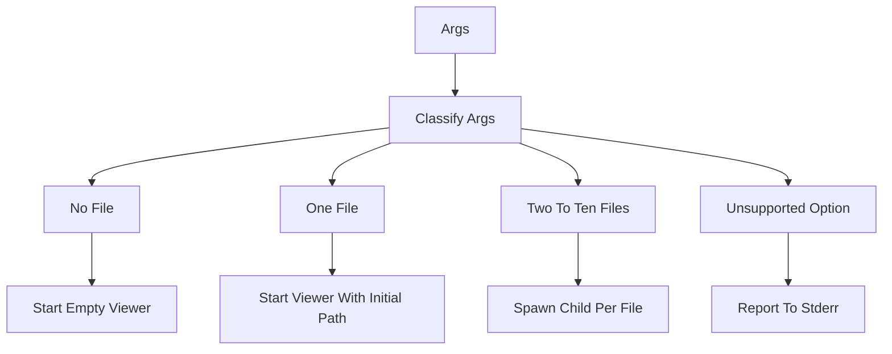

# command-line-file-open 設計書

## Overview

この機能は、MDLuma の既存ビューアーを壊さずに、起動時の OS 引数から Markdown ファイルを直接開けるようにする。要件の中心は、`PathBuf` ベースで受け取ったファイルパスを既存の単一ドキュメント表示経路へ接続し、複数ファイルが渡された場合は 1 ファイル 1 インスタンスへ起動前に分岐することである。

対象ユーザーは、コマンドラインから直接起動する利用者と、ファイル関連付けや外部ランチャーから MDLuma を起動する利用者である。既存 UI の責務は増やさず、起動時オーケストレーションだけを最小追加することで、軽量性と単純性を保つ。

### Goals
- 起動引数のファイルパスを既存の単一ドキュメント表示へ接続する。
- 2 件以上のファイルパスは別プロセスへ分岐し、1 インスタンス 1 ファイルを維持する。
- 未対応 `--` 引数をファイルとして扱わず、非致命 `stderr` 通知と起動継続を両立する。

### Non-Goals
- `--help` や `--theme` のような正式オプション定義。
- ファイル関連付けの登録、アンインストーラ連携、OS 側設定変更。
- 1 ウィンドウ内での複数ドキュメント表示、タブ、セッション復元。

## Boundary Commitments

### This Spec Owns
- OS 引数を `PathBuf` と未対応 `--` 通知へ分類する起動前ルール。
- 0 件、1 件、2-10 件のファイルパスに対する起動モード選択。
- 単一ファイル起動時に、既存 `AppController` を使って初回表示前に `ViewerState` を確定すること。
- 未対応 `--` 引数の `stderr` 通知書式と通知タイミング。

### Out of Boundary
- 未対応 `--` 引数以外の正式 CLI オプション追加。
- `--` で始まる実在ファイル名を開けるためのエスケープ規則。
- 複数ファイルを 1 プロセス内で複数ウィンドウ管理する仕組み。
- runtime DLL 検証、Sciter FFI、Markdown 変換仕様そのものの変更。

### Allowed Dependencies
- Rust 標準ライブラリの `std::env::args_os`、`std::process::Command`、`std::path::PathBuf`。
- 既存の `AppController`、`ViewerState`、`FileDocumentLoader`、`ComrakMarkdownRenderer`、`DefaultHtmlShell`、`SciterWindow`。
- 既存の `StartupError` / `ViewerError` と `debug_log!`。
- 新規依存は追加しない。

### Revalidation Triggers
- `run()` の責務や起動順序が変わる変更。
- `ViewerState` が単一ドキュメント前提でなくなる変更。
- `stderr` の用途が診断ログや別の CLI 機能へ拡張される変更。
- 起動ファイルの初回表示を `show_initial()` 前でなく後にずらす変更。

## Architecture

### Existing Architecture Analysis
- `main.rs` は薄いバイナリエントリポイントであり、fatal startup failure だけを `stderr` へ流す。
- `lib.rs` は runtime 検証、controller 構築、イベントループ開始を束ねる composition root である。
- `app.rs` の `AppController` は既存のファイルオープンとエラー状態遷移を担当し、`ViewerState` は 1 ドキュメントのみを保持する。
- `sciter/window.rs` は初回表示と再表示の HTML 読込順序に制約があるため、起動ファイル表示は初回 `show_initial()` に乗せる方が安全である。

### Architecture Pattern & Boundary Map



**Architecture Integration**:
- Selected pattern: 小さな引数分類モジュール + 既存 startup root オーケストレーション。
- Domain/feature boundaries: 引数分類は `startup_args.rs`、起動計画実行は `lib.rs`、起動前 state 解決は `app.rs` が担当する。
- Dependency direction: `main.rs` -> `lib.rs` -> `startup_args.rs` / `app.rs` -> `document.rs` / `markdown.rs` / `html_shell.rs` / `sciter/window.rs`。下位レイヤは startup planning へ逆依存しない。
- Existing patterns preserved: `lib.rs` による起動組立、`AppController` による状態制御、トレイト境界による loader / renderer / UI 分離。
- New components rationale: 新規コンポーネントは `StartupArgumentPlanner` のみを追加し、process fan-out は既存 startup root に留める。
- Build vs adopt: CLI 解析ライブラリは導入せず、`args_os()` と `Command` の標準ライブラリ採用で要求範囲を満たす。
- Steering compliance: 軽量性、責務分離、Windows 優先、Sciter FFI 境界の局所化を維持する。

### Technology Stack

| Layer | Choice / Version | Role in Feature | Notes |
|-------|------------------|-----------------|-------|
| Frontend / CLI | Rust std `args_os` / `Command` | OS 引数取得と子プロセス起動 | 新規依存なし |
| Backend / Services | `AppController` in `src/app.rs` | 起動前の単一ファイル state 解決 | 既存責務を拡張 |
| Data / Storage | `PathBuf`, `OsString`, `ViewerState` | 起動計画と一時 state | 永続化なし |
| Messaging / Events | なし | 不要 | 非同期 IPC は導入しない |
| Infrastructure / Runtime | Sciter.js SDK 既存 runtime | 初回 HTML 表示 | 追加 runtime 前提なし |

## File Structure Plan

### Directory Structure
```text
src/
├── main.rs                # バイナリエントリポイント。fatal startup failure の終了経路を維持する
├── lib.rs                 # 起動計画実行、stderr 通知、child spawn、controller 構築
├── startup_args.rs        # OS 引数を LaunchPlan へ分類する純粋ロジック
├── app.rs                 # 起動前の初期ファイル state 解決と既存 viewer state 制御
├── document.rs            # 既存の Markdown ファイル読込境界を再利用
├── markdown.rs            # 既存の Markdown 変換境界を再利用
├── html_shell.rs          # 既存の初回 HTML レンダリングを再利用
└── sciter/
    └── window.rs          # 既存の初回表示 / event loop を再利用
```

### Modified Files
- `src/lib.rs` — `run()` 内で `StartupLaunchPlan` を取得し、notice を `stderr` へ通知し、0 件/1 件/複数件の起動モードを分岐する。複数件では child process を起動し、1 件では controller に起動前 path を渡す。テスト用の helper 注入点もここに置く。
- `src/app.rs` — UI に触らず `Path` から `ViewerState` を準備する startup 専用入口を追加する。既存 open フローと loader / renderer の整合性を保つ。
- `src/main.rs` — public API 呼び出しは維持し、fatal startup failure の exit path をそのまま使う。必要ならテスト専用で CLI 通知 helper を参照可能にする。
- `src/startup_args.rs` — 新規ファイル。`LaunchAction`、`StartupNotice`、`StartupLaunchPlan` と `plan_startup_launch()`、その単体テストを保持する。

## System Flows



起動ファイル成功時も失敗時も、最初の `show_initial()` が最終 state を表示する。これにより startup success path で追加の `show_document()` を要求しない。



複数ファイル時は親プロセスが viewer を持たず、各 child が通常の single-file startup flow を再利用する。

## Requirements Traceability

| Requirement | Summary | Components | Interfaces | Flows |
|-------------|---------|------------|------------|-------|
| 1.1 | 1 件のファイルパスで単一ビューアー起動 | StartupArgumentPlanner, StartupCoordinator, AppController Startup Bootstrap | `StartupLaunchPlan`, `prepare_startup_path` | Single file startup |
| 1.2 | 引数なしで空ビューアー起動 | StartupArgumentPlanner, StartupCoordinator | `LaunchAction::StartViewer { initial_path: None }` | No file path branch |
| 1.3 | 読めないファイルで UI エラー表示 | AppController Startup Bootstrap | `ViewerError::FileRead`, `prepare_startup_path` | Single file startup |
| 1.4 | 非 UTF-8 ファイルで UI エラー表示 | AppController Startup Bootstrap | `ViewerError::InvalidEncoding`, `prepare_startup_path` | Single file startup |
| 2.1 | 2-10 件で別インスタンス起動 | StartupArgumentPlanner, StartupCoordinator | `LaunchAction::SpawnChildren` | Multi file fan out |
| 2.2 | 1 インスタンスで複数ファイルを同時表示しない | StartupArgumentPlanner, AppController Startup Bootstrap | `LaunchAction`, `ViewerState` single document invariant | Multi file fan out |
| 2.3 | 一部だけ開けない場合も他ファイル起動継続 | StartupCoordinator, AppController Startup Bootstrap | child single-file startup contract | Multi file fan out |
| 3.1 | 起動対象は先頭 10 件まで | StartupArgumentPlanner | `StartupLaunchPlan` bounded file list | Multi file fan out |
| 3.2 | 11 件目以降は無視 | StartupArgumentPlanner | `StartupLaunchPlan` bounded file list | Multi file fan out |
| 4.1 | `--` 引数をファイルとして扱わない | StartupArgumentPlanner | `StartupNotice::UnsupportedOption` | Notice branch |
| 4.2 | 未対応 `--` を `stderr` へ通知 | StartupCoordinator | `report_startup_notice` | Notice branch |
| 4.3 | 未対応 `--` と有効ファイルが混在しても継続 | StartupArgumentPlanner, StartupCoordinator | `StartupLaunchPlan` + notice reporting | Notice + single or multi flow |
| 4.4 | `--` だけなら空ビューアー起動 | StartupArgumentPlanner, StartupCoordinator | `LaunchAction::StartViewer { initial_path: None }` | Notice + empty viewer |

## Components and Interfaces

| Component | Domain/Layer | Intent | Req Coverage | Key Dependencies (P0/P1) | Contracts |
|-----------|--------------|--------|--------------|---------------------------|-----------|
| StartupArgumentPlanner | Startup parsing | OS 引数を bounded launch plan へ変換する | 1.1, 1.2, 2.1, 2.2, 3.1, 3.2, 4.1, 4.3, 4.4 | std `OsString` P0 | Service, State |
| StartupCoordinator | Startup orchestration | launch plan 実行、notice 通知、child spawn、controller wiring | 1.1, 1.2, 2.1, 2.3, 4.2, 4.3, 4.4 | StartupArgumentPlanner P0, AppController P0, std `Command` P0 | Service, State |
| AppController Startup Bootstrap | Application control | 起動前 path を `ViewerState` へ解決し、既存 start flow へ渡す | 1.1, 1.3, 1.4, 2.3 | DocumentLoader P0, MarkdownRenderer P0, HtmlShell P1 | Service, State |

### Startup Parsing

#### StartupArgumentPlanner

| Field | Detail |
|-------|--------|
| Intent | OS 引数を副作用なしで `StartupLaunchPlan` へ分類する |
| Requirements | 1.1, 1.2, 2.1, 2.2, 3.1, 3.2, 4.1, 4.3, 4.4 |

**Responsibilities & Constraints**
- 実行ファイル名を除いた引数列から file path 候補を順序保持で収集する。
- `--` で始まる引数を file path へ入れず、notice として保持する。
- file path は最大 10 件まで保持し、11 件目以降は黙って無視する。
- file path 0 件なら empty viewer、1 件なら single viewer、2-10 件なら child fan-out として表現する。

**Dependencies**
- External: Rust std `OsString`, `PathBuf` — OS 依存文字列を保持した分類 (P0)

**Contracts**: Service [x] / API [ ] / Event [ ] / Batch [ ] / State [x]

##### Service Interface
```rust
pub enum StartupNotice {
    UnsupportedOption(std::ffi::OsString),
}

pub enum LaunchAction {
    StartViewer { initial_path: Option<std::path::PathBuf> },
    SpawnChildren { file_paths: Vec<std::path::PathBuf> },
}

pub struct StartupLaunchPlan {
    pub action: LaunchAction,
    pub notices: Vec<StartupNotice>,
}

pub fn plan_startup_launch<I>(args: I) -> StartupLaunchPlan
where
    I: IntoIterator<Item = std::ffi::OsString>;
```
- Preconditions:
  - `args` には実行ファイル名を含めない。
- Postconditions:
  - `LaunchAction` は empty / single / multi のいずれか 1 つだけを表す。
  - `SpawnChildren.file_paths.len()` は常に `2..=10`。
  - `StartViewer.initial_path` は `None` または 1 件のみ。
- Invariants:
  - file path の入力順は保持される。
  - notice は file path と独立に保持される。

##### State Management
- State model: `StartupLaunchPlan` は永続化しない一時的な起動計画。
- Persistence & consistency: メモリ上のみ。process 起動後は child に 1 path だけ渡す。
- Concurrency strategy: なし。startup thread 上で逐次処理する。

**Implementation Notes**
- Integration:
  - `lib.rs::run()` から `std::env::args_os().skip(1)` を渡して利用する。
- Validation:
  - 0 件、1 件、2 件、10 件、11 件以上、unsupported option 混在、unsupported only を unit test で固定する。
- Risks:
  - `--memo.md` のような実在ファイル名も notice として扱う。これは要件どおりの制限である。

### Startup Orchestration

#### StartupCoordinator

| Field | Detail |
|-------|--------|
| Intent | `StartupLaunchPlan` を実行し、viewer 起動か child fan-out を選ぶ |
| Requirements | 1.1, 1.2, 2.1, 2.3, 4.2, 4.3, 4.4 |

**Responsibilities & Constraints**
- plan に含まれる notice を `stderr` へ 1 行ずつ通知する。
- `StartViewer` なら existing startup path を使って controller を起動する。
- `SpawnChildren` なら自分自身の executable を使って child process を file path ごとに起動する。
- multi-file parent process は viewer window を生成しない。

**Dependencies**
- Outbound: `StartupArgumentPlanner` — 起動計画の供給元 (P0)
- Outbound: `AppController Startup Bootstrap` — single-file / empty startup の実行先 (P0)
- External: Rust std `Command` — child process 起動 (P0)
- External: Rust std `current_exe` — child process 用 executable path 取得 (P0)

**Contracts**: Service [x] / API [ ] / Event [ ] / Batch [ ] / State [x]

##### Service Interface
```rust
fn report_startup_notice(notice: &StartupNotice, stderr_reporter: &mut dyn FnMut(&str));

fn execute_launch_plan(
    plan: StartupLaunchPlan,
    stderr_reporter: &mut dyn FnMut(&str),
) -> Result<(), StartupError>;
```
- Preconditions:
  - runtime distribution directory は既存 `run()` と同じ手順で取得可能である。
- Postconditions:
  - `StartViewer` はちょうど 1 つの controller 実行へ進む。
  - `SpawnChildren` は plan に含まれる path ごとに 1 child spawn を試行する。
- Invariants:
  - unsupported option 通知は fatal error 扱いにしない。
  - child process へ unsupported option を再送しない。

##### State Management
- State model: 起動モードは `StartupLaunchPlan.action` が唯一の truth source である。
- Persistence & consistency: child process 起動後に parent state を保持しない。
- Concurrency strategy: spawn は順次実行し、最初の fatal failure で `StartupError` を返す。

**Implementation Notes**
- Integration:
  - existing `build_startup_controller()` の前後で launch mode を判定する。
  - child process は `current_exe()` から取得した path へ 1 file path だけを渡す。
- Validation:
  - empty startup、single startup、multi-file spawn、mixed unsupported + valid を integration test で固定する。
- Risks:
  - parent が一部 child spawn 後に失敗する可能性があるが、既に起動済み child は継続する。

### Application Control

#### AppController Startup Bootstrap

| Field | Detail |
|-------|--------|
| Intent | 起動前 file path を `ViewerState` へ解決し、初回 `show_initial()` が最終 state を描画できるようにする |
| Requirements | 1.1, 1.3, 1.4, 2.3 |

**Responsibilities & Constraints**
- `Path` から `DocumentLoaded` または `ErrorVisible` を導出する。
- UI をまだ表示していない段階では `show_document()` を呼ばない。
- `ViewerState` の単一ドキュメント不変条件を保つ。
- file read / invalid encoding / markdown render 失敗は `ViewerError` から startup state へ折りたたむ。

**Dependencies**
- Outbound: `DocumentLoader` — file path から source 読込 (P0)
- Outbound: `MarkdownRenderer` — HTML body への変換 (P0)
- Outbound: `HtmlShell` — 初回 state の HTML 化 (P1)
- Inbound: `StartupCoordinator` — single-file 起動時の path 供給元 (P0)

**Contracts**: Service [x] / API [ ] / Event [ ] / Batch [ ] / State [x]

##### Service Interface
```rust
impl<D, L, R, H, U> AppController<D, L, R, H, U>
where
    D: FileDialog,
    L: DocumentLoader,
    R: MarkdownRenderer,
    H: HtmlShell,
    U: ViewerUi,
{
    pub fn prepare_startup_path(&mut self, path: &std::path::Path);
}
```
- Preconditions:
  - `prepare_startup_path()` は `run()` / `start()` の前に呼ばれる。
- Postconditions:
  - 成功時は `ViewerState::DocumentLoaded` になる。
  - file read / invalid encoding / render 失敗時は `ViewerState::ErrorVisible` になる。
- Invariants:
  - `document_count()` は 0 または 1 のまま変わらない。
  - startup path 準備自体は UI 副作用を持たない。

##### State Management
- State model: 既存 `ViewerState` をそのまま使用し、startup 専用 state 型は追加しない。
- Persistence & consistency: state は controller 内メモリのみ。既存 `with_error()` / `current_document()` 契約に従う。
- Concurrency strategy: なし。起動前の単一スレッド準備で完結する。

**Implementation Notes**
- Integration:
  - existing `open_selected_path()` と同じ loader / renderer 契約を共有し、UI 呼び出しだけを遅らせる。
- Validation:
  - startup success、file read failure、invalid UTF-8 failure の state 遷移を `app.rs` 近傍テストで固定する。
- Risks:
  - shell render failure は startup fatal として既存 `run()` の error path に流れる。

## Data Models

### Domain Model
- `StartupLaunchPlan`
  - 起動引数の分類結果を表す value object。
  - `action` と `notices` の 2 軸だけを持つ。
- `LaunchAction`
  - `StartViewer { initial_path: Option<PathBuf> }`
  - `SpawnChildren { file_paths: Vec<PathBuf> }`
- `StartupNotice`
  - 初期スコープでは `UnsupportedOption(OsString)` のみを持つ。
- `ViewerState`
  - 既存型を再利用し、`DocumentLoaded` と `ErrorVisible` で起動ファイル結果を表す。

### Logical Data Model
- `StartupLaunchPlan.action` が起動モードの唯一の truth source である。
- `SpawnChildren.file_paths` は `2..=10` 件、順序保持、重複許容とする。
- `notices` は file path 判定と独立し、通知順は入力順に従う。

### Data Contracts & Integration
- Child process へ渡す contract は `PathBuf` 1 件のみ。
- `stderr` notice contract は 1 notice 1 行の英語メッセージとする。
- file read / invalid encoding は既存 `ViewerError` user message を再利用する。

## Error Handling

### Error Strategy
- unsupported `--` は user-facing startup notice として `stderr` へ出し、process は継続する。
- 読めないファイル、非 UTF-8、Markdown render failure は起動済み viewer の `ErrorVisible` state で表現する。
- runtime 不足、`current_exe()` 失敗、child spawn failure、初期 shell render failure は `StartupError` として fatal 扱いにする。

### Error Categories and Responses
- **User Startup Notices**: unsupported `--` 引数 → `stderr` 通知、終了コードは変えない。
- **User Content Errors**: `FileRead`, `InvalidEncoding`, `MarkdownRender` → viewer 内エラー表示、child ごとに独立処理。
- **System Startup Errors**: runtime missing, executable path failure, child spawn failure → `StartupError` を `main.rs` が `stderr` へ報告して exit 1。

### Monitoring
- unsupported option の通知書式は `stderr` のみでよく、診断ログの常設化は行わない。
- spawn failure や unexpected startup failure は既存 `debug_log!` と `StartupError` の diagnostic text を使う。

## Testing Strategy

### Unit Tests
- `src/startup_args.rs`: 引数なしで `StartViewer { None }` を返すことを確認する。
- `src/startup_args.rs`: 1 件の file path で `StartViewer { Some(path) }` を返すことを確認する。
- `src/startup_args.rs`: file path 11 件以上で先頭 10 件だけが保持され、11 件目以降が無視されることを確認する。
- `src/startup_args.rs`: `--bad` が `StartupNotice::UnsupportedOption` へ分類され、file path と混在しても file path 側が維持されることを確認する。
- `src/app.rs`: `prepare_startup_path()` が success / file read failure / invalid UTF-8 failure を `ViewerState` へ正しく折りたたむことを確認する。

### Integration Tests
- `src/lib.rs`: empty startup plan で既存どおり `show_initial()` に空ビューアー HTML が渡ることを確認する。
- `src/lib.rs`: single-file startup で `initial_html` に対象ファイル名と本文が入り、startup success path で追加 `document_html` 更新が発生しないことを確認する。
- `src/lib.rs`: mixed unsupported option + valid file path で `stderr` 通知後も single-file startup が継続することを確認する。
- `src/lib.rs`: multi-file startup で child spawner が file path ごとに 1 回ずつ呼ばれ、親 controller が起動されないことを確認する。

### E2E/UI Tests (if applicable)
- Windows runtime smoke: 実ファイルを引数に渡して起動し、初回表示でファイル名と Markdown 本文が見えることを確認する。
- Windows runtime smoke: 非 UTF-8 fixture を引数に渡して起動し、初回表示で UTF-8 エラー文言が見えることを確認する。
- Windows runtime smoke: 2 件の file path を渡して起動し、2 child process がそれぞれ 1 ファイルだけを表示することを確認する。
