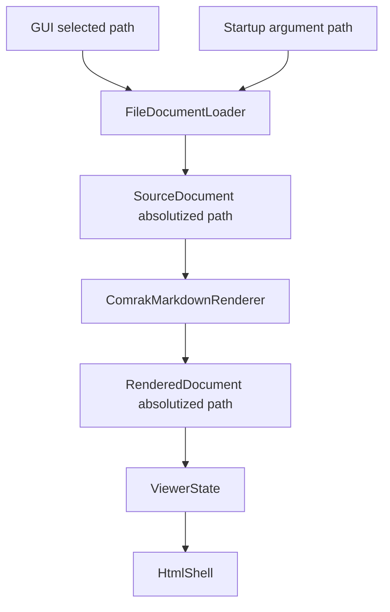
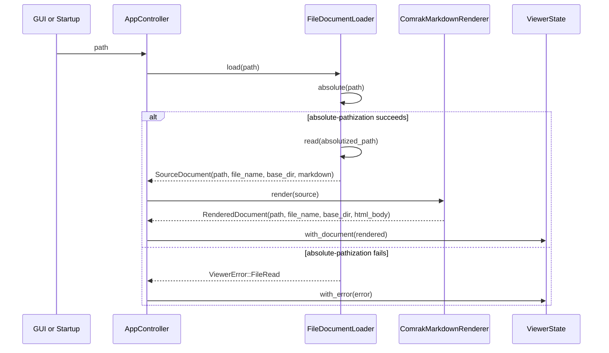

# 設計書

## Overview
この仕様は、MDLuma が受け取る Markdown ドキュメントパスを、GUI のファイル選択と起動引数のどちらから開いても同じ内部表現へそろえる。読み込み済み状態で保持するドキュメント位置を「絶対パス化された保持パス」として確定し、その親ディレクトリを後続文脈の唯一の基準にする。

対象ユーザーは、ファイルの開き方を意識せずに同じ Markdown を同じ位置のドキュメントとして扱いたい閲覧ユーザーである。現在の実装では GUI 側は絶対パス寄り、起動引数側は相対パスをそのまま通しうるため、読み込み済み状態の `path` / `base_dir` の意味が入口依存になる。この設計はその差を `DocumentLoader` 境界で解消する。

### Goals
- GUI と起動引数の両経路で、読み込み済みドキュメントの保持パスを同一形式の絶対パス化された保持パスへ統一する。
- ドキュメント位置に基づく `base_dir` を絶対パス化された保持パスから一貫して導出する。
- パスの絶対化に失敗した場合と空パスが渡された場合は読み込み済み状態へ進めず、既存のエラー表示経路で停止する。

### Non-Goals
- UI 上のファイル名表示やタイトルバー文言の変更。
- シンボリックリンク解決、実体パス比較、重複ドキュメント同一性判定の追加。
- OS 側のファイル関連付けや引数生成方式の変更。

## Boundary Commitments

### This Spec Owns
- `DocumentLoader` に入る単一ドキュメントパスを絶対パス化された保持パスへ確定する責務。
- 読み込み済み `SourceDocument` / `RenderedDocument` / `ViewerState` に保持されるドキュメント位置の正本表現。
- 絶対パス化された保持パスから導出される `base_dir` の一貫性。
- 空パスまたはパス絶対化失敗時に読み込み済み状態へ遷移しない失敗制御。

### Out of Boundary
- シンボリックリンク解決や `canonicalize` ベースの実体パス比較。
- 複数ドキュメントの同一ファイル判定やタブ管理。
- ファイル名表示 UI や Sciter レンダリングレイアウトの変更。
- 起動引数の解析仕様そのものの変更。

### Allowed Dependencies
- Rust 標準ライブラリの `std::path::absolute` を絶対パス化 API として利用する。
- 既存の `ViewerError::FileRead`、`AppController`、`MarkdownRenderer`、`ViewerState` を再利用する。
- Windows ファイルダイアログと起動引数解析は入力元としてのみ依存し、絶対パス化責務は持たせない。

### Revalidation Triggers
- `SourceDocument` または `RenderedDocument` の保持フィールド構成が変わる。
- `DocumentLoader::load` の責務が分割され、別入口がローダーを通らなくなる。
- ドキュメント位置の基準が `path` 以外へ移る。
- 絶対パス化 API を `absolute` 以外へ変更する。

## Architecture

### Existing Architecture Analysis
- GUI 経路は `WindowsFileDialog -> AppController::open_selected_path -> DocumentLoader::load` で構成される。
- 起動引数経路は `plan_startup_launch -> start_viewer_with -> AppController::prepare_startup_path -> DocumentLoader::load` で構成される。
- 両経路はすでに `DocumentLoader` へ収束するが、`FileDocumentLoader` は入力 `path` をそのまま `SourceDocument.path` と `base_dir` へ反映している。
- `RenderedDocument` には `path` がなく、ロード後の状態は表示用 `file_name` と `base_dir` しか持たない。

### Architecture Pattern & Boundary Map



**Architecture Integration**:
- Selected pattern: 既存の単一路線形パイプラインを維持し、`DocumentLoader` を絶対パス化境界にする。
- Domain/feature boundaries: 入力元はパス受領のみ、ローダーがパス確定、レンダラが本文変換、状態が保持、HTML シェルが表示を担当する。
- Existing patterns preserved: trait 境界 (`DocumentLoader`, `MarkdownRenderer`, `HtmlShell`) と `AppController` 主導の状態遷移を維持する。
- New components rationale: 新規公開コンポーネントは追加しない。必要な絶対パス化 helper は `src/document.rs` 内の private 関数に留める。
- Steering compliance: 小さな責務境界、軽量性、UI 非依存のコアロジックを維持する。

### Technology Stack

| Layer | Choice / Version | Role in Feature | Notes |
|-------|------------------|-----------------|-------|
| Backend / Core | Rust 2021 | パス絶対化と読み込み済み状態の保持 | 新規依存追加なし |
| Data / State | `PathBuf`, `ViewerState` | 絶対パス化された保持パスと親ディレクトリを保持 | `RenderedDocument` に `path` を追加 |
| Infrastructure / Runtime | `std::path::absolute` | symlink 解決なしで絶対化 | `canonicalize` は使わない |

## File Structure Plan

### Directory Structure
```text
src/
├── app.rs                         # RenderedDocument と ViewerState の保持モデル
├── document.rs                    # ドキュメント読み込みとパス絶対化境界
├── html_shell.rs                  # 表示用ファイル名契約を消費する既存シェル
├── markdown.rs                    # SourceDocument から RenderedDocument への伝播
└── lib.rs                         # 起動引数経由の統合テスト
```

### Modified Files
- `src/document.rs` — `FileDocumentLoader::load` の先頭で空パスを明示的に拒否し、その後入力パスを `std::path::absolute` により絶対パス化する。その値から `path`, `file_name`, `base_dir` を構築し、失敗時は最低限 `debug_log!` を残す。
- `src/app.rs` — `RenderedDocument` に `path: PathBuf` を追加し、`ViewerState` がロード後も絶対パス化された保持パスを保持できるようにする。既存 state テスト fixture を更新する。
- `src/markdown.rs` — `RenderedDocument` 生成時に `SourceDocument.path` をそのまま伝播する。
- `src/lib.rs` — 起動引数経由で相対パスを渡したときでも初期表示の裏側で絶対パス化された保持パスが使われることを確認する統合テストを追加する。

## System Flows



フロー上の判断は 3 点である。1 つ目は、空パスを絶対化前に必ず失敗として扱うこと。2 つ目は、パス絶対化をファイル読み込み前に必ず行うこと。3 つ目は、失敗した場合に UI 更新経路は既存のエラー表示へ委ねつつ、`DocumentLoaded` へ遷移しないこと。

## Requirements Traceability

| Requirement | Summary | Components | Interfaces | Flows |
|-------------|---------|------------|------------|-------|
| 1.1 | GUI で開いたドキュメントを絶対パス化された保持パスで扱う | `FileDocumentLoader`, `RenderedDocument`, `ViewerState` | `DocumentLoader::load` | GUI open flow |
| 1.2 | 起動引数で開いたドキュメントを絶対パス化された保持パスで扱う | `FileDocumentLoader`, `RenderedDocument`, `ViewerState` | `DocumentLoader::load`, `prepare_startup_path` | Startup open flow |
| 1.3 | 同一ファイルを異なる開始経路でも同一形式で保持する | `FileDocumentLoader`, `RenderedDocument` | absolutized `path` contract | GUI / Startup 共通フロー |
| 1.4 | 表示用ファイル名と別に絶対パス化された保持パスを保持する | `RenderedDocument` | state contract | Loaded state |
| 2.1 | 親ディレクトリ基準を絶対パス化された保持パスから導出する | `FileDocumentLoader`, `SourceDocument`, `RenderedDocument` | `base_dir` derivation rule | Common load flow |
| 2.2 | 開始経路に関係なく同じ親ディレクトリ基準を使う | `FileDocumentLoader`, `ViewerState` | absolutized `path` + `base_dir` contract | GUI / Startup 共通フロー |
| 2.3 | 既存のファイル名表示体験を維持する | `RenderedDocument`, `HtmlShell` | `file_name` display contract | Loaded state |
| 3.1 | 絶対パス化できないパスは読み込み済み状態にしない | `FileDocumentLoader`, `AppController` | `ViewerError::FileRead` | Failure branch |
| 3.2 | 絶対パス化前のパスを読み込み済み状態へ保持しない | `FileDocumentLoader`, `RenderedDocument` | absolutized `path` only contract | Failure branch |
| 3.3 | 既存表示中に失敗したら現在表示を置き換えない | `AppController`, `ViewerState` | existing error-preservation behavior | Failure branch during replace |

## Components and Interfaces

| Component | Domain/Layer | Intent | Req Coverage | Key Dependencies (P0/P1) | Contracts |
|-----------|--------------|--------|--------------|--------------------------|-----------|
| `FileDocumentLoader` | Document loading | 入力パスを絶対パス化し Markdown を読み込む | 1.1, 1.2, 1.3, 2.1, 2.2, 3.1, 3.2 | `std::path::absolute` (P0), `std::fs::read` (P0) | Service, State |
| `ComrakMarkdownRenderer` | Rendering | 絶対パス化済みドキュメント情報を維持したまま HTML 化する | 1.4, 2.1 | `SourceDocument` (P0) | Service |
| `RenderedDocument` / `ViewerState` | Application state | 読み込み済みドキュメントの正本位置と表示情報を保持する | 1.4, 2.2, 2.3, 3.3 | `AppController` (P0) | State |
| `AppController` | Application control | 正常系と失敗系の状態遷移を制御する | 1.2, 3.1, 3.3 | `DocumentLoader` (P0), `MarkdownRenderer` (P0), `ViewerUi` (P1) | Service, State |

### Document Loading Layer

#### FileDocumentLoader

| Field | Detail |
|-------|--------|
| Intent | パス絶対化とファイル読み込みを一つの入口で確定する |
| Requirements | 1.1, 1.2, 1.3, 2.1, 2.2, 3.1, 3.2 |

**Responsibilities & Constraints**
- 空パスは明示的に拒否し、絶対パス化処理へ進めない。
- 入力パスを `std::path::absolute` で絶対パス化された保持パスへ変換する。
- 以後の `fs::read`, `file_name`, `base_dir` 導出はすべて絶対パス化後の値を基準にする。
- 失敗時は `SourceDocument` を返さず、絶対パス化前の入力を読み込み済み状態へ流さない。
- 絶対パス化失敗時は最低限 `debug_log!` を出して診断可能にする。
- symlink 解決や実体パス比較は行わない。

**Dependencies**
- Inbound: `AppController` — ドキュメント読み込み要求 (P0)
- Outbound: `std::path::absolute` — 絶対化 (P0)
- Outbound: `std::fs::read` — UTF-8 Markdown バイト列取得 (P0)
- External: Rust stdlib — 標準パス API とファイル I/O (P0)

**Contracts**: Service [x] / API [ ] / Event [ ] / Batch [ ] / State [x]

##### Service Interface
```rust
trait DocumentLoader {
    fn load(&self, path: &Path) -> Result<SourceDocument, ViewerError>;
}

struct SourceDocument {
    path: PathBuf,
    file_name: String,
    base_dir: PathBuf,
    markdown: String,
}
```
- Preconditions:
  - `path` は単一ドキュメントを指す入力値である。
- Postconditions:
  - 成功時の `SourceDocument.path` は絶対パス化された保持パスである。
  - 成功時の `base_dir` は `SourceDocument.path.parent()` 由来である。
  - 失敗時は `SourceDocument` を生成しない。
- Invariants:
  - `file_name` は `path.file_name()` 由来の表示用値であり、絶対パス化された保持パスの代替にならない。

**State Management**
- State model: `SourceDocument` は絶対パス化された保持パスを含む一時的な読み込み済み入力モデル。
- Persistence & consistency: `path` と `base_dir` は同じ絶対パス化後の値から生成される。
- Concurrency strategy: 共有状態なし。呼び出し単位で完結する。

**Implementation Notes**
- Integration: private helper `resolve_document_path(path: &Path) -> Result<PathBuf, ViewerError>` を `src/document.rs` に閉じ込める。
- Validation: GUI 経路と CLI 経路の両方で、同じ相対位置のファイルが同じ `path` / `base_dir` になることと、空パスで失敗することをテストする。
- Risks: `absolute` は現在ディレクトリ依存なので、テストでは一時ディレクトリを明示的に使う。

### Rendering Layer

#### ComrakMarkdownRenderer

| Field | Detail |
|-------|--------|
| Intent | Markdown 本文を HTML 化しつつ、位置情報を `RenderedDocument` へ伝播する |
| Requirements | 1.4, 2.1 |

**Responsibilities & Constraints**
- `SourceDocument.markdown` を HTML 断片へ変換する。
- `SourceDocument.path`, `file_name`, `base_dir` を失わず `RenderedDocument` へ引き継ぐ。
- パス絶対化そのものは担当しない。

**Dependencies**
- Inbound: `AppController` — レンダリング要求 (P0)
- Inbound: `SourceDocument` — 絶対パス化済み入力モデル (P0)
- External: `comrak` — GFM HTML 変換 (P1)

**Contracts**: Service [x] / API [ ] / Event [ ] / Batch [ ] / State [ ]

##### Service Interface
```rust
trait MarkdownRenderer {
    fn render(&self, source: &SourceDocument) -> Result<RenderedDocument, ViewerError>;
}

struct RenderedDocument {
    path: PathBuf,
    file_name: String,
    base_dir: PathBuf,
    html_body: String,
}
```
- Preconditions:
  - `source.path` は絶対パス化された保持パスである。
- Postconditions:
  - `RenderedDocument.path == SourceDocument.path`
  - `RenderedDocument.base_dir == SourceDocument.base_dir`
- Invariants:
  - レンダリングは表示内容を生成しても保持パスの意味を変更しない。

**Implementation Notes**
- Integration: 構造体初期化に `path` フィールドを追加するだけでよい。
- Validation: レンダラ単体テストで `path` と `base_dir` の保持を確認する。
- Risks: fixture 更新漏れでビルドが壊れやすいため、共通 helper を使う。

### Application State Layer

#### RenderedDocument / ViewerState

| Field | Detail |
|-------|--------|
| Intent | 読み込み済みドキュメントの正本位置と表示用メタデータを保持する |
| Requirements | 1.4, 2.2, 2.3, 3.3 |

**Responsibilities & Constraints**
- `RenderedDocument.path` を絶対パス化された保持パスの唯一の保持場所として持つ。
- `file_name` は UI 表示専用、`base_dir` は文脈基準専用として役割を分ける。
- エラー遷移時も既存ドキュメントがある場合はそれを維持する。

**Dependencies**
- Inbound: `ComrakMarkdownRenderer` — 完成済みドキュメント (P0)
- Inbound: `AppController` — 状態更新 (P0)
- Outbound: `HtmlShell` — 表示には `file_name` と `html_body` を提供 (P1)

**Contracts**: Service [ ] / API [ ] / Event [ ] / Batch [ ] / State [x]

##### State Management
- State model: `ViewerState::DocumentLoaded(RenderedDocument)` がロード成功時の唯一状態。
- Persistence & consistency: `path`, `base_dir`, `file_name` は同一ロード結果から生成される。
- Concurrency strategy: 単一 UI スレッド内で `AppController` が直列更新する。

**Implementation Notes**
- Integration: `HtmlShell` は引き続き `file_name` のみ参照し、表示体験を変えない。
- Validation: state テストで `current_document().path` と `current_document().base_dir` を直接確認する。
- Risks: path を追加しても利用箇所が増えないため、実装時に dead field 化しないようテストで意味を固定する。

### Control Layer

#### AppController

| Field | Detail |
|-------|--------|
| Intent | 絶対パス化失敗時の非破壊遷移と成功時の状態更新を制御する |
| Requirements | 1.2, 3.1, 3.3 |

**Responsibilities & Constraints**
- GUI と startup の両経路で同一 `DocumentLoader` 契約を呼ぶ。
- ローダー失敗時は `show_error_state` または `with_error` を通し、既存文書を破壊しない。
- パス正規化ロジックは持たない。

**Dependencies**
- Inbound: `ViewerCommand` / startup flow — 開く要求 (P0)
- Outbound: `DocumentLoader` — 絶対パス化と読込 (P0)
- Outbound: `MarkdownRenderer` — HTML 変換 (P0)
- Outbound: `ViewerUi` — 正常/失敗 UI 反映 (P1)

**Contracts**: Service [x] / API [ ] / Event [ ] / Batch [ ] / State [x]

##### Service Interface
```rust
impl AppController {
    fn open_selected_path(&mut self, path: &Path) -> Result<(), ViewerError>;
    fn prepare_startup_path(&mut self, path: &Path);
}
```
- Preconditions:
  - `path` は外部入力だが、絶対パス化済み前提ではない。
- Postconditions:
  - 成功時は `ViewerState::DocumentLoaded` が絶対パス化された保持パスを含む。
  - 失敗時は `DocumentLoaded` を失敗パスで置き換えない。
- Invariants:
  - GUI と startup で別の絶対パス化経路を増やさない。

**Implementation Notes**
- Integration: 制御フロー自体は既存のまま、ローダー返却モデルの拡張に追従する。
- Validation: 既存文書表示中に絶対パス化失敗したとき current document が変わらないことを確認する。
- Risks: startup 側は UI 更新前ロードなので、失敗時でも `start()` が空/エラー表示で継続する既存挙動を維持する。

## Data Models

### Domain Model
- **Document Input**: 外部から受け取った未確定パス。
- **Absolutized Document Location**: `std::path::absolute` により確定した絶対パス化された保持パス。
- **SourceDocument**: 絶対パス化された保持パス、表示用ファイル名、親ディレクトリ、Markdown 本文を持つロード結果。
- **RenderedDocument**: `SourceDocument` の位置情報を保持したまま HTML 本文を加えた表示モデル。

### Logical Data Model
- `SourceDocument.path: PathBuf` — 絶対パス化された保持パス。読み込み系の正本。
- `SourceDocument.file_name: String` — UI 表示用の葉名。
- `SourceDocument.base_dir: PathBuf` — `path.parent()` 由来の文脈基準。
- `RenderedDocument.path: PathBuf` — ロード後状態でも失われない正本パス。
- `RenderedDocument.file_name: String` — 表示専用で継続保持。
- `RenderedDocument.base_dir: PathBuf` — 相対参照や周辺文脈の基準。

**Consistency & Integrity**:
- `base_dir` は `path` からのみ導出し、入力生パスからは導出しない。
- `RenderedDocument.path` と `RenderedDocument.base_dir` は `SourceDocument` と一致する。
- 空パスまたは絶対化失敗時はこれらのモデルを生成しない。

## Error Handling

### Error Strategy
- 空パス検証とパス絶対化はファイル読み込み前に実行し、失敗時は即座に `ViewerError::FileRead` へ変換する。
- 既存ドキュメントがない startup 初期ロード失敗では `ErrorVisible` を初期シェルへ反映する。
- 既存ドキュメントがある GUI 再読込失敗では、失敗した入力で状態を置き換えず、前の文書を維持したままエラー表示する。

### Error Categories and Responses
- **User Errors**: 空パスやカレントディレクトリ解決失敗は「Markdown ファイルを読めなかった」系の既存表示を使う。
- **System Errors**: ファイル読み込みや UTF-8 変換失敗は既存の `FileRead` / `InvalidEncoding` を継続使用する。
- **Business Logic Errors**: なし。この仕様は状態整合性の維持のみを扱う。

### Monitoring
- 空パス検証または絶対パス化失敗の詳細理由は、最低限既存の `debug_log!` 経路へ残して追跡可能にする。既存のログ捕捉手段がある場合のみテストで出力確認を行い、捕捉手段がない場合は失敗分岐に入ることと成功側モデルが生成されないことを確認対象にする。

## Testing Strategy

### Unit Tests
- `src/document.rs`: 相対パス入力をロードすると `SourceDocument.path` が絶対パス化された保持パスになることを検証する。
- `src/document.rs`: `.` や `..` を含む入力で `base_dir` が絶対パス化後の値由来になることを検証する。
- `src/document.rs`: 空パスまたは絶対化失敗入力で `SourceDocument` を返さず `ViewerError::FileRead` を返すことを検証する。既存のログ捕捉手段がある場合は `debug_log!` 出力も確認する。
- `src/markdown.rs`: `RenderedDocument.path` と `base_dir` が `SourceDocument` から不変で伝播することを検証する。

### Integration Tests
- `src/app.rs`: GUI 経由の選択パスで、読み込み後の `current_document().path` が絶対パスであることを検証する。
- `src/app.rs`: 既存文書表示中に新規パスの絶対パス化が失敗しても `current_document()` が以前の文書を維持することを検証する。
- `src/lib.rs`: startup 引数で相対パスを渡した場合でも、内部状態では GUI と同形式の絶対パス化された保持パスが使われることを検証する。

### E2E/UI Tests
- 初期表示のファイル名表示が従来どおり葉名のみであることを確認する。
- GUI で開いた文書と CLI で開いた同一文書で、表示内容とエラーなし挙動が変わらないことを確認する。
- 文書表示中に不正パスを開こうとしたとき、画面上の現在文書が置き換わらないことを確認する。
