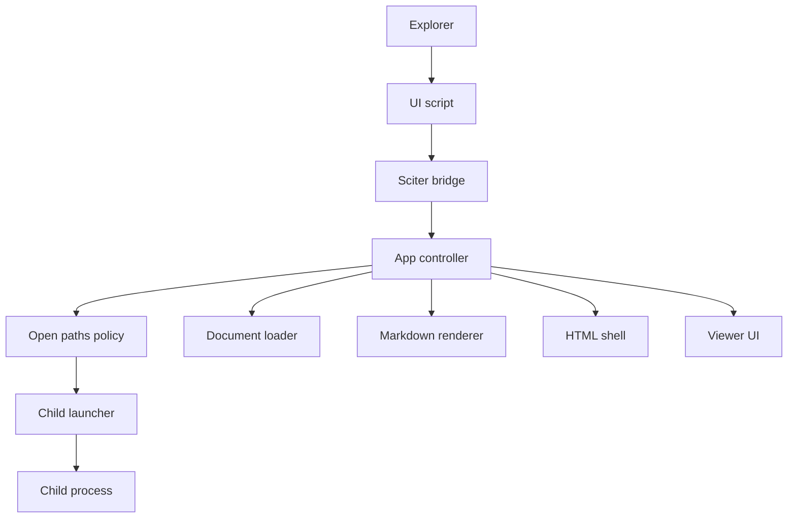
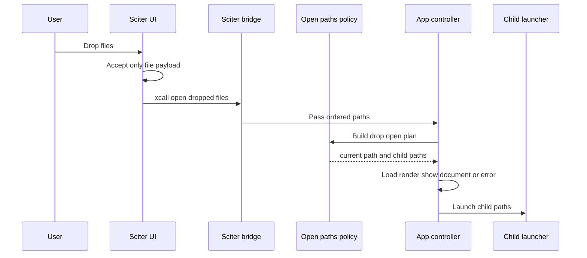

# 設計書

## Overview
この機能は、MDLuma の既存ウィンドウに対してエクスプローラーから通常ローカルファイルをドラッグ＆ドロップし、ファイルを開くための入力経路を追加する。価値は「起動済みビューアーへ直接落として開けること」であり、文書表示、エラー表示、複数ファイル時の単一ドキュメント方針は既存仕様を維持する。

対象ユーザーは、ローカル Markdown を素早く確認したい Windows ユーザーである。影響範囲は UI 入力境界、Sciter と Rust のコマンド橋、現在ウィンドウでの文書オープン、追加ファイルの子ウィンドウ起動に限定する。

### Goals
- 既存ウィンドウで通常ローカルファイルのドロップを受け付ける。
- 先頭 1 件は現在ウィンドウ、2-10 件目は別ウィンドウという既存方針を維持する。
- フォルダ無視、10 件上限、既存エラー表示の再利用を仕様として固定する。

### Non-Goals
- 複数文書を 1 ウィンドウに保持する機能
- タブ管理、ドロップ中の視覚演出、特殊ドロップ形式対応
- コマンドライン引数仕様の再設計

## Boundary Commitments

### This Spec Owns
- Sciter UI 上での通常ファイルドロップ受理と Rust への正規化入力
- ドロップされたパス列から、現在ウィンドウ用 1 件と子ウィンドウ用 2-10 件を決める規則
- 現在ウィンドウでの既存文書表示置換と既存エラー表示への合流
- 追加ファイルを 1 ファイル 1 子ウィンドウで起動する契約

### Out of Boundary
- 仮想項目、ショートカット、他アプリ由来の特殊ドロップ解決
- フォルダ展開、再帰探索、複数ファイルの同一ウィンドウ表示
- ドロップ可能領域の視覚強調、ステータス通知、タブ UI
- ローカルファイル以外の新しい入力経路追加

### Allowed Dependencies
- `src/ui/app.js` の既存 `Window.this.xcall()` 機構
- `src/sciter/ffi.rs` と `src/sciter/window.rs` の Sciter イベント橋
- `src/app.rs` の既存 `open_selected_path()` 系文書オープン経路
- `std::fs` によるファイル / ディレクトリ判定
- `std::process::Command` による既存の子インスタンス起動

### Revalidation Triggers
- `open-dropped-files` の `xcall` 名や引数順序を変更する場合
- 10 件上限や「先頭 1 件だけ現在ウィンドウ」の規則を変更する場合
- 子インスタンス起動責務を `lib.rs` 以外へ再配置する場合
- Sciter の遅延 HTML ロード方針や event bridge 契約を変更する場合
- current window で複数文書状態を持つ設計へ拡張する場合

## Architecture

### Existing Architecture Analysis
- `AppController` はファイル選択後の読み込み、Markdown 変換、HTML シェル反映、エラー表示を集約している。
- `ViewerState` は単一文書前提であり、現在文書は 0 または 1 件だけ保持される。
- Sciter との統合は `src/sciter/window.rs` が持ち、UI からの入力は `ViewerCommand` へ正規化される。
- 起動時の複数ファイル処理は `lib.rs` と `startup_args.rs` にあり、2-10 件は子インスタンスへ分配される。

### Architecture Pattern & Boundary Map
**Architecture Integration**:
- Selected pattern: 既存の「UI adapter -> Sciter bridge -> app controller」へ、ドロップ入力 adapter とファイル配分ポリシーを足す拡張パターン
- Domain/feature boundaries: UI はドロップイベント受理だけ、Sciter bridge は型付きコマンド化だけ、AppController は現在ウィンドウ更新だけ、launcher は追加ウィンドウ起動だけを担当する
- Existing patterns preserved: 単一ドキュメント状態、既存エラー表示、既存 child launch 方針、Sciter 遅延 HTML 更新
- New components rationale: 共有上限値とドロップ配分を重複させないため `open_paths.rs` を追加し、子起動再利用のため `viewer_launcher.rs` を追加する
- Steering compliance: 軽量性、Windows 優先、Sciter 境界の局所化、責務別の小モジュール分離を維持する



### Technology Stack

| Layer | Choice / Version | Role in Feature | Notes |
|-------|------------------|-----------------|-------|
| Frontend / CLI | `src/ui/app.js` on Sciter.js SDK | `willacceptdrop` / `drop` の受理と `xcall` 転送 | 新規依存なし |
| Backend / Services | Rust 2021 `AppController` | ドロップされた現在ウィンドウ用パスの実行 | 既存オープン経路を再利用 |
| Data / Storage | In-memory only | `DropOpenPlan` と path 配列の一時保持 | 永続化なし |
| Messaging / Events | Sciter `window.xcall(name, ...args)` | UI から Rust へのパス列橋渡し | 既存 bridge の拡張 |
| Infrastructure / Runtime | `std::fs`, `std::process`, Sciter.js SDK | ファイル判定、子起動、HTML 更新 | Windows 優先 |

## File Structure Plan

### Directory Structure
```text
src/
├── app.rs                  # 現在ウィンドウでのドロップ実行と既存オープン経路の合流
├── lib.rs                  # 起動時組み立てと child launcher の配線
├── open_paths.rs           # 新規: 10件上限、フォルダ除外、current / child 分配ポリシー
├── startup_args.rs         # CLI 側も共有上限値へ合わせる
├── viewer_launcher.rs      # 新規: 子インスタンス起動契約と既定実装
├── sciter/
│   ├── ffi.rs              # xcall 引数の最小デコード支援
│   └── window.rs           # `open-dropped-files` を `ViewerCommand` へ正規化
└── ui/
    ├── app.js              # Sciter DnD イベント受理と xcall 転送
    └── mod.rs              # app.js のテストハーネス更新
```

### Modified Files
- `src/ui/app.js` — `willacceptdrop` と `drop` を購読し、通常ファイルのパス順序を保ったまま `Window.this.xcall("open-dropped-files", ...paths)` を送る。
- `src/ui/mod.rs` — 新しい DnD ハンドラ登録と `xcall` 引数送出を検証する JS テストを追加する。
- `src/sciter/window.rs` — `ViewerCommand::OpenDroppedFiles(Vec<PathBuf>)`、`ScriptingMethodParams` 引数解析、イベント橋のテストを追加する。
- `src/sciter/ffi.rs` — script call 引数から文字列パスを取り出す最小ユーティリティを追加する。
- `src/app.rs` — ドロップされたパス列を処理する `open_dropped_files()` を追加し、先頭 1 件を既存表示更新へ、残りを launcher へ委譲する。
- `src/lib.rs` — `AppController` へ child launcher を配線し、既存 startup の `spawn_children()` も同じ launcher を使うよう整理する。
- `src/startup_args.rs` — 10 件上限を `open_paths.rs` の共有定数へ寄せる。
- `src/open_paths.rs` — 新規。入力パス列を `DropOpenPlan` へ変換し、フォルダ除外と 10 件上限を保証する。
- `src/viewer_launcher.rs` — 新規。`ViewerChildLauncher` と `ProcessViewerChildLauncher` を定義し、起動時と DnD 後の追加起動で共有する。

## System Flows



- `Planner` はフォルダを除外し、最大 10 件へ切り詰める。
- `App` は現在ウィンドウの表示更新だけを担当し、複数文書状態は作らない。
- `Launcher` は追加ファイルごとに 1 子ウィンドウを起動する。

## Requirements Traceability

| Requirement | Summary | Components | Interfaces | Flows |
|-------------|---------|------------|------------|-------|
| 1.1 | 単一通常ファイルを現在ウィンドウで開く | `DropInteractionScript`, `SciterDropCommandBridge`, `DropOpenCoordinator` | `ViewerCommand::OpenDroppedFiles`, `open_dropped_files()` | ドロップ受理フロー |
| 1.2 | 既存文書やエラー表示を新しい結果へ置換する | `DropOpenCoordinator` | `open_selected_path()` 再利用 | ドロップ受理フロー |
| 1.3 | 読み取り不可は current window の既存エラー表示へ流す | `DropOpenCoordinator` | `show_error_state()` | ドロップ受理フロー |
| 1.4 | UTF-8 非対応は current window の既存エラー表示へ流す | `DropOpenCoordinator` | `show_error_state()` | ドロップ受理フロー |
| 2.1 | 2-10 件は先頭 current、残り child windows | `OpenPathsPolicy`, `DropOpenCoordinator`, `ViewerChildLauncher` | `DropOpenPlan`, `launch_path()` | ドロップ受理フロー |
| 2.2 | 同一ウィンドウで複数文書を同時表示しない | `OpenPathsPolicy`, `DropOpenCoordinator` | `DropOpenPlan` | ドロップ受理フロー |
| 2.3 | 一部だけ開けない場合も他を継続し、各 child で個別結果を扱う | `ViewerChildLauncher`, `DropOpenCoordinator` | `launch_path()` | ドロップ受理フロー |
| 3.1 | 11 件以上は先頭 10 件だけ対象 | `OpenPathsPolicy` | `MAX_OPEN_FILE_COUNT` | ドロップ受理フロー |
| 3.2 | 11 件目以降は無視 | `OpenPathsPolicy` | `DropOpenPlan` | ドロップ受理フロー |
| 3.3 | ファイルとフォルダ混在時はフォルダ無視 | `OpenPathsPolicy` | `plan_drop_open()` | ドロップ受理フロー |
| 3.4 | フォルダだけなら現状維持 | `OpenPathsPolicy`, `DropOpenCoordinator` | `plan_drop_open()` | ドロップ受理フロー |

## Components and Interfaces

| Component | Domain/Layer | Intent | Req Coverage | Key Dependencies | Contracts |
|-----------|--------------|--------|--------------|------------------|-----------|
| `DropInteractionScript` | UI | Sciter DnD を受けてパス列を Rust へ渡す | 1.1, 2.1, 3.3, 3.4 | `Window.this.xcall` P0 | Event |
| `SciterDropCommandBridge` | Runtime boundary | `xcall` 引数を型付き `ViewerCommand` へ正規化する | 1.1, 2.1 | `SciterApi`, `ScriptingMethodParams` P0 | Service |
| `OpenPathsPolicy` | Core policy | 10 件上限、フォルダ除外、current / child 分配を決める | 2.1, 2.2, 3.1, 3.2, 3.3, 3.4 | `std::fs` P0 | Service, State |
| `DropOpenCoordinator` | Application | current window のオープン実行と child launch 委譲を行う | 1.1, 1.2, 1.3, 1.4, 2.1, 2.3 | `DocumentLoader` P0, `ViewerChildLauncher` P0 | Service |
| `ViewerChildLauncher` | Runtime boundary | 追加ファイルごとに新しい MDLuma インスタンスを起動する | 2.1, 2.3 | `std::process::Command` P0 | Service |

### UI

#### DropInteractionScript

| Field | Detail |
|-------|--------|
| Intent | Sciter DnD を受け、通常ファイルの順序を保って Rust へ転送する |
| Requirements | 1.1, 2.1, 3.3, 3.4 |

**Responsibilities & Constraints**
- `willacceptdrop` で `dataType == "file"` の場合だけドロップ受理を宣言する。
- `drop` では `event.detail.data.file` を単一 / 複数の両方から配列化する。
- フォルダ判定、件数制限、起動判断は行わない。
- パスは DOM 属性へ保持せず、その場で `xcall` 引数として渡すだけにする。

**Dependencies**
- Inbound: Sciter DOM DnD event — file drop signal (P0)
- Outbound: `Window.this.xcall` — Rust command dispatch (P0)
- External: Sciter.js SDK DOM events — event payload contract (P0)

**Contracts**: Service [ ] / API [ ] / Event [x] / Batch [ ] / State [ ]

##### Event Contract
- Published events:
  - `open-dropped-files(path0, path1, ..., pathN)` scripting call
- Subscribed events:
  - `willacceptdrop`
  - `drop`
- Ordering / delivery guarantees:
  - JS が受け取ったファイル順をそのまま Rust へ渡す
  - `dataType != "file"` は受理しない

**Implementation Notes**
- Integration:
  - 既存 `initializeInteractions()` に DnD ハンドラ登録を追加する
- Validation:
  - `xcall` に引数付きで渡る順序と件数を JS テストで確認する
- Risks:
  - タイトルバー付きの Sciter 画面全体で drop が届くかを確認する必要がある

### Runtime Boundary

#### SciterDropCommandBridge

| Field | Detail |
|-------|--------|
| Intent | `open-dropped-files` の script call を `ViewerCommand` へ変換する |
| Requirements | 1.1, 2.1 |

**Responsibilities & Constraints**
- `open-file-requested` 既存経路を壊さず、新しい `open-dropped-files` を追加する。
- `ScriptingMethodParams` から文字列引数だけを読み取り、`Vec<PathBuf>` に正規化する。
- 汎用 JSON 変換や複雑な `SciterValue` 解釈は導入しない。

**Dependencies**
- Inbound: `DropInteractionScript` — scripting call source (P0)
- Outbound: `DropOpenCoordinator` — typed viewer command consumer (P0)
- External: `SciterApi`, `ScriptingMethodParams`, `SciterValue` helpers — argument decoding (P0)

**Contracts**: Service [x] / API [ ] / Event [ ] / Batch [ ] / State [ ]

##### Service Interface
```rust
enum ViewerCommand {
    OpenFileRequested,
    OpenDroppedFiles(Vec<std::path::PathBuf>),
}

fn parse_scripting_call(
    method_name: &str,
    argv: &[SciterValue],
) -> Result<Option<ViewerCommand>, ViewerError>;
```
- Preconditions:
  - `method_name` は `window.xcall()` から渡された識別子である
  - `argv` は Sciter が所有する有効な script call 引数列である
- Postconditions:
  - `open-dropped-files` のときだけ `Vec<PathBuf>` を持つ `ViewerCommand` を返す
  - 既知でない method は `None` を返す
- Invariants:
  - `ViewerCommand` は順序を保持する
  - bridge はファイル I/O や子起動を行わない

**Implementation Notes**
- Integration:
  - `src/sciter/ffi.rs` に文字列引数専用の最小デコードヘルパーを追加する
- Validation:
  - 既存の `open-file-requested` テストに加え、引数付き xcall の単体テストを追加する
- Risks:
  - `SciterValue` の文字列型読み取りを広げすぎると汎用変換層になりやすい

#### ViewerChildLauncher

| Field | Detail |
|-------|--------|
| Intent | 追加ファイルを 1 パス 1 インスタンスで起動する |
| Requirements | 2.1, 2.3 |

**Responsibilities & Constraints**
- 追加ファイルごとに同一実行ファイルを子起動する。
- path の読める / 読めない判定は行わず、子インスタンスへ委譲する。
- current window の状態更新や HTML 再描画を行わない。

**Dependencies**
- Inbound: `DropOpenCoordinator` — child path execution request (P0)
- Outbound: OS process launch — child viewer process creation (P0)
- External: `std::process::Command`, `std::env::current_exe` (P0)

**Contracts**: Service [x] / API [ ] / Event [ ] / Batch [ ] / State [ ]

##### Service Interface
```rust
trait ViewerChildLauncher {
    fn launch_path(&self, path: &std::path::Path) -> Result<(), ViewerError>;
}
```
- Preconditions:
  - `path` は `OpenPathsPolicy` により採用済みである
- Postconditions:
  - 成功時は対象 path を引数にした MDLuma 子プロセスが 1 件起動される
- Invariants:
  - 1 path につき 1 child process
  - current window の表示状態は変更しない

**Implementation Notes**
- Integration:
  - 既存 `lib.rs::spawn_children()` の責務をこの境界へ寄せる
- Validation:
  - テストでは記録用 launcher で起動順序と件数を確認する
- Risks:
  - OS 起動失敗はこの spec では operator diagnostic として扱い、current window は巻き戻さない

### Core Policy

#### OpenPathsPolicy

| Field | Detail |
|-------|--------|
| Intent | ドロップされた path 列を current / child 用へ分配する |
| Requirements | 2.1, 2.2, 3.1, 3.2, 3.3, 3.4 |

**Responsibilities & Constraints**
- 受け取った path 列の順序を維持する。
- 通常ファイルだけを採用し、フォルダは無視する。
- 採用件数を先頭 10 件までに制限する。
- current window 用 1 件と child 用残余へ分配する。

**Dependencies**
- Inbound: `DropOpenCoordinator` — ordered raw paths to classify (P0)
- Outbound: none — returns `DropOpenPlan` to caller
- External: `std::fs::metadata` or equivalent file check (P0)

**Contracts**: Service [x] / API [ ] / Event [ ] / Batch [ ] / State [x]

##### Service Interface
```rust
pub const MAX_OPEN_FILE_COUNT: usize = 10;

pub struct DropOpenPlan {
    pub current_path: Option<std::path::PathBuf>,
    pub child_paths: Vec<std::path::PathBuf>,
}

pub fn plan_drop_open(paths: Vec<std::path::PathBuf>) -> DropOpenPlan;
```
- Preconditions:
  - `paths` は UI から渡された順序付き path 列である
- Postconditions:
  - `current_path` は採用済み先頭 1 件または `None`
  - `child_paths` は 2-10 件目の採用パス列
- Invariants:
  - `current_path` と `child_paths` の合計件数は 10 以下
  - フォルダは含まれない

**Implementation Notes**
- Integration:
  - CLI と DnD の共有上限値をこのモジュールへ寄せる
- Validation:
  - 混在入力、11 件以上、フォルダのみ、順序保持を単体テストで固定する
- Risks:
  - パス存在チェックのタイミング差により race があっても、最終的な読取失敗は既存 error flow へ委譲する

### Application

#### DropOpenCoordinator

| Field | Detail |
|-------|--------|
| Intent | current window の表示更新と child launch を統括する |
| Requirements | 1.1, 1.2, 1.3, 1.4, 2.1, 2.3, 3.4 |

**Responsibilities & Constraints**
- `OpenDroppedFiles` を受けたら `OpenPathsPolicy` の結果に従って実行する。
- `current_path` があれば既存 `open_selected_path()` 相当の経路で現在ウィンドウを更新する。
- `child_paths` は `ViewerChildLauncher` に順次委譲する。
- `current_path == None` の場合は current window を変更しない。

**Dependencies**
- Inbound: `SciterDropCommandBridge` — typed viewer command (P0)
- Outbound: `DocumentLoader`, `MarkdownRenderer`, `HtmlShell`, `ViewerUi`, `ViewerChildLauncher` (P0)
- External: none

**Contracts**: Service [x] / API [ ] / Event [ ] / Batch [ ] / State [ ]

##### Service Interface
```rust
impl<D, L, R, H, U, S> AppController<D, L, R, H, U, S>
where
    D: FileDialog,
    L: DocumentLoader,
    R: MarkdownRenderer,
    H: HtmlShell,
    U: ViewerUi,
    S: ViewerChildLauncher,
{
    pub fn open_dropped_files(
        &mut self,
        dropped_paths: Vec<std::path::PathBuf>,
    ) -> Result<(), ViewerError>;
}
```
- Preconditions:
  - `dropped_paths` は `SciterDropCommandBridge` で順序保持済みである
- Postconditions:
  - 採用された先頭 1 件は current window の表示結果になる
  - 追加採用分は child launcher へ渡される
  - 先頭採用分が存在しない場合は current window を変更しない
- Invariants:
  - current window は常に 0 または 1 文書だけを表示する
  - 既存の `ViewerError` 表示系を再利用する

**Implementation Notes**
- Integration:
  - `open_selected_path()` を内部共有し、Dnd 専用の別レンダリング経路を増やさない
- Validation:
  - 既存文書の置換、エラー表示、child launch 委譲、フォルダのみ no-op をテストする
- Risks:
  - 追加 child 起動失敗は operator diagnostic とし、current window の成功結果を巻き戻さない

## Data Models

### Domain Model
- `ViewerCommand::OpenDroppedFiles(Vec<PathBuf>)` — UI 入力境界を越える一時コマンド
- `DropOpenPlan` — 採用済み先頭 1 件と child paths のみを持つ一時分配結果
- 永続データや新しいドキュメント集合状態は導入しない

### Logical Data Model
**Structure Definition**:
- `OpenDroppedFiles` は順序付き path 列を保持する
- `DropOpenPlan.current_path` は `Option<PathBuf>`
- `DropOpenPlan.child_paths` は `Vec<PathBuf>`

**Consistency & Integrity**:
- `DropOpenPlan` 作成時に「ファイルのみ」「最大 10 件」「先頭 1 件 current」を満たす
- current window に表示される path は `DocumentLoader` により絶対化される

### Data Contracts & Integration
**API Data Transfer**:
- UI から Rust への contract は `open-dropped-files(path0, path1, ..., pathN)` の script call
- path 引数は Windows の通常ローカルパス文字列
- Rust 側は順序を保持した `Vec<PathBuf>` へ変換する

## Error Handling

### Error Strategy
- drop payload がファイルでない場合は no-op とする
- フォルダのみ、または採用ファイル 0 件の場合は current window とウィンドウ数を変更しない
- current window 用 path の読取失敗や UTF-8 失敗は既存 `show_error_state()` に合流させる
- child path の読取失敗は child instance 側の既存 startup error flow へ委譲する

### Error Categories and Responses
- **User Errors**: 読めないファイル、UTF-8 非対応ファイルは current window または child window の既存エラー UI を表示する
- **System Errors**: child process の起動自体に失敗した場合は operator diagnostic を残し、current window の成功結果を巻き戻さない
- **Business Logic Errors**: 対象外のフォルダや 11 件目以降は静かに無視し、追加の UI 状態は作らない

### Monitoring
- 新しいドロップ処理中の診断出力は `debug_log!` を使う
- 記録対象は drop 件数、採用件数、フォルダ除外数、child launch failure の診断に限定する

## Testing Strategy

### Unit Tests
- `src/open_paths.rs`: `3.1, 3.2` — 11 件以上で先頭 10 件だけ残ること
- `src/open_paths.rs`: `3.3, 3.4` — フォルダ混在ではファイルのみ採用し、フォルダだけなら `current_path == None` になること
- `src/sciter/window.rs` / `src/sciter/ffi.rs`: `1.1, 2.1` — `open-dropped-files` の xcall 引数が順序どおり `Vec<PathBuf>` に変換されること
- `src/app.rs`: `1.2, 1.3, 1.4` — 既存文書置換、読み取り失敗、UTF-8 失敗が既存 error flow に合流すること

### Integration Tests
- `src/app.rs` + 記録用 launcher: `2.1` — 3 件ドロップで先頭 1 件を current window、残り 2 件を launcher に順次渡すこと
- `src/lib.rs` / `src/viewer_launcher.rs`: `2.3` — child launch 引数が 1 path ずつ既存起動契約どおりになること
- `src/ui/mod.rs` + `src/ui/app.js`: `1.1, 3.3` — file payload のみが `xcall` され、非 file payload は無視されること
- `src/sciter/window.rs`: custom titlebar を持つ window binding でも drop command が通常 open command と同じ handler へ届くこと

### E2E/UI Tests
- current window に 1 件ドロップして文書名表示が更新されること `1.1`
- エラー表示中の window に正常ファイルをドロップして内容表示へ戻ること `1.2`
- 2 件ドロップで current window と child launch の両方が発生すること `2.1`
- フォルダだけをドロップして current window が変化しないこと `3.4`

### Security Considerations
- 生の絶対パスを HTML シェルや DOM 属性へ書き込まない
- ネットワーク資源や外部 URL は追加せず、既存の local-only 方針を維持する
