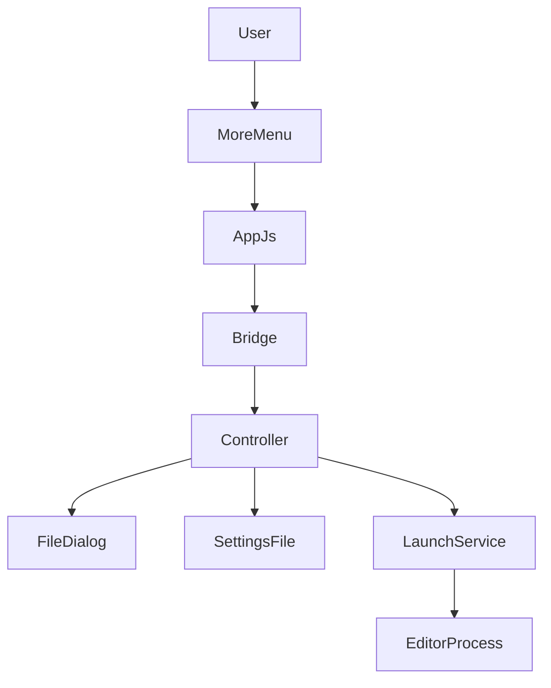
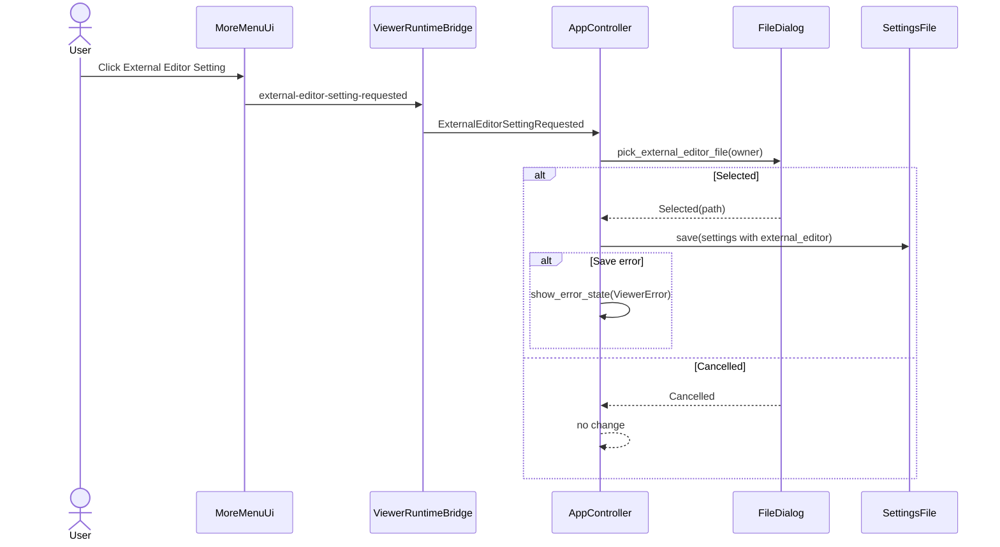

# Design Document

## Overview
この機能は、既存の `External Editor` 起動機能に対して、利用者が外部エディタ実行ファイルを選択・保存できる設定導線を追加する拡張である。MDLuma の軽量な閲覧中心方針を維持し、設定 UI は `...` メニュー内の最小導線（`External Editor Setting`）に限定する。

設計の中心は、既存の command ルーティング・設定保存基盤・エラー表示経路を再利用し、Windows 標準ファイル選択ダイアログで選択したフルパスを `settings.json` に保持する点にある。`External Editor` 起動成功時のみ終了、失敗時は表示継続という既存契約は維持する。

### Goals
- `...` メニューの `External Editor` 配下に `External Editor Setting` を追加する。
- `External Editor Setting` 選択で OS 標準ファイル選択ダイアログを開き、選択確定時のみ設定を保存する。
- 保存済み `external_editor` を起動に使い、未設定時は `notepad.exe` を使う。
- 設定保存失敗や起動失敗時はユーザー可視エラーを表示し、閲覧セッションを継続する。

### Non-Goals
- MDLuma 内編集、複数エディタ管理、引数テンプレート、関連付け解決。
- 外部エディタ起動後の同期・再読込・履歴管理。
- Windows 以外の実行ファイル選択ダイアログ実装。

## Boundary Commitments

### This Spec Owns
- `...` メニュー内の `External Editor Setting` 追加と command 連携。
- 外部エディタ実行ファイル選択ダイアログ（Windows）呼び出し。
- `external_editor` 設定値の保存・読込・再起動後再利用契約。
- `External Editor` 起動先解決（設定優先 / 未設定時 `notepad.exe`）。
- 設定保存失敗・起動失敗時のユーザー可視エラーと継続動作。

### Out of Boundary
- エディタ設定画面の追加実装（独立ダイアログ画面等）。
- 外部エディタへの複数引数、環境変数展開、履歴保存。
- 外部エディタ側の編集挙動や保存結果の追跡。

### Allowed Dependencies
- `src/settings.rs` の `SettingsFile` と JSON 永続化。
- `src/platform/windows_file_dialog.rs` の Win32 `GetOpenFileNameW` 実装基盤。
- `src/sciter/window.rs` の `ViewerCommand` / `xcall` ブリッジ。
- `src/app.rs` の `show_error_state()` と `ViewerState::current_document()`。

### Revalidation Triggers
- `Settings` JSON 形状変更（`external_editor` 型・キー名変更）。
- `ViewerCommand` ルーティング仕様変更（`data-action`/`xcall`）。
- Windows ダイアログ契約変更（戻り値やキャンセル判定）。
- `ExternalEditorLauncher` の launch 契約変更。

## Architecture

### Existing Architecture Analysis
- `Settings.external_editor: Option<PathBuf>` は既に存在し、起動時に `AppController` へ読込済み。
- `open_in_external_editor()` は設定優先・未設定時 `notepad.exe` を実装済み。
- 欠落しているのは、設定変更導線、実行ファイル選択ダイアログ API、保存失敗のユーザー可視化。

### Architecture Pattern & Boundary Map


**Architecture Integration**:
- Selected pattern: 既存拡張ポイントを使う extension-first。
- Domain/feature boundaries: UI event は `ui/`、command 変換は `sciter/window.rs`、業務フローは `app.rs`、Windows 固有は `platform/`。
- Existing patterns preserved: Settings 全体保存、show_error_state 経路、単一 launch 呼び出し。
- New components rationale: 新規ファイルは作らず、既存 `FileDialog` を editor picker に拡張。

### Technology Stack

| Layer | Choice / Version | Role in Feature | Notes |
|-------|------------------|-----------------|-------|
| Frontend | Sciter.js menu popup | `External Editor Setting` 表示/クリック | `data-action` 追加 |
| Application | Rust 2021 AppController | 設定更新と起動判定 | 既存 controller 拡張 |
| Data / Storage | SettingsFile JSON | `external_editor` 保存/読込 | `%LOCALAPPDATA%` |
| Messaging / Events | xcall + ViewerCommand | UI 操作の Rust 連携 | 新規 command 追加 |
| Infrastructure | Win32 GetOpenFileNameW | 実行ファイル選択 | 既存実装を汎用化 |

## File Structure Plan

### Directory Structure
```text
src/
├── app.rs                          # 設定変更フローとエラー表示、起動先解決
├── platform/
│   ├── mod.rs                      # FileDialog 公開契約の拡張
│   └── windows_file_dialog.rs      # 実行ファイル選択APIを追加
├── sciter/
│   └── window.rs                   # 新規 ViewerCommand ルーティング
├── ui/
│   ├── index.html                  # External Editor Setting 項目追加
│   └── app.js                      # setting-requested xcall 発火
└── settings.rs                     # external_editor 永続化契約（既存維持）
```

### Modified Files
- `src/ui/index.html` — `External Editor` の下に `External Editor Setting` を追加。
- `src/ui/app.js` — `data-action="external-editor-setting"` クリック時に `external-editor-setting-requested` を送出。
- `src/sciter/window.rs` — `ViewerCommand::ExternalEditorSettingRequested` と method/action 変換追加。
- `src/app.rs` — command ハンドリング、ダイアログ結果に応じた設定更新保存、保存失敗時エラー表示。
- `src/platform/windows_file_dialog.rs` — markdown専用 API に加え、実行ファイル選択 API を追加。
- `src/platform/mod.rs` — 拡張した FileDialog 契約を再公開。
- `src/settings.rs` — 既存 `external_editor` 保存/読込を維持し、保存失敗通知用の戻り値方針に合わせて調整。

## System Flows



Flow-level decisions:
- 設定は「選択確定時のみ」更新。
- キャンセル時は設定不変。
- 保存失敗時はユーザー可視エラーを表示するがセッションは継続。

## Requirements Traceability

| Requirement | Summary | Components | Interfaces | Flows |
|-------------|---------|------------|------------|-------|
| 1.1 | `External Editor` 下へ設定項目表示 | MoreMenuUi | `index.html` menu action | 設定変更フロー |
| 1.2 | 設定項目でOSダイアログ表示 | ViewerRuntimeBridge, AppController, FileDialog | command + dialog API | 設定変更フロー |
| 1.3 | ダイアログ完了まで未確定 | AppController | Selected/Cancelled分岐 | 設定変更フロー |
| 2.1 | 選択パスを設定保存 | AppController, SettingsFile | `Settings.external_editor` | 設定変更フロー |
| 2.2 | 起動時に保存値読込 | AppController | `SettingsFile::load()` | 外部エディタ起動フロー |
| 2.3 | 再起動後も利用 | SettingsFile, AppController | 永続化契約 | 外部エディタ起動フロー |
| 2.4 | キャンセル時は設定不変 | AppController, FileDialog | `OpenFileResult::Cancelled` | 設定変更フロー |
| 3.1 | 設定値を起動先に使用 | AppController, LaunchService | `external_editor` 参照 | 外部エディタ起動フロー |
| 3.2 | 未設定は `notepad.exe` | AppController | fallback rule | 外部エディタ起動フロー |
| 3.3 | 1回選択で1実行ファイル | LaunchService | single launch call | 外部エディタ起動フロー |
| 4.1 | 起動失敗表示 | AppController | `show_error_state()` | 外部エディタ起動フロー |
| 4.2 | 起動失敗でも継続 | AppController | no close on error | 外部エディタ起動フロー |
| 4.3 | 保存失敗表示 + 継続 | AppController, SettingsFile | save error handling | 設定変更フロー |

## Components and Interfaces

| Component | Domain/Layer | Intent | Req Coverage | Key Dependencies (P0/P1) | Contracts |
|-----------|--------------|--------|--------------|--------------------------|-----------|
| MoreMenuUi | UI | 設定項目を表示し操作を起点化 | 1.1 | index.html (P0), app.js (P0) | Event |
| ViewerRuntimeBridge | Runtime | xcall を ViewerCommand に変換 | 1.2 | sciter/window.rs (P0) | Event |
| AppController | Application | 設定変更、保存、エラー表示、起動先解決 | 1.3, 2.1-2.4, 3.1-3.2, 4.1-4.3 | settings, dialog, launcher (P0) | Service, State |
| FileDialog | Platform | 実行ファイル選択を提供 | 1.2, 2.4 | windows_file_dialog.rs (P0) | Service |
| ExternalEditorLaunchService | Integration | executable と document path を単一起動 | 3.1-3.3, 4.1-4.2 | external_editor.rs (P0) | Service |

### UI Layer

#### MoreMenuUi
| Field | Detail |
|-------|--------|
| Intent | `External Editor Setting` の可視導線を提供する |
| Requirements | 1.1 |

**Responsibilities & Constraints**
- `External Editor` の下に固定配置する。
- 選択イベントを発行するまでを責務とし、保存処理を持たない。

### Application Layer

#### AppController
| Field | Detail |
|-------|--------|
| Intent | 設定変更フローと既存起動フローの整合を担保する |
| Requirements | 1.3, 2.1, 2.2, 2.3, 2.4, 3.1, 3.2, 4.1, 4.2, 4.3 |

**Responsibilities & Constraints**
- `ExternalEditorSettingRequested` を受けたら dialog を開き、Selected のときのみ保存する。
- 保存失敗は `ViewerError` として可視化し、セッションは継続する。
- 起動先は設定値優先、未設定のみ `notepad.exe`。

##### Service Interface
```rust
fn open_external_editor_setting(&mut self) -> Result<(), ViewerError>
```
- Preconditions: command が dispatch 済みであること
- Postconditions: Selected なら設定更新、Cancelled なら不変
- Invariants: 保存/起動失敗でも閲覧セッションは維持

### Platform Layer

#### FileDialog
| Field | Detail |
|-------|--------|
| Intent | Windows 標準ダイアログで外部エディタ実行ファイルを選択する |
| Requirements | 1.2, 2.4 |

##### Service Interface
```rust
fn pick_external_editor_file(
    &self,
    owner: Option<SciterWindowHandle>,
) -> Result<OpenFileResult, ViewerError>
```
- Preconditions: owner は無効でも許容
- Postconditions: Selected または Cancelled を返す
- Invariants: キャンセルはエラー扱いしない

## Data Models

### Logical Data Model
- `Settings.external_editor: Option<PathBuf>` を継続利用する。
- `None` は未設定を示し、`Some(path)` は利用者指定エディタを示す。

## Error Handling

### Error Strategy
- 起動失敗: 既存 `ViewerError::ExternalEditorLaunch` を利用し `show_error_state()` 表示。
- 設定保存失敗: 保存 API が失敗を返す契約にし、`ViewerError` に変換して表示。
- ダイアログ失敗: `ViewerError::FileDialog` を表示。

## Testing Strategy

### Unit Tests
- `ExternalEditorSettingRequested` で dialog Selected 時のみ `external_editor` が更新される。
- dialog Cancelled 時に `external_editor` が変化しない。
- 保存失敗時に `show_error_state()` が呼ばれ close されない。
- `External Editor` 起動で設定値優先 / 未設定 `notepad.exe` が維持される。

### Integration Tests
- `index.html` のメニュー順序: `External Editor` の下に `External Editor Setting`。
- `app.js` クリックで `external-editor-setting-requested` が1回送出される。
- `sciter/window.rs` の action / xcall 変換が新規 command へ到達する。

### E2E/UI Tests
- 設定保存後の再起動で保存済みエディタが起動に使われる。
- 保存失敗・起動失敗時にエラー表示され、文書閲覧が継続できる。
