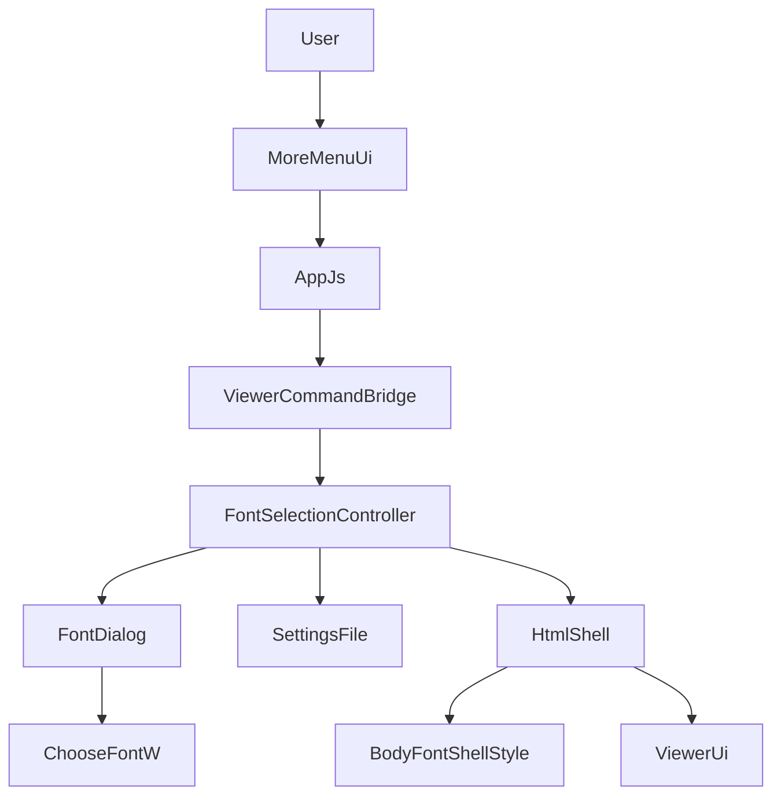
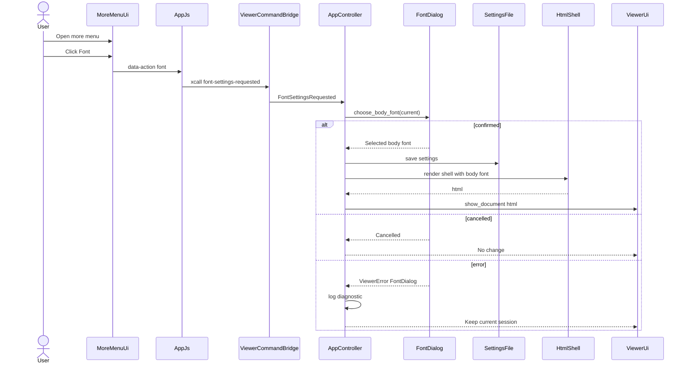
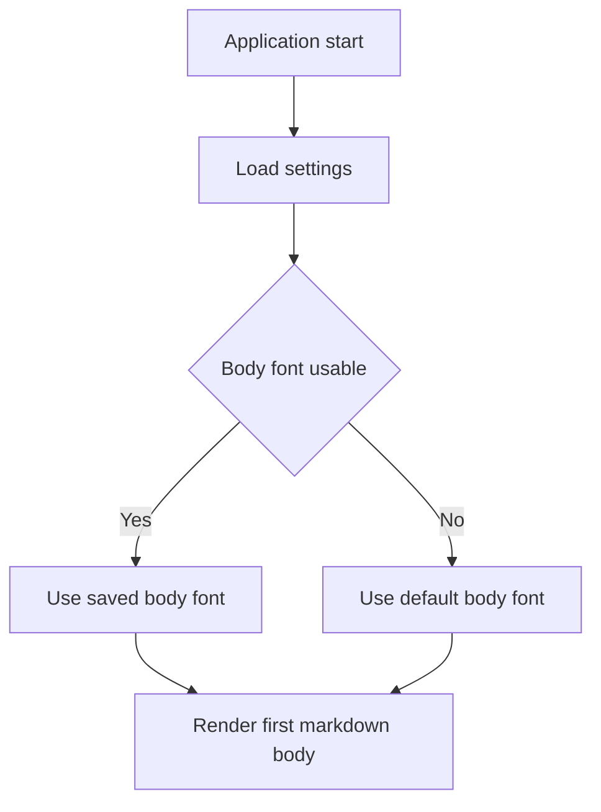

# Design Document

## Overview
この機能は、MDLuma のタイトルバー `...` メニューから本文フォント設定を開き、Markdown 本文のフォント種類とサイズだけを変更できる閲覧機能を提供する。利用者は Windows ネイティブのフォントダイアログで選択を確定すると、現在表示中の文書と以後に開く文書へ同じ本文フォント設定が反映される。

既存の theme 設定と同じく、設定はローカル JSON に保存し、次回起動時の最初の本文表示前に復元する。失敗時は閲覧継続を優先し、保存済み設定が読めない、または現環境で選択フォントが解決できない場合は既定本文フォントへ戻す。

### Goals
- `...` メニュー配下に `Font` 項目を追加し、本文フォント設定へ到達できるようにする。
- 選択した本文フォント種類とサイズを、本文だけに適用して現在文書と次の文書へ引き継ぐ。
- 本文フォント設定を保存し、次回起動時に復元しつつ、失敗時は既定本文フォントで継続動作させる。

### Non-Goals
- タイトルバー、ウィンドウボタン、検索 UI、エラー表示など本文以外の UI フォント変更。
- Web フォント取得、独自フォント一覧管理、OS が提供しないフォントの追加。
- フォント変更時の検索パネル開閉状態、検索クエリ、ハイライト状態の保持。

## Boundary Commitments

### This Spec Owns
- タイトルバー `...` メニューから `Font` 項目へ到達する viewer 内導線。
- Windows ネイティブフォントダイアログの起動、確定・キャンセル・実エラーの扱い。
- 本文用フォント設定の永続化モデル、起動時復元、現在セッション内状態。
- Markdown 本文だけに作用する CSS 適用経路と既定本文フォントへのフォールバック規則。

### Out of Boundary
- theme 切替、検索機能、ファイルオープン機能そのものの仕様変更。
- タイトルバーや検索入力欄などアプリケーション操作 UI のフォント変更。
- 検索の一時状態保持、部分 DOM 更新化、owner window を渡す高度なネイティブダイアログ統合。
- macOS/Linux 向けフォントダイアログ実装。

### Allowed Dependencies
- `src/settings.rs` の JSON 設定基盤と既存の best-effort load/save 方針。
- `src/app.rs` の `AppController` による状態保持と全文再描画パターン。
- `src/sciter/window.rs` の `ViewerCommand` / `Window.this.xcall(...)` ブリッジ。
- `src/platform/` 配下の Windows 固有 FFI 実装パターン。
- Sciter.js SDK の `button type="menu"` と `<menu.popup>`。

### Revalidation Triggers
- `Settings` JSON 形状や `ShellModel` の公開フィールドが変わる場合。
- `ViewerCommand` 名や JS `xcall` 契約が変わる場合。
- 本文 HTML のラッパ構造 (`.markdown-selection-host`, `.markdown-body`) が変わる場合。
- Windows ネイティブダイアログに owner window 連携や追加ランタイム前提を持ち込む場合。

## Architecture

### Existing Architecture Analysis
- 設定変更は既に `theme` 機能で `SettingsFile` 保存と `render_state_html()` 経由の全文再描画が定着している。
- Rust 側の UI 操作は `ViewerCommand` を介して `AppController` へ集約される。
- 本文表示は `HtmlShell` が組み立てる `<article class="markdown-body">` に閉じ込められており、本文限定スタイル適用点が明確である。
- 検索 UI は JS ローカル状態で動作しているため、全文再描画では検索の一時状態がリセットされる。

### Architecture Pattern & Boundary Map



**Architecture Integration**:
- Selected pattern: 既存 viewer 設定フローを拡張し、Windows ネイティブフォントダイアログだけを `src/platform/` に分離するハイブリッド拡張。
- Domain/feature boundaries: UI 導線は `src/ui/`、コマンド変換は `src/sciter/window.rs`、状態遷移と保存は `src/app.rs`、永続化モデルは `src/settings.rs`、ネイティブダイアログは `src/platform/windows_font_dialog.rs` が責務を持つ。
- Existing patterns preserved: `SettingsFile` の best-effort 永続化、`ViewerCommand` ブリッジ、`HtmlShell` の全文再描画、Windows 固有 FFI の局所化。
- New components rationale: `FontDialog` は `FileDialog` と責務を分離し、Windows API の契約差を局所化するために必要である。
- Steering compliance: 軽量・最小構成を保ち、viewer 機能だけを追加し、Windows 固有処理は `src/platform/` へ閉じ込める。

**Dependency Direction**:
- `src/settings.rs` と `src/platform/windows_font_dialog.rs` は末端の値/OS 境界として振る舞う。
- `src/sciter/window.rs` は UI イベントを `ViewerCommand` に変換するが、設定保存や HTML 生成を直接知らない。
- `src/app.rs` は設定、プラットフォーム境界、HTML シェル、UI を組み合わせる唯一のオーケストレータである。
- `src/lib.rs` は具体実装の配線のみを持ち、機能判断を持たない。

### Technology Stack

| Layer | Choice / Version | Role in Feature | Notes |
|-------|------------------|-----------------|-------|
| Frontend | Sciter.js SDK builtin menu behavior | `...` メニューと `Font` 項目の表示 | `button type="menu"` を使用 |
| Application | Rust 2021 `AppController` | フォント設定の確定、保存、再描画制御 | 既存 theme パターンを拡張 |
| Data / Storage | `SettingsFile` + JSON | 本文フォント設定の保存と復元 | `%LOCALAPPDATA%\MDLuma\settings.json` |
| Messaging / Events | `Window.this.xcall(...)` + `ViewerCommand` | UI から Rust へのフォント設定要求 | `font-settings-requested` を追加 |
| Infrastructure / Runtime | Win32 `ChooseFontW` / `CHOOSEFONTW` / `LOGFONTW` | OS ネイティブフォントダイアログ | `Comdlg32` を直接利用 |

## File Structure Plan

### Directory Structure
```text
src/
├── app.rs                          # 本文フォント選択フロー、現在セッション状態、再描画制御
├── errors.rs                       # フォントダイアログ失敗の診断カテゴリ
├── html_shell.rs                   # 本文限定のフォント CSS 変数注入とフォールバック整形
├── lib.rs                          # WindowsFontDialog を含む起動時配線
├── settings.rs                     # BodyFontSettings と Settings JSON 拡張
├── platform/
│   ├── mod.rs                      # FontDialog 境界の公開
│   └── windows_font_dialog.rs      # ChooseFontW を使う Windows 固有実装
├── sciter/
│   └── window.rs                   # font-settings-requested の ViewerCommand 変換
└── ui/
    ├── app.js                      # Font メニュー項目の xcall 送出
    ├── index.html                  # `...` メニューと `Font` 項目の DOM
    └── styles.css                  # 本文フォント CSS 変数と menu 見た目
```

### Modified Files
- `src/settings.rs` — `Settings` に `body_font` を追加し、本文フォント名とサイズの値オブジェクト、および load/save テストを追加する。
- `src/app.rs` — `AppController` に `body_font` 状態と `FontDialog` 依存を追加し、確定・キャンセル・保存失敗時の本文フォント更新フローを持たせる。
- `src/html_shell.rs` — `ShellModel` に本文フォント設定を流し込み、`.markdown-selection-host` または `.markdown-body` に限定した CSS 変数を注入する。
- `src/ui/index.html` — disabled な `more` ボタンを Sciter menu button 化し、`Font` 項目を子メニューとして定義する。
- `src/ui/app.js` — `font` アクションから `Window.this.xcall("font-settings-requested")` を送る。
- `src/ui/styles.css` — 本文フォント変数の消費、メニュー項目の最小見た目、本文限定スコープを定義する。
- `src/sciter/window.rs` — `ViewerCommand::FontSettingsRequested` と UI 変換規則を追加する。
- `src/platform/mod.rs` — `FontDialog`, `FontDialogResult`, `WindowsFontDialog` を公開する。
- `src/errors.rs` — `ViewerError::FontDialog` を追加し、診断文面をファイルダイアログと分離する。
- `src/lib.rs` — 起動時 controller の具体型と配線へ `WindowsFontDialog` を追加する。
- `src/platform/windows_font_dialog.rs` — 新規作成。Windows ネイティブフォントダイアログの FFI 境界を持つ。

## System Flows





Flow-level decisions:
- キャンセルは正常系 no-op とし、HTML 再生成も保存も行わない。
- 保存失敗時はセッション内の本文フォント変更を維持し、次回起動時復元だけが失われる。
- 起動時復元では本文フォントの構文が不正、または family 解決が失敗しても既定本文フォントで描画を続行する。

## Requirements Traceability

| Requirement | Summary | Components | Interfaces | Flows |
|-------------|---------|------------|------------|-------|
| 1.1 | `...` メニューに `Font` 項目を表示する | MoreMenuUi | `button type="menu"`, `data-action="font"` | Font selection |
| 1.2 | `Font` 選択で OS ネイティブダイアログを開く | ViewerCommandBridge, FontSelectionController, WindowsFontDialog | `font-settings-requested`, `FontDialog::choose_body_font` | Font selection |
| 1.3 | ダイアログで本文フォント種類とサイズを選択できる | WindowsFontDialog | `CHOOSEFONTW`, `LOGFONTW`, `FontDialogResult::Selected` | Font selection |
| 1.4 | キャンセル時は現在設定を変えない | FontSelectionController | `FontDialogResult::Cancelled` | Font selection |
| 2.1 | 確定時に現在本文へ適用する | FontSelectionController, BodyFontShellStyle | `ShellModel.body_font`, `show_document()` | Font selection |
| 2.2 | 本文以外の UI フォントは変えない | BodyFontShellStyle, MoreMenuUi | `.markdown-body` scoped CSS vars | Font selection |
| 2.3 | 別文書にも現在設定を適用する | FontSelectionController, BodyFontShellStyle | `render_state_html()` | Font selection |
| 2.4 | テキスト選択とコピーを継続利用可能にする | BodyFontShellStyle | `.markdown-selection-host` 維持 | Font selection |
| 3.1 | 確定時に設定保存する | FontSelectionController, BodyFontSettingsStore | `SettingsFile.save()` | Font selection |
| 3.2 | 起動時に保存済み設定を表示前に読む | BodyFontSettingsStore, FontSelectionController | `SettingsFile.load()` | Startup restore |
| 3.3 | 最初の本文へ復元設定を適用する | FontSelectionController, BodyFontShellStyle | `ShellModel.body_font` | Startup restore |
| 3.4 | 保存設定がない場合は既定本文フォントを使う | BodyFontSettingsStore, BodyFontShellStyle | `Option<BodyFontSettings>` | Startup restore |
| 4.1 | 保存済み設定を読めない場合も既定本文フォントで起動継続する | BodyFontSettingsStore | `Settings::default()` fallback | Startup restore |
| 4.2 | 保存済み設定を適用できない場合は既定本文フォントで表示する | BodyFontShellStyle | CSS fallback chain | Startup restore |
| 4.3 | 保存失敗時も閲覧継続し診断情報を残す | FontSelectionController, BodyFontSettingsStore | `SettingsFile.save()`, `debug_log!` | Font selection |

## Components and Interfaces

| Component | Domain/Layer | Intent | Req Coverage | Key Dependencies (P0/P1) | Contracts |
|-----------|--------------|--------|--------------|--------------------------|-----------|
| MoreMenuUi | UI | `...` メニューに `Font` 項目を出す | 1.1, 2.2 | Sciter menu behavior (P0), AppJs (P0) | State |
| ViewerCommandBridge | Runtime bridge | `font-settings-requested` を Rust 側コマンドへ変換する | 1.2, 1.4 | AppJs (P0), AppController (P0) | Event |
| FontSelectionController | Application | ダイアログ起動、状態更新、保存、再描画を調停する | 1.2-1.4, 2.1-2.4, 3.1-3.3, 4.3 | FontDialog (P0), SettingsFile (P0), HtmlShell (P0), ViewerUi (P0) | Service, State |
| BodyFontSettingsStore | Persistence | 本文フォント設定の永続化と既定値フォールバックを担う | 3.1-3.4, 4.1, 4.3 | serde JSON (P0) | State |
| WindowsFontDialog | Platform | ChooseFontW を本文フォント選択 API として包む | 1.2-1.4 | Win32 Comdlg32 (P0) | Service |
| BodyFontShellStyle | Rendering | 本文限定のフォント CSS 変数とフォールバックを組み立てる | 2.1-2.4, 3.3, 4.2 | HtmlShell (P0), styles.css (P0) | State |

### UI Layer

#### MoreMenuUi

| Field | Detail |
|-------|--------|
| Intent | タイトルバー `...` メニューに `Font` 項目を提供する |
| Requirements | 1.1, 2.2 |

**Responsibilities & Constraints**
- `...` ボタンを Sciter の menu button として定義する。
- `Font` 項目は viewer command トリガだけを持ち、設定保存やダイアログ制御は持たない。
- ボタン配置は既存の drag 領域外に保ち、ウィンドウ操作ロールと干渉させない。

**Dependencies**
- Inbound: `DefaultHtmlShell` — タイトルバー HTML を供給する (P0)
- Outbound: `AppJs` — `font` アクションを Rust 通知へ変換する (P0)
- External: Sciter menu behavior — `button type="menu"` と `<menu.popup>` の表示 (P0)

**Contracts**: Service [ ] / API [ ] / Event [ ] / Batch [ ] / State [x]

**Implementation Notes**
- `Font` 項目の DOM は静的に持ち、動的メニュー生成は行わない。
- `more` ボタンの disabled は除去し、既存アイコン資産を再利用する。
- 本文フォント設定は menu 自体のフォントへ波及させない。

### Runtime Bridge

#### ViewerCommandBridge

| Field | Detail |
|-------|--------|
| Intent | `font` UI 操作を `ViewerCommand::FontSettingsRequested` へ正規化する |
| Requirements | 1.2, 1.4 |

**Responsibilities & Constraints**
- JS `xcall` と必要なら `data-action` 由来のイベントを同じ viewer command へ寄せる。
- コマンド変換だけを担い、ダイアログ表示や保存判断は持たない。

**Dependencies**
- Inbound: `src/ui/app.js` — `font-settings-requested` 呼び出し元 (P0)
- Outbound: `AppController` — viewer command 処理先 (P0)
- External: Sciter scripting method call bridge — `Window.this.xcall(...)` (P0)

**Contracts**: Service [ ] / API [ ] / Event [x] / Batch [ ] / State [ ]

##### Event Contract
- Published events: `font-settings-requested`
- Subscribed events: click on `[data-action="font"]`
- Ordering / delivery guarantees: UI スレッド上で同期的に dispatch され、キャンセル時の追加イベントは発行しない

**Implementation Notes**
- `theme-toggle-requested` と同じ命名規約を使い、viewer command の拡張点を増やしすぎない。

### Application Layer

#### FontSelectionController

| Field | Detail |
|-------|--------|
| Intent | 本文フォント選択の確定、保存、再描画、継続動作を一括調停する |
| Requirements | 1.2, 1.4, 2.1, 2.3, 3.1, 3.2, 3.3, 4.3 |

**Responsibilities & Constraints**
- `body_font: Option<BodyFontSettings>` をセッション状態として持つ。
- `FontDialog` 結果が確定なら現在セッション状態を更新し、保存を試み、HTML を再描画する。
- キャンセル時は state と HTML を変えない。
- 保存失敗時もセッション状態と本文表示は更新し、診断ログだけを残す。

**Dependencies**
- Inbound: `ViewerCommandBridge` — `FontSettingsRequested` を渡す (P0)
- Outbound: `FontDialog` — 本文フォント選択 (P0)
- Outbound: `SettingsFile` — `Settings` 保存と復元 (P0)
- Outbound: `HtmlShell` — 本文フォント付き HTML 生成 (P0)
- Outbound: `ViewerUi` — 現在表示の差し替え (P0)

**Contracts**: Service [x] / API [ ] / Event [ ] / Batch [ ] / State [x]

##### Service Interface
```rust
pub trait FontDialog {
    fn choose_body_font(
        &self,
        initial: Option<&BodyFontSettings>,
    ) -> Result<FontDialogResult, ViewerError>;
}

pub enum FontDialogResult {
    Selected(BodyFontSettings),
    Cancelled,
}

impl<D, F, L, R, H, U, S> AppController<D, F, L, R, H, U, S> {
    fn open_body_font_dialog(&mut self) -> Result<(), ViewerError>;
}
```
- Preconditions:
  - `body_font` は `None` または妥当な `BodyFontSettings` である。
  - `ViewerUi` は既に初期 HTML を表示済み、または起動直前の状態にある。
- Postconditions:
  - 確定時は `body_font` が更新され、以後の `render_state_html()` が同じ値を使用する。
  - キャンセル時は `body_font`、設定ファイル、現在 HTML のいずれも変更しない。
- Invariants:
  - `body_font` の更新有無にかかわらず、`ViewerState` の現在文書参照は保持する。

##### State Management
- State model: `AppController` は `theme` と並んで `body_font: Option<BodyFontSettings>` を保持する。
- Persistence & consistency: 確定時に `Settings { theme, body_font }` を丸ごと保存する。
- Concurrency strategy: 単一 UI スレッド更新。最新確定値が次回描画の唯一の真実となる。

**Implementation Notes**
- 保存は best-effort とし、失敗しても選択済み本文フォントは現セッションへ適用する。
- フォント変更は theme 切替と同じ全文再描画で反映する。
- フォントダイアログ自体の実エラーは `debug_log!` で記録し、文書閲覧は継続する。

### Persistence Layer

#### BodyFontSettingsStore

| Field | Detail |
|-------|--------|
| Intent | 本文フォント設定の JSON 形状と既定値フォールバック規則を定義する |
| Requirements | 3.1, 3.2, 3.4, 4.1, 4.3 |

**Responsibilities & Constraints**
- `Settings` に theme と本文フォント設定を同居させる。
- `None` を「既定本文フォントを使う」の唯一の表現にする。
- 空文字 family や 0 サイズは無効として扱い、既定本文フォントへ戻す。

**Dependencies**
- Inbound: `AppController` — 保存/読込の利用者 (P0)
- External: `serde`, `serde_json` — JSON 変換 (P0)

**Contracts**: Service [ ] / API [ ] / Event [ ] / Batch [ ] / State [x]

##### State Management
- State model:
```rust
#[derive(Serialize, Deserialize, Clone, PartialEq, Eq, Debug)]
pub struct BodyFontSettings {
    pub family_name: String,
    pub point_size_tenths: u16,
}

#[derive(Serialize, Deserialize, Clone, PartialEq, Eq, Debug)]
#[serde(default)]
pub struct Settings {
    pub theme: ThemePreference,
    pub body_font: Option<BodyFontSettings>,
}
```
- Persistence & consistency: `SettingsFile.save()` は theme と `body_font` を単一 JSON スナップショットとして書き込む。
- Concurrency strategy: 単一プロセス前提、最後に保存したスナップショットが有効。

**Implementation Notes**
- `body_font` 不在、設定ファイル欠落、JSON 解析失敗では `Settings::default()` にフォールバックする。
- フォント設定だけが不正な場合も本文は既定フォントへ戻し、起動継続を優先する。

### Platform Layer

#### WindowsFontDialog

| Field | Detail |
|-------|--------|
| Intent | Windows `ChooseFontW` を本文フォント選択 API として包む |
| Requirements | 1.2, 1.3, 1.4 |

**Responsibilities & Constraints**
- `BodyFontSettings` から `LOGFONTW` 初期値を構築する。
- ダイアログ成功時だけ本文フォント名とサイズを返す。
- `FALSE + CommDlgExtendedError() == 0` をキャンセル、非 0 を実エラーとして区別する。

**Dependencies**
- Inbound: `AppController` — ダイアログ起動依頼 (P0)
- External: `Comdlg32` / `ChooseFontW` / `CHOOSEFONTW` / `LOGFONTW` (P0)

**Contracts**: Service [x] / API [ ] / Event [ ] / Batch [ ] / State [ ]

##### Service Interface
```rust
pub trait FontDialog {
    fn choose_body_font(
        &self,
        initial: Option<&BodyFontSettings>,
    ) -> Result<FontDialogResult, ViewerError>;
}
```
- Preconditions:
  - `initial` が存在する場合、その `family_name` は非空、`point_size_tenths` は 0 より大きい。
- Postconditions:
  - 確定時は `Selected(BodyFontSettings)` を返す。
  - キャンセル時は `Cancelled` を返し、設定変更を発生させない。
- Invariants:
  - 永続化対象は本文フォント名とサイズだけで、style/effects は保存しない。

**Implementation Notes**
- `CF_INITTOLOGFONTSTRUCT` を使って前回値を初期選択へ戻す。
- `CF_FORCEFONTEXIST` を使い、ダイアログ確定時に存在しないフォント名が返らない前提を強める。
- owner window は既存 `WindowsFileDialog` と同じく今回の spec では連携しない。

### Rendering Layer

#### BodyFontShellStyle

| Field | Detail |
|-------|--------|
| Intent | 本文だけに作用するフォント CSS を HTML シェルへ注入する |
| Requirements | 2.1, 2.2, 2.4, 3.3, 4.2 |

**Responsibilities & Constraints**
- `ShellModel` が本文フォント設定を受け取り、CSS 変数へ安全に変換する。
- 適用範囲を `.markdown-selection-host` / `.markdown-body` に限定し、`html` ルートフォントを変更しない。
- DOM 構造は維持し、本文選択とコピー処理が壊れないようにする。

**Dependencies**
- Inbound: `AppController` — 現在の `body_font` 値 (P0)
- Outbound: `src/ui/styles.css` — 変数の消費先 (P0)

**Contracts**: Service [ ] / API [ ] / Event [ ] / Batch [ ] / State [x]

##### State Management
- State model:
```rust
pub struct ShellModel<'a> {
    pub app_name: &'a str,
    pub state: &'a ViewerState,
    pub resource_policy: ResourcePolicy,
    pub theme: Theme,
    pub body_font: Option<&'a BodyFontSettings>,
}
```
- Persistence & consistency: `ShellModel.body_font` が `None` の場合は CSS デフォルト値だけで描画する。
- Concurrency strategy: HTML 再生成ごとに一貫したスナップショットを埋め込む。

**Implementation Notes**
- family は CSS 文字列としてエスケープし、`selected, "Segoe UI", sans-serif` のようなフォールバックチェーンを生成する。
- サイズは `point_size_tenths` を `pt` 文字列へ変換し、本文ルートにのみ渡す。
- `.markdown-body` 以外の UI 要素は既存の `html { font-family: "Segoe UI", sans-serif; }` を保つ。

## Data Models

### Domain Model
- `Settings` は viewer 設定の集約であり、`theme` と `body_font` を保持する。
- `BodyFontSettings` は本文フォントの値オブジェクトで、`family_name` と `point_size_tenths` を持つ。
- `FontDialogResult` はネイティブダイアログの結果を `Selected` と `Cancelled` に閉じた戻り値として表す。

**Business rules & invariants**
- `BodyFontSettings.family_name` は空文字不可。
- `BodyFontSettings.point_size_tenths` は 0 不可。
- `None` は「保存済み本文フォントなし」、すなわち既定本文フォント使用を意味する。

### Logical Data Model

**Structure Definition**:
- `Settings`
  - `theme: ThemePreference`
  - `body_font: Option<BodyFontSettings>`
- `BodyFontSettings`
  - `family_name: String`
  - `point_size_tenths: u16`

**Consistency & Integrity**:
- 設定保存は単一 JSON ファイルへのスナップショット書込で完結する。
- 読込失敗や本文フォント値不正時は `body_font = None` と同等の扱いへ戻す。

### Physical Data Model
- 保存場所: `%LOCALAPPDATA%\MDLuma\settings.json`
- 例:

```json
{
  "theme": "dark",
  "body_font": {
    "family_name": "Yu Gothic UI",
    "point_size_tenths": 120
  }
}
```

- 既存設定ファイル互換性: `body_font` 欠落時は `None` として扱う。

## Error Handling

### Error Strategy
- ネイティブダイアログのキャンセルはエラーにしない。
- ネイティブダイアログの実エラーは `ViewerError::FontDialog` として診断可能にしつつ、閲覧セッションは継続する。
- 設定読込失敗は既定本文フォントへフォールバックする。
- 設定保存失敗はログのみ残し、現セッションの本文フォント適用は維持する。

### Error Categories and Responses
- **User cancel**: `ChooseFontW` が cancel を返した場合 — no-op。設定保存なし、再描画なし。
- **Dialog failure**: `CommDlgExtendedError() != 0` — 診断ログを残し、現在文書をそのまま維持する。
- **Settings load failure**: ファイル欠落/JSON 失敗/本文フォント値不正 — `Settings::default()` または `body_font = None` で継続する。
- **Settings save failure**: `fs::write` 等の失敗 — 現セッションの本文フォント表示は維持し、次回復元だけを失う。
- **Render failure after confirm**: `render_shell()` / `show_document()` が失敗 — 既存の viewer error 経路を使い、少なくとも直前の本文表示は残す。

### Monitoring
- 以下を `debug_log!` で記録する:
  - font dialog の実エラーコード
  - 保存済み本文フォント値の無効化理由
  - 設定保存失敗のパスと OS エラー

## Testing Strategy

### Unit Tests
- `src/settings.rs`: `body_font` 欠落時に既定本文フォントへ戻ること、空文字 family や 0 サイズを無効値として扱うことを検証する。
- `src/platform/windows_font_dialog.rs`: `ChooseFontW` の成功、キャンセル、実エラーを `Selected` / `Cancelled` / `ViewerError::FontDialog` へ正しく写像することを検証する。
- `src/html_shell.rs`: 本文フォント CSS が `.markdown-body` にだけ入ること、`html` や検索入力のフォント指定を変更しないこと、フォールバックチェーンが生成されることを検証する。
- `src/sciter/window.rs`: `font-settings-requested` と `data-action="font"` が `ViewerCommand::FontSettingsRequested` へ変換されることを検証する。
- `src/app.rs`: 確定時に `body_font` が更新され保存されること、キャンセル時に state と HTML が不変であること、保存失敗時もセッション表示が更新されることを検証する。

### Integration Tests
- 起動時に保存済み本文フォントを読み込み、最初の Markdown 本文表示へ反映することを controller レベルで検証する。
- 本文フォント変更後に別文書を開いても同じ本文フォントが使われることを検証する。
- 保存済みフォント名が現環境で解決できない想定でも、レンダリングされた CSS が既定本文フォントへフォールバックすることを検証する。

### E2E/UI Tests
- `...` メニューを開くと `Font` 項目が見え、選択で `font-settings-requested` が発火することを検証する。
- 本文フォント変更後も本文テキスト選択とコピー操作が引き続き利用できることを検証する。
- 本文フォント変更後も検索パネルを再び開いて検索でき、タイトルバー/検索入力のフォントが変わらないことを検証する。
