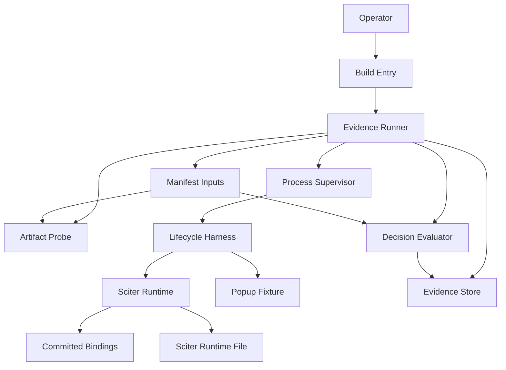
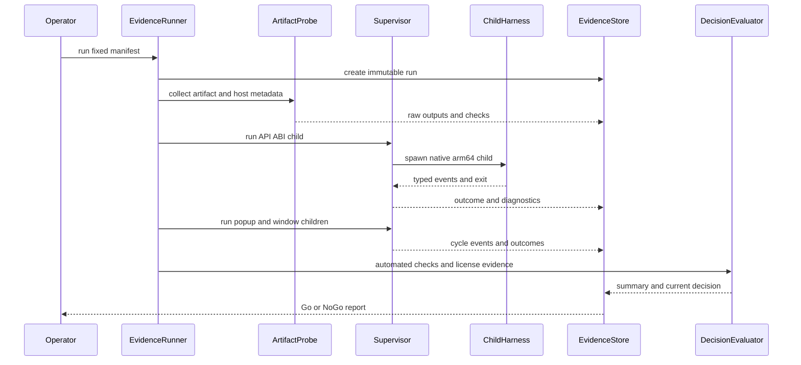
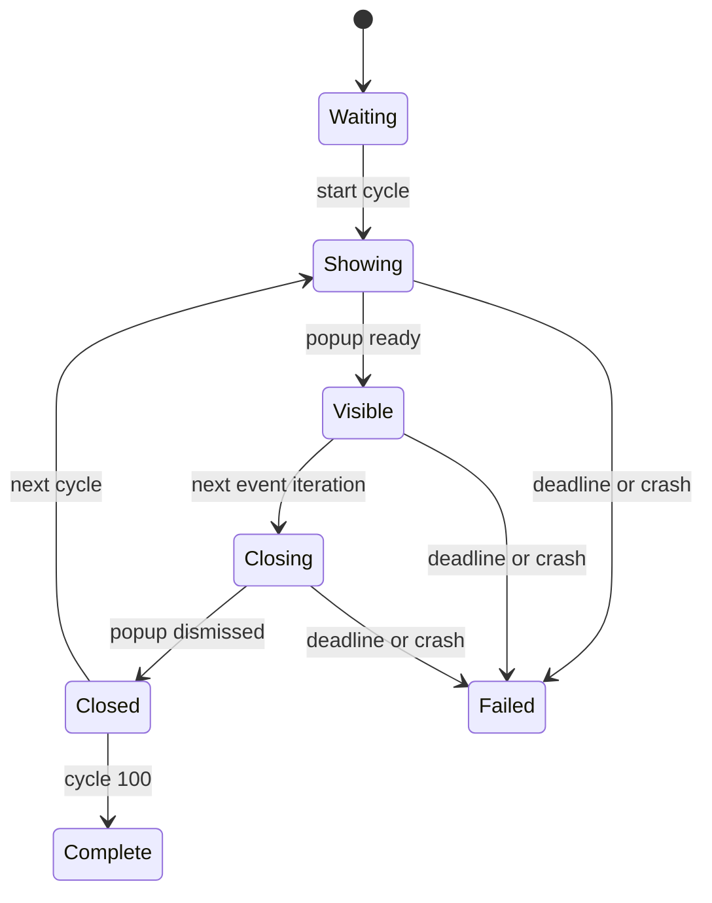
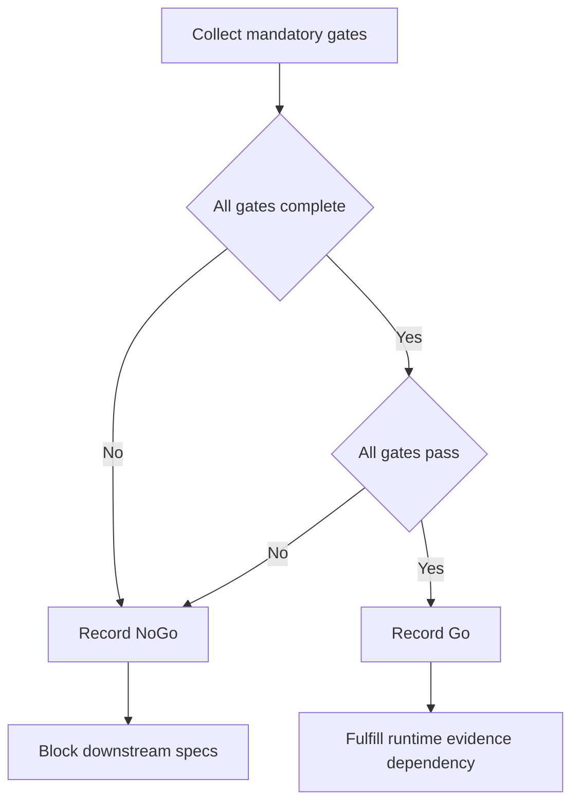
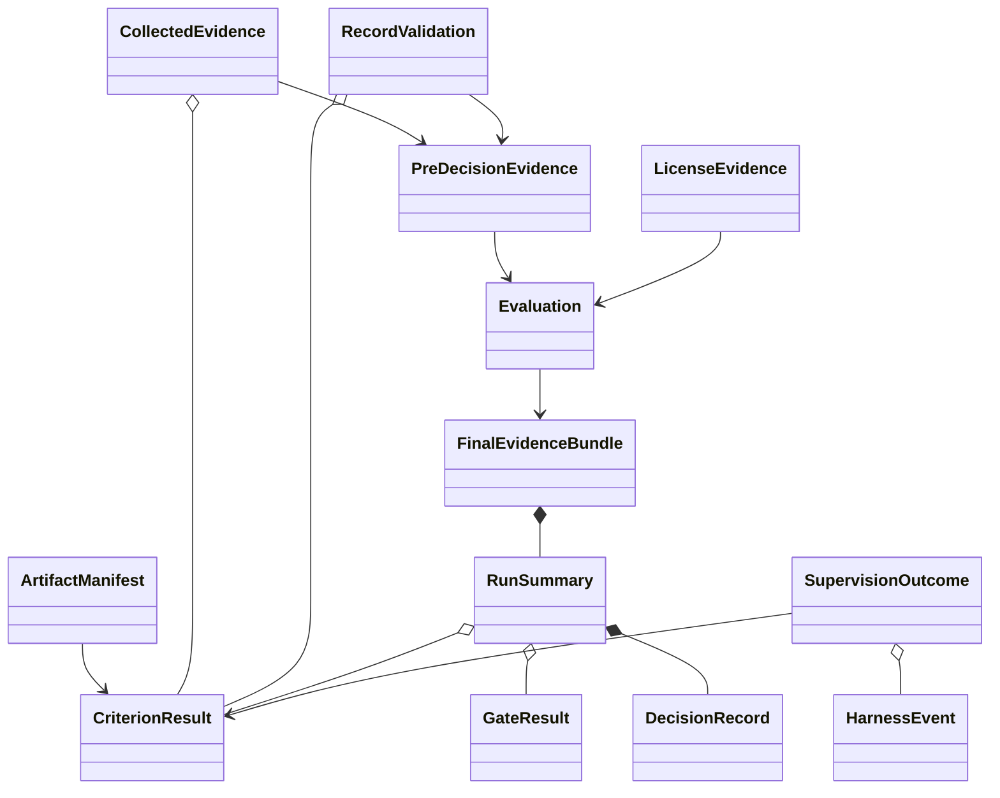

# Technical Design: macos-sciter-runtime-evidence

## Overview

本機能は、Sciter.js SDK 6.0.3.18のmacOS runtimeをApple Silicon向けMDLumaのベースラインとして採用できるかを、再実行可能な証拠と明示的なGo/No-Go判定で確認する。対象利用者はmacOS移植開発者、レビュー担当者、配布責任者である。

Phase 0専用のstandalone evidence toolkitを`tools/`配下へ追加する。toolkitは製品crateへlinkせず、製品`src/`、`Cargo.toml`、Windows runtime経路を変更しない。固定runtimeのmetadata、APIと限定ABI smoke、popup/window lifecycle、license evidenceを収集し、immutable run directoryと最新decision recordへ保存する。

### Goals

- 固定commit由来の`libsciter.dylib`についてidentity、native arm64、API version、engine versionを検証する。
- committed bindingsでAPI table先頭のversion取得範囲だけをABI smokeする。
- 要件上の`menu.popup`、すなわち実`menu`要素を`Element.popup`で表示する機能とSciter window lifecycleを各100 cycle、1 cycle 10秒以内で検証する。
- crash、signal、timeout、allocator診断を親processから記録する。
- 自動証拠と権威あるlicense evidenceを統合してGo/No-Goを再現可能にする。

### Non-Goals

- 製品`SciterApi`、`SciterWindow`、macOS loader、platform adapterを実装しない。
- 全`ISciterAPI` entryのABI互換性を保証しない。
- `.app` packaging、install-name変更、Developer ID署名、notarizationを実行しない。
- Sciter 6.0.4.8への更新を実装しない。
- Windows製品コード、runtime、release workflowを変更しない。

## Boundary Commitments

### This Spec Owns

- Phase 0専用toolのbuild、実行、child supervision、Sciter fixture lifecycle。
- 固定artifact manifestと、runtime identity・platform metadata・API/ABI smokeの証拠。
- popup/window各cycleのprogress protocol、timeout、exit/signal、allocator診断の記録。
- immutable run directory、summary、current decision recordのschema。
- license evidenceの入力contractと、未解決・禁止をNo-Goにする判定。

### Out of Boundary

- `src/`以下の製品runtime境界とUI挙動。
- Phase 1のplatform contractsとPhase 2のSciter/Win32分離。
- macOS製品window、Cocoa UI、native-frame shell、配布bundle。
- 全API table layoutの検証とbindings再生成。
- Sciter提供元に代わる法的判断。
- Rust toolchainと提供元回答そのものの調達。欠落時はBlocked/No-Goとして記録する。
- 未実行の過去macOS versionに対する互換性保証。Goはrecorded current macOS versionだけを対象とする。

### Allowed Dependencies

- Rust standard library。追加crate、workspace、Cargo packageは導入しない。
- macOS system commands: `shasum`、`lipo`、`otool`、`codesign`、`sw_vers`、`sysctl`、`uname`。
- macOS `libSystem`の`dlopen`、`dlsym`、`dlerror`。
- `vendor/sciter-js-sdk-main/bin/macosx/libsciter.dylib`の固定artifact。
- `src/sciter/generated_sciter_bindings.rs`のread-only include。
- 同一Sciter commitの公式headers、LICENSE、EULA、提供元公開文書または書面回答。
- `.kiro/specs/macos-sciter-runtime-evidence/evidence/`だけを永続証拠保存先とする。

### Revalidation Triggers

- runtimeのrepository、commit、path、SHA-256、engine version、API versionが変わる。
- `src/sciter/generated_sciter_bindings.rs`の内容または生成条件が変わる。
- popup/window cycle数、10秒deadline、完了event contractが変わる。
- target architecture、最低macOS version、macOS test matrixが変わる。
- Sciter LICENSE、EULA、再配布・再署名条件、About attributionが変わる。
- evidence schemaまたはchild protocol versionが変わる。
- 後続specが本設計の限定ABI範囲を超えて利用する。

## Architecture

### Existing Architecture Analysis

- 製品runtime validationは`src/sciter/runtime.rs`、Windows dynamic loadとAPI table bindingは`src/sciter/ffi.rs`にある。
- non-Windows `SciterApi::load()`とevent loopは明示的errorであり、製品crateはPhase 0 harnessとして利用できない。
- committed bindingsは6.0.3.18/API 10を含むが`-DWINDOWS`生成であり、検証済み範囲をversion fieldと`SciterVersion` entryへ限定する必要がある。
- 現行UIは`anchor.popup(...)`を使用し、AboutにはSciter attributionがある。asset testは実runtime lifecycleを検証しない。
- 要件中の`menu.popup`はmethod名ではなくmenu popup機能を指す。受入対象の具体的なSciter API shapeは、現行UIと同じ`anchor.popup(menu, ...)`に固定する。
- `.cargo/config.toml`はWindows targetを既定化するため、toolkitはCargoを経由せずnative `rustc`でbuildする。

### Architecture Pattern & Boundary Map



**Architecture Integration**:
- Selected pattern: standalone supervised evidence pipeline。外部runtimeのfailureを製品processから隔離する。
- Domain boundaries: artifact probe、Sciter child harness、supervisor、evidence store、decision evaluatorを分離する。
- Existing patterns preserved: typed error、fail-fast prerequisite、operator diagnostic、read-only committed bindings。
- New components rationale: crash後も証拠を保持する親processと、法的証拠を別入力にするdecision boundaryが必要である。
- Steering compliance: single product crate、追加runtime dependencyなし、Windows無変更、Sciter固有eventを公式contractに従って扱う。

**Dependency direction**:

```text
model -> manifest and sciter -> artifact and harness and supervisor -> decision -> evidence -> main
```

各moduleは左側のlayerだけをimportする。同じlayerのartifact、harness、supervisor間にimportを作らない。probe、harness、supervisor、decisionはfilesystemへ永続化せず、typed resultとraw artifactだけを返す。`EvidenceStore`だけがrun directoryと`decision.md`を書き込む。製品`mdluma` crateへの依存は禁止する。

### Technology Stack

| Layer | Choice / Version | Role in Feature | Notes |
| --- | --- | --- | --- |
| Tool language | Rust 2021 / project-compatible stable | typed orchestration、FFI、supervision、report | native `rustc`でbuild、追加crateなし |
| UI fixture | Sciter.js SDK 6.0.3.18 HTML/JS | popup lifecycle state machine | browser APIを仮定しない |
| Runtime | `libsciter.dylib` 6.0.3.18 API 10 | verification target | fixed SHA-256、process lifetime保持 |
| Platform probes | macOS system commands | architecture、minOS、dependency、signature | raw outputも保存 |
| Persistence | TSV + Markdown + raw text artifacts | append-only evidence | database、serde不要 |
| Memory diagnostics | Apple malloc environment | heap corruption signalization | detection limitをsummaryへ記録 |

## File Structure Plan

### Directory Structure

```text
tools/
└── macos-runtime-evidence/
    ├── run.sh                 # native arm64 prerequisite check and rustc build entry
    ├── main.rs                # CLI mode dispatch and top-level orchestration
    ├── model.rs               # typed statuses, events, manifests, summaries, errors
    ├── manifest.rs            # fixed artifact and license evidence parsing
    ├── artifact.rs            # macOS command probes and raw metadata capture
    ├── sciter.rs              # unsafe dylib and limited API table boundary
    ├── harness.rs             # API, popup, and window child lifecycle modes
    ├── supervisor.rs          # child protocol, cycle deadline, exit and signal capture
    ├── evidence.rs            # immutable run directories and report serialization
    ├── decision.rs            # mandatory gate aggregation and Blocked state output
    ├── popup.htm              # Sciter popup event-driven 100-cycle fixture
    ├── tests.rs               # std-only unit and deterministic child tests
    └── README.md              # prerequisites, invocation, evidence interpretation

.kiro/specs/macos-sciter-runtime-evidence/
└── evidence/
    ├── .lock                  # transient exclusive writer lock, not committed
    ├── artifact-manifest.txt  # authoritative repository, commit, path, hash, versions
    ├── license-evidence.txt   # manual authoritative permission statuses and sources
    ├── decision.md            # latest Go or No-Go and downstream dependency states
    └── runs/
        └── <run-id>/
            ├── summary.md     # immutable run summary and requirement gate results
            ├── events.tsv     # typed progress and child outcome events
            ├── metadata/      # raw lipo, otool, codesign, host, and hash outputs
            ├── api/           # API and ABI smoke stdout and stderr
            ├── popup/         # popup child stdout, stderr, and cycle failures
            ├── window/        # window child stdout, stderr, and cycle failures
            └── crashes/       # matching crash reports when available
```

### Modified Files

- 製品codeとCargo metadataの変更はない。
- `.kiro/specs/macos-sciter-runtime-evidence/spec.json`はspec workflow metadataだけを更新する。
- `.kiro/specs/macos-sciter-runtime-evidence/research.md`へdiscoveryとdesign rationaleを追記する。
- `src/sciter/generated_sciter_bindings.rs`はtoolがread-onlyで参照し、変更しない。

## System Flows

### Evidence Run



### Popup Cycle State



`PopupWindow.isValid == true`をshown完了、official `close` callbackと`isValid == false`の組合せをclosed完了とする。`popup()`のreturnやHTML parse成功は代替にしない。

### Decision Flow



## Requirements Traceability

| Requirement | Summary | Components | Interfaces | Flows |
| --- | --- | --- | --- | --- |
| 1.1, 1.2, 1.3, 1.4, 1.5, 1.6, 1.7 | artifact provenance and hash | ArtifactManifest, ArtifactProbe, EvidenceStore | `ArtifactManifest`, `ProbeBundle` | Evidence Run |
| 2.1, 2.2, 2.3, 2.4, 2.5, 2.6, 2.7, 2.8 | arm64 and Mach-O metadata | ArtifactProbe, LifecycleHarness | `ProbeBundle`, `HarnessEvent` | Evidence Run |
| 3.1, 3.2, 3.3, 3.4, 3.5, 3.6, 3.7, 3.8, 3.9 | runtime API compatibility | SciterRuntime, LifecycleHarness, ProcessSupervisor | `SupervisionOutcome` | Evidence Run |
| 4.1, 4.2, 4.3, 4.4, 4.5, 4.6, 4.7, 4.8, 4.9, 4.10 | limited committed-bindings ABI smoke | ArtifactManifest, SciterRuntime, LifecycleHarness | `HeaderEvidence`, `SupervisionOutcome` | Evidence Run |
| 5.1, 5.2, 5.3, 5.4, 5.5, 5.6, 5.7, 5.8, 5.9, 5.10 | current macOS popup and window stability | LifecycleHarness, PopupFixture, ProcessSupervisor | `HarnessEvent`, `SupervisionOutcome` | Popup Cycle State |
| 6.1, 6.2, 6.3, 6.4, 6.5, 6.6, 6.7, 6.8, 6.9, 6.10, 6.11 | license and permissions | LicenseEvidence | `LicenseEvidence`, `LicenseValidation`, `PermissionStatus` | Decision Flow |
| 7.1, 7.2, 7.3, 7.4, 7.5, 7.6, 7.7, 7.8, 7.9, 7.10, 7.11, 7.12 | reproducible immutable evidence | EvidenceStore, ProcessSupervisor | `RunContext`, `RunSummary`, events TSV schema | Evidence Run |
| 8.1, 8.2, 8.3, 8.4, 8.5, 8.6, 8.7, 8.8, 8.9, 8.10, 8.11 | decision and downstream gating | DecisionEvaluator, EvidenceStore | `DecisionRecord` | Decision Flow |

## Components and Interfaces

| Component | Domain | Intent | Requirement Coverage | Dependencies | Contracts |
| --- | --- | --- | --- | --- | --- |
| BuildEntry | Tooling | native tool build and prerequisite validation | 2.3, 2.4, 7.2, 7.3, 7.4 | rustc P0, macOS host P0 | Batch |
| ArtifactManifest | Input | fixed artifact, header, and license evidence parsing | 1.1-1.4, 3.1-3.2, 4.1-4.2, 6.1-6.6 | evidence input files P0 | State |
| ArtifactProbe | Evidence | artifact and host metadata collection | 1.1-1.7, 2.1-2.8, 7.1-7.9 | system commands P0 | Service |
| SciterRuntime | FFI | fixed dylib and limited API table access | 3.1-3.9, 4.1-4.10 | dylib P0, bindings P0 | Service |
| LifecycleHarness | Runtime Test | API, popup, window child modes | 3.3-3.9, 4.3-4.10, 5.1-5.10 | SciterRuntime P0, PopupFixture P0 | Service, Event |
| ProcessSupervisor | Orchestration | child progress, deadlines, exits, diagnostics | 5.1-5.10, 7.7-7.12 | child executable P0 | Service, Event |
| EvidenceStore | Persistence | immutable run artifacts and summaries | 1.5, 2.1-2.8, 7.1-7.12, 8.2-8.11 | filesystem P0 | Service, State |
| LicenseEvidence | Compliance | authoritative input validation and license gate | 6.1-6.11 | provider sources P0 | Service, State |
| DecisionEvaluator | Decision | complete source gate validation and R8 generation | 8.1-8.11 | all source checks P0 | Service, State |
| EvidenceRunner | Application | ordered execution and fail-safe finalization | 1.1-8.11 | all components P0 | Batch |

### Component Dependency Matrix

| Component | Direction | Dependency | Criticality | Purpose |
| --- | --- | --- | --- | --- |
| BuildEntry | Outbound | native `rustc`, macOS host | P0 | build and host prerequisite validation |
| EvidenceRunner | Outbound | all feature components | P0 | ordered orchestration only |
| ArtifactManifest | External | manifest and license input files | P0 | authoritative expected values |
| ArtifactProbe | Inbound | ArtifactManifest | P0 | artifact expectations |
| ArtifactProbe | External | macOS system commands | P0 | raw metadata |
| SciterRuntime | External | fixed dylib and committed bindings | P0 | API table access |
| LifecycleHarness | Inbound | SciterRuntime, PopupFixture | P0 | child lifecycle execution |
| ProcessSupervisor | Outbound | child invocation | P0 | deadlines and exit capture |
| DecisionEvaluator | Inbound | complete PreDecisionEvidence | P0 | exact mandatory gate evaluation |
| EvidenceStore | Inbound | RunContext, raw artifacts, DecisionRecord | P0 | single-writer persistence |

### Tool Entry and Application Layer

#### BuildEntry

| Field | Detail |
| --- | --- |
| Intent | native arm64 prerequisiteを確認し、toolとtest binaryを再現可能にbuildする |
| Requirements | 2.3, 2.4, 7.2, 7.3, 7.4 |

**Batch Contract**:
- Trigger: `run.sh run`または`run.sh test`。
- Input: repository root、native `rustc`、artifact/license manifests。
- Output: temporary native arm64 binaryまたはunit test result。
- Validation: `uname -m`とcompiled binary architectureが`arm64`でなければ実行しない。
- Build outputはtemporary directoryに置き、製品`target/`とrelease artifactsへ混入させない。

#### EvidenceRunner

| Field | Detail |
| --- | --- |
| Intent | componentを固定順序で実行し、部分failureでもNo-Go evidenceをfinalizeする |
| Requirements | 1.1-8.11 |

```rust
struct RunnerConfig {
    repository_root: PathBuf,
    evidence_root: PathBuf,
    artifact_manifest: PathBuf,
    license_evidence: PathBuf,
    cycles: u16,
    cycle_deadline: Duration,
}

fn run_evidence(config: RunnerConfig) -> Result<CommitReceipt, EvidenceError>;
```

Execution order: input parse、evidence root lock、run reservation、artifact/header probe、API/ABI child、popup child、window child、license evidence取込、R1-R6収集、R7 record validation、R8 evaluation、final bundle atomic commit、current decision publish、lock release。artifact/header gate失敗時はunsafe childを起動せず、残りをNotRunとしてNo-Go bundleをcommitする。

### Shared Model

#### Evidence Types

| Field | Detail |
| --- | --- |
| Intent | 全componentが共有する判定、event、error、run identityを型で固定する |
| Requirements | 7.1-7.12, 8.1-8.11 |

```rust
enum CriterionStatus {
    Satisfied,
    Unsatisfied,
    NotRun,
    NotApplicable,
}

#[derive(Clone, Copy, Eq, Ord, PartialEq, PartialOrd)]
struct CriterionId {
    requirement: u8,
    criterion: u8,
}

struct CriterionResult {
    id: CriterionId,
    status: CriterionStatus,
    summary: String,
    artifacts: Vec<PathBuf>,
}

enum GateId {
    Artifact,
    Platform,
    Api,
    Abi,
    Popup,
    Window,
    License,
    Record,
}

enum GateStatus { Pass, Fail, NotRun }

struct GateResult {
    id: GateId,
    status: GateStatus,
    criteria: Vec<CriterionId>,
    summary: String,
}

enum DecisionState {
    Pending,
    Go,
    NoGo,
}

enum EvidenceError {
    InvalidManifest(String),
    UnsupportedHost(String),
    CommandFailure { command: String, diagnostic: String },
    RuntimeLoad(String),
    Protocol(String),
    Timeout { kind: CycleKind, cycle: u16 },
    ChildExit { code: Option<i32>, signal: Option<i32> },
    Io { operation: &'static str, path: PathBuf, message: String },
}
```

Invariants:
- `ALL_CRITERIA`は1.1から8.11までrequirementsに存在する78 IDを重複なく列挙する。
- `SOURCE_CRITERIA`はRequirements 1から7の67 IDを列挙し、R8 output criteriaを含めない。
- conditional acceptanceのtriggerが成立しない場合だけ`NotApplicable`を許可する。
- `Unsatisfied`と`NotRun`は対応gateをPassにできない。
- evaluatorはR1-R7のcriterion completenessと8個の`GateResult`を検証してdecisionを作り、その結果からR8.1-R8.11を生成する。
- duplicate ID、unknown ID、missing IDはNo-Go理由になる。
- cycle番号は1から100だけを受理する。
- errorはdiagnostic textを保持するが、判定はtyped variantで行う。

### Manifest and Artifact Layer

#### ArtifactManifest and LicenseEvidence

| Field | Detail |
| --- | --- |
| Intent | 固定artifact expectationとhuman-reviewed license statusを厳格に読み込む |
| Requirements | 1.1-1.7, 3.1, 3.2, 6.1-6.11 |

```rust
struct ArtifactManifest {
    repository: String,
    commit: String,
    sdk_relative_path: PathBuf,
    workspace_relative_path: PathBuf,
    sha256: String,
    engine_version: [u32; 4],
    api_version: u32,
    version_header_path: PathBuf,
    api_header_path: PathBuf,
    version_header_source: String,
    api_header_source: String,
}

enum PermissionStatus {
    Permitted,
    Prohibited,
    Unresolved,
}

struct LicenseEvidence {
    redistribution: PermissionStatus,
    resigning: PermissionStatus,
    license_source: String,
    eula_source: String,
    permission_source: String,
    required_about_text: String,
    required_distribution_files: Vec<String>,
}

struct LicenseValidation {
    criteria_r6: Vec<CriterionResult>,
    license_gate: GateResult,
}

struct HeaderEvidence {
    commit: String,
    engine_version: [u32; 4],
    api_version: u32,
    raw_artifacts: Vec<NamedArtifact>,
}
```

- strict `key=value` schemaとschema versionを使用する。unknown key、duplicate key、missing keyをerrorにする。
- same-revision headersが指定pathにない場合、4.1と4.2はNotRunである。network downloadへfallbackしない。
- `Permitted`でも`permission_source`、必須文書一覧、About textのいずれかが空なら対応criterionはFailである。
- `Prohibited`と`Unresolved`はともにNo-Goである。
- `validate_license(&LicenseEvidence)`はR6.1-R6.11とLicense gateを一度だけ生成する。DecisionEvaluatorはlicense inputを再解釈しない。

#### ArtifactProbe

| Field | Detail |
| --- | --- |
| Intent | macOS標準commandを実行しraw outputとtyped resultを生成する |
| Requirements | 1.5-1.7, 2.1-2.8, 7.1-7.9 |

```rust
fn probe_artifact(
    manifest: &ArtifactManifest,
    runtime_path: &Path,
) -> Result<ProbeBundle, EvidenceError>;

struct ProbeBundle {
    criteria: Vec<CriterionResult>,
    gates: Vec<GateResult>,
    raw_artifacts: Vec<NamedArtifact>,
    host: HostSnapshot,
}

struct HostSnapshot {
    hardware: String,
    macos_version: String,
    process_architecture: String,
}
```

Preconditions:
- runtime pathをcanonicalizeし、manifestの`workspace_relative_path`と一致させる。
- provenance recordは公式repository commit内の`sdk_relative_path`をR1.3として記録し、workspace配置pathと混同しない。
- host processはnative arm64である。

Postconditions:
- commandごとのstdout/stderrを`NamedArtifact`として返し、filesystemへ直接書かない。
- SHA mismatchまたはarm64欠落はFailを返す。
- command unavailableはNotRunではなくenvironment failureとして記録し、最終判定をNo-Goにする。

### Sciter Runtime Layer

#### SciterRuntime

| Field | Detail |
| --- | --- |
| Intent | 固定runtimeを絶対pathでloadし、typed API table pointerを保持する |
| Requirements | 3.3-3.9, 4.3-4.10 |

```rust
struct SciterRuntime {
    library: NonNull<c_void>,
    api: NonNull<bindings::ISciterAPI>,
}

#[repr(transparent)]
struct WindowHandle(NonNull<c_void>);

enum AppCommand { Stop, Loop, Init, Shutdown, LoopIteration }
enum WindowState { Closed, Hidden, Shown, Other(isize) }
struct WindowFlags(u32);
type HostCallback = unsafe extern "C" fn(*mut bindings::SCITER_CALLBACK_NOTIFICATION, *mut c_void) -> u32;
type DebugCallback = unsafe extern "C" fn(*mut c_void, u32, u32, *const u16, u32);

struct HostContext {
    destroyed: bool,
}

struct DebugContext {
    protocol_prefix: &'static str,
}

impl SciterRuntime {
    unsafe fn load_absolute(path: &Path) -> Result<Self, EvidenceError>;
    fn api_version(&self) -> u32;
    fn engine_version(&self) -> Result<[u32; 4], EvidenceError>;
    fn exec(&self, command: AppCommand, p1: usize, p2: usize) -> Result<isize, EvidenceError>;
    fn create_window(&self, flags: WindowFlags) -> Result<WindowHandle, EvidenceError>;
    fn set_callback(&self, window: WindowHandle, context: NonNull<HostContext>, callback: HostCallback) -> Result<(), EvidenceError>;
    fn load_html(&self, window: WindowHandle, html: &[u8], base_url: &[u16]) -> Result<(), EvidenceError>;
    fn set_window_state(&self, window: WindowHandle, state: WindowState, force: bool) -> Result<(), EvidenceError>;
    fn get_window_state(&self, window: WindowHandle) -> Result<WindowState, EvidenceError>;
    fn setup_debug_output(&self, window: Option<WindowHandle>, context: NonNull<DebugContext>, callback: DebugCallback) -> Result<(), EvidenceError>;
}
```

Safety invariants:
- SHA-256とcanonical pathの合格後だけ`load_absolute`を呼ぶ。
- `dlsym` addressは正確な`SciterAPI` signatureへ一度だけ変換する。
- API pointerと`SciterVersion` entryのnull check後だけdereference/callする。
- library handleは`SCITER_APP_SHUTDOWN`後もprocess lifetimeまで保持し、`dlclose`しない。
- version fieldと`SciterVersion`以外をR4のABI合格範囲として報告しない。
- lifecycleで使う`SciterExec`、`SciterCreateWindow`、`SciterSetCallback`、`SciterLoadHtml`、`SciterWindowExec`、`SciterSetupDebugOutput`は個別にnull checkする。これらの成功はR5の実行証拠でありR4のABI claimを拡張しない。
- Sciter API callとcallbackはmain threadだけで実行する。
- `HostContext`はBoxでstable addressを保持する。`SC_ENGINE_DESTROYED` callbackは`destroyed = true`を設定するだけで、memoryを解放しない。
- callback復帰後に`SCITER_APP_LOOP_ITERATION`がownerへcontrolを返し、ownerが`destroyed`を観測してからHostContextを解放する。
- `DebugContext`はdebug callback登録前に確保し、Sciter shutdown完了まで保持する。途中解除やcallback中の解放を行わない。

#### LifecycleHarness

| Field | Detail |
| --- | --- |
| Intent | supervisorから指定されたone-shot child modeを実行する |
| Requirements | 3.3-3.9, 4.3-4.10, 5.1-5.10 |

```rust
enum ChildMode {
    ApiAbi,
    PopupCycles,
    WindowCycles,
}

fn run_child(
    mode: ChildMode,
    runtime_path: &Path,
    fixture_path: &Path,
) -> Result<(), EvidenceError>;
```

Lifecycle contract:
- `ApiAbi`: load、API 10、engine 6.0.3.18、existing bindings経由versionを検証して終了する。
- `PopupCycles`: INIT後にmain controller windowへfixtureをloadし、`SCITER_APP_LOOP_ITERATION`でeventをpumpする。100 shown/closed cycle後にcontrollerをcloseし、destroyとloop停止を観測してSHUTDOWNする。
- `WindowCycles`: INIT後にmain controller windowを維持し、transient windowを逐次create/show/closeする。各`SC_ENGINE_DESTROYED` callback復帰後だけcontextを解放して次cycleへ進み、100回後にcontrollerをcloseする。
- popup fixtureは実`menu`要素を作成し、anchorから`anchor.popup(menu, ...)`を呼ぶ。`PopupWindow.isValid == true`を確認した時点でshown eventを生成する。
- この`anchor.popup(menu, ...)`実行をRequirement 5.2の`menu.popup`検証として扱い、別の呼出し形状へ読み替えない。
- shown後の`Element.post()` iterationで`close()`を呼び、official `PopupWindow.on("close")` callbackを受けた次の`Element.post()` iterationで`isValid == false`を確認してclosed eventを生成する。close callback内のinvalid化順序は仮定しない。
- window生成完了はshown state確認、終了完了は`SC_ENGINE_DESTROYED`である。
- INIT、callback context作成、window、LOOP ITERATION、destroy、SHUTDOWNの順序を崩さない。controller close後もdestroyedになるまでiterationを続ける。
- controller destroyed後にLOOP ITERATIONが継続を返す場合は`SCITER_APP_STOP`を一度だけ送信し、falseを確認してからSHUTDOWNする。
- popup fixtureは`console.log`へprotocol lineを出し、native `SciterSetupDebugOutput` callbackがUTF-16 textを検証してchild stdoutへ転送する。

#### PopupFixture

| Field | Detail |
| --- | --- |
| Intent | Sciter event loop上でpopupを表示・closeし、公式状態からcycle eventを発行する |
| Requirements | 5.2, 5.4, 5.6, 5.8, 5.9, 5.10 |

- fixture HTMLはanchorと実`menu`要素を持ち、現行MDLumaと同じ`anchor.popup(menu, ...)`形状を使う。
- `popup()`後に`PopupWindow.isValid`を確認し、trueの場合だけshownを出す。
- `Element.post()`で次iterationへcloseを送り、`PopupWindow.on("close")`後の次iterationで`isValid == false`を確認してclosedを出す。
- 100 cycle完了時だけmain windowへcloseを要求する。fixture自身はdeadlineやGo/No-Goを所有しない。

##### Child Event Contract

```rust
enum CycleKind { Popup, Window }
enum CyclePhase { Started, Shown, Closed, Created, Destroyed }

struct HarnessEvent {
    protocol_version: u16,
    kind: CycleKind,
    cycle: u16,
    phase: CyclePhase,
}
```

Wire format:

```text
MDLUMA_EVIDENCE<TAB>1<TAB>popup<TAB>42<TAB>shown
```

- protocol prefix外のstdout/stderrはdiagnosticでありeventとして扱わない。
- 同cycleの順序違反、duplicate completion、1..100外の番号はprotocol failureである。
- popup順序はStarted、Shown、Closed、window順序はStarted、Created、Destroyedで固定する。
- window Createdはnon-null handleにSHOWN stateを設定できた後だけ送信する。

### Supervision and Evidence Layer

#### ProcessSupervisor

| Field | Detail |
| --- | --- |
| Intent | child failureから独立してcycle progressと診断を保存する |
| Requirements | 5.1-5.10, 7.7-7.12 |

```rust
struct SupervisionOutcome {
    gate: GateResult,
    criteria: Vec<CriterionResult>,
    events: Vec<HarnessEvent>,
    exit_code: Option<i32>,
    signal: Option<i32>,
    failed_cycle: Option<u16>,
    raw_artifacts: Vec<NamedArtifact>,
}

struct ChildCommand {
    executable: PathBuf,
    mode: ChildMode,
    runtime_path: PathBuf,
    fixture_path: Option<PathBuf>,
    environment: Vec<(String, String)>,
}

fn supervise(
    command: ChildCommand,
    expected_cycles: u16,
    cycle_deadline: Duration,
) -> Result<SupervisionOutcome, EvidenceError>;
```

- child stdout/stderrはreader threadでdrainし、protocol parserとbounded raw bufferへ送る。supervisorはfilesystemへ書かない。
- 各cycle開始または直前cycle完了から10秒以内にcompletion eventがない場合、kill、wait、Timeout記録を行う。
- Unix exit statusからexit codeとsignalを分離する。
- child環境へ`MallocScribble=1`、`MallocCheckHeapStart=1`、`MallocCheckHeapEach=100`、`MallocCheckHeapAbort=1`を設定する。
- allocator診断の検出範囲と未検出可能性をsummaryへ記載する。

#### EvidenceStore

| Field | Detail |
| --- | --- |
| Intent | run evidenceを上書き不能なdirectoryへ保存する |
| Requirements | 1.5, 2.1-2.8, 7.1-7.12, 8.2-8.11 |

```rust
struct RunId(String);

struct RunSummary {
    run_id: RunId,
    context: RunContext,
    criteria: Vec<CriterionResult>,
    gates: Vec<GateResult>,
    decision: DecisionRecord,
}

enum RunCompletion { Completed, Aborted }

struct RunContext {
    started_at_utc: String,
    hardware: String,
    macos_version: String,
    process_architecture: String,
    runtime_path: PathBuf,
    runtime_sha256: String,
    invocation: Vec<String>,
    completion: RunCompletion,
}

struct NamedArtifact {
    relative_path: PathBuf,
    bytes: Vec<u8>,
}

struct RunDirectory {
    root: PathBuf,
}

struct CollectedEvidence {
    run_id: RunId,
    context: RunContext,
    criteria_r1_to_r5: Vec<CriterionResult>,
    gates_r1_to_r5: Vec<GateResult>,
    license: LicenseValidation,
    artifacts: Vec<NamedArtifact>,
}

struct RecordValidation {
    criteria_r7: Vec<CriterionResult>,
    record_gate: GateResult,
}

struct PreDecisionEvidence {
    collected: CollectedEvidence,
    record: RecordValidation,
}

struct FinalEvidenceBundle {
    summary: RunSummary,
    artifacts: Vec<NamedArtifact>,
}

struct CommitReceipt {
    run_path: PathBuf,
}

struct EvidenceRootLock {
    lock_path: PathBuf,
    run_id: RunId,
}

fn acquire_root_lock(base: &Path, run_id: RunId) -> Result<EvidenceRootLock, EvidenceError>;
fn reserve_run(lock: &EvidenceRootLock) -> Result<RunDirectory, EvidenceError>;
fn validate_record(collected: &CollectedEvidence) -> RecordValidation;
fn commit_run(lock: &EvidenceRootLock, run: RunDirectory, bundle: FinalEvidenceBundle) -> Result<CommitReceipt, EvidenceError>;
fn publish_current_decision(lock: &EvidenceRootLock, receipt: &CommitReceipt, decision: &DecisionRecord) -> Result<(), EvidenceError>;
```

- run IDはUTC timestampと短いnonceで構成する。
- 既存run directoryが存在すればfailし、上書きしない。
- `EvidenceStore`だけが`NamedArtifact`、events、summary、decisionをfilesystemへ書く。
- `acquire_root_lock`はevidence rootの`.lock`をexclusive createし、PID、開始時刻、受け取ったrun IDを記録する。既存lockがあれば並列runをfail-fastで拒否し、自動削除しない。
- `reserve_run`は`EvidenceRootLock.run_id`だけを使用し、別run IDを受け取らない。
- lockはrun reservation前からrun commitと`decision.md` publish完了までRAIIで保持する。これにより古いrunが新しいcurrent decisionを後から上書きしない。
- stale lockの削除は記録PIDが存在しないことをoperatorが確認した後のmanual recoveryとし、通常runは推測でlockを奪わない。
- `CollectedEvidence`はR1-R5のautomated criterion/gatesと一度だけ生成された`LicenseValidation`、raw artifacts、run contextだけを持ち、decisionを含まない。
- `validate_record`はR7 required fieldsとraw artifactsのin-memory completenessからR7 criterionとRecord gateを生成する。
- `reserve_run`はfinal pathと同じfilesystemにstaging directoryを作る。`commit_run`は全artifactとsummaryをstagingへ書き、検証後にatomic renameでimmutable runを公開する。
- `publish_current_decision`はcommitted runを参照する`decision.md`をatomic replaceする。失敗時はcommandをnonzero終了し、run内summaryをauthoritative recordとして保持する。
- `events.tsv`はschema versionを先頭に持ち、field内tab/newlineを拒否する。
- crash reportはPIDと開始時刻で一致するものだけをcopyし、不在を成功根拠にしない。

#### DecisionEvaluator

| Field | Detail |
| --- | --- |
| Intent | mandatory checksを集約しdecisionとdownstream stateを出力する |
| Requirements | 6.7-6.11, 8.1-8.11 |

```rust
struct DecisionRecord {
    state: DecisionState,
    reasons: Vec<String>,
    platform_contract_extraction: DependencyState,
    sciter_win32_separation: DependencyState,
    fallback: Option<String>,
}

struct Evaluation {
    decision: DecisionRecord,
    criteria: Vec<CriterionResult>,
    gates: Vec<GateResult>,
}

enum DependencyState { Blocked, Fulfilled }

fn evaluate(
    evidence: PreDecisionEvidence,
) -> Evaluation;
```

Invariants:
- `PreDecisionEvidence`はR1-R7 criterionと8 gateを持つがdecisionとR8 criterionを持たない。これによりRecord gateとdecisionの型循環を禁止する。
- `SOURCE_CRITERIA`の67 IDが一件ずつ存在し、trigger成立時に全てSatisfiedであることを確認する。
- 8個の`GateResult`が一件ずつ存在し全てPassの場合だけGo。
- Unsatisfied、NotRun、duplicate、unknown、missing criterion/gateはNo-Go。license Unresolved/Prohibitedは既に`LicenseValidation`でUnsatisfiedとFailへ変換されている。
- evaluatorはdecisionとdependency stateからR8.1-R8.11の`CriterionResult`を生成し、最終`ALL_CRITERIA` 78 ID集合を完成させる。
- evaluatorは`PreDecisionEvidence`を消費し、R8 criterion、DecisionRecord、全78 criterion、全8 gateを持つEvaluationを返す。
- `EvidenceRunner`はEvaluationから`FinalEvidenceBundle`を構築し、`commit_run`でatomic publishできた場合だけGoをcommand outputとして報告する。commit失敗時にGoを表示・publishしない。
- `Pending`はrunner開始前またはfinalize不能時だけ使用し、完了runのdecisionには残さない。
- No-Goまたはrun未完了では両downstream specをBlockedにする。
- Goでは`platform-contract-extraction`だけをFulfilledにし、`sciter-win32-separation`はroadmap依存上、Phase 1完了までBlockedを維持する。
- No-Goには6.0.4.8同一revision更新方針を記録するが、更新は実行しない。

## Data Models

### Domain Model



Invariants:
- `RunSummary`は一つのfixed runtime hashとhost environmentだけを表す。
- `CriterionResult`は一つのcanonical acceptance IDだけを所有し、`GateResult`は判定領域とそのcriterion集合を所有する。
- raw artifactはrun directory内のrelative pathで参照する。
- `decision.md`は最新集約であり、過去runの`summary.md`は不変である。
- `PreDecisionEvidence`はR8 outputとDecisionRecordを型として保持できない。
- current decisionの更新はEvidenceRootLockを保持するprocessだけが行う。

### Evidence Schemas

`artifact-manifest.txt` required keys:

```text
schema_version=1
repository=https://gitlab.com/sciter-engine/sciter-js-sdk
commit=e31ec0f726bdbe5d0402ad647f3b34feef84654e
sdk_relative_path=bin/macosx/libsciter.dylib
workspace_relative_path=vendor/sciter-js-sdk-main/bin/macosx/libsciter.dylib
sha256=be5ac8b83fd46a17b9f6507d38b37ec5c3dcc14466bc36c04f42014d2d506c4b
engine_version=6.0.3.18
api_version=10
version_header_path=vendor/sciter-js-sdk-main/include/sciter-version.h
api_header_path=vendor/sciter-js-sdk-main/include/sciter-x-api.h
version_header_source=https://gitlab.com/sciter-engine/sciter-js-sdk/-/blob/e31ec0f726bdbe5d0402ad647f3b34feef84654e/include/sciter-version.h
api_header_source=https://gitlab.com/sciter-engine/sciter-js-sdk/-/blob/e31ec0f726bdbe5d0402ad647f3b34feef84654e/include/sciter-x-api.h
```

`license-evidence.txt` required keys:

```text
schema_version=1
redistribution=unresolved
resigning=unresolved
license_source=<official URL>
eula_source=<official URL>
permission_source=<official public document or written response>
required_about_text=<exact required text>
required_distribution_files=LICENSE,SCITER-ENGINE-EULA.md
```

## Error Handling

### Error Strategy

- prerequisite、manifest、artifact mismatchはchild起動前にfail-fastする。
- individual child failure後も親はraw evidenceとNo-Go summaryをfinalizeする。
- report write failureではGoを出力せずprocessをnonzero終了する。
- unknown/partial stateをsuccessへfallbackしない。

### Error Categories and Responses

| Category | Example | Recorded Status | Response |
| --- | --- | --- | --- |
| Environment | rustc/system command unavailable | NotRun | No-Go、missing prerequisiteを記録 |
| OS scope | 未実行の過去macOS version | Out of scope | recorded current versionだけを判定対象として明記 |
| Concurrency | evidence root lock already exists | Fatal | 後発runを開始せずcurrent decisionを変更しない |
| Artifact | hash mismatch、arm64 absent | Fail | childを起動せずNo-Go |
| API/ABI | dlopen/dlsym/null/version mismatch | Fail | stderrとstageを保存 |
| Protocol | malformed event、order mismatch | Fail | child停止、failed cycle保存 |
| Timeout | cycle completionが10秒超過 | Fail | kill、wait、timeout記録 |
| Crash | signal、abnormal exit、allocator abort | Fail | exit/signal/stderr/crash report保存 |
| Compliance | permission unresolved/prohibited | Fail | 技術結果に関係なくNo-Go |
| Persistence | run/summary write failure | Fatal | decisionを更新せずnonzero終了 |

## Testing Strategy

### Unit Tests

- `manifest.rs`: required key、duplicate/unknown key、SHA/version format、permission enumを検証する。Coverage: 1.1-1.4, 6.1-6.6。
- `model.rs`: 78 ID catalog、67 source ID catalog、8 gateのunique/completeness、cycle range、event order、CriterionStatusを検証する。Coverage: 5.4-5.10, 8.1-8.11。
- `supervisor.rs`: deterministic child modesでsuccess、nonzero、signal、10秒未満のtest timeout、malformed protocolを検証する。Coverage: 5.6-5.10, 7.8-7.12。
- `evidence.rs`: root lock競合、stale lock非自動削除、run collision、既存run不変、TSV invalid field拒否、atomic commit、lock-protected current decision publishを検証する。Coverage: 7.1-7.12。
- `decision.rs`: `CollectedEvidence`がdecisionを持てないこと、Record validation、各gateのFail/NotRun/欠落、criterion欠落、license status、R8 criterion生成、Go時のdependency stateをtable-drivenで検証する。Coverage: 6.7-6.11, 8.1-8.11。
- `run.sh test`: `rustc --test main.rs`で`tests.rs`を含むtest binaryをnative arm64 buildし、製品Cargo targetに依存せず上記unit testsを実行する。

### Integration Tests

- fixed dylibに対しhash、architectures、minOS、dependencies、install name、signature raw outputを収集する。Coverage: 1.5-1.7, 2.1-2.8。
- native arm64 childで`SciterAPI`、API 10、engine 6.0.3.18を検証する。Coverage: 3.3-3.9。
- existing bindings型でAPI version fieldと`SciterVersion`だけを読み、限定scopeをsummaryに出す。Coverage: 4.1-4.10。
- popup fixtureを1 cycleでpreflightし、`isValid`確認後shown、official close callback後closedのevent orderを確認する。Coverage: 5.1, 5.4, 5.6, 5.8。
- transient windowを1 cycleでpreflightし、shownと`SC_ENGINE_DESTROYED`を確認する。Coverage: 5.1, 5.5, 5.7, 5.8。
- callback内ではdestroyed flagだけを設定し、callback復帰後のloop ownerがcontextを解放することをinstrumented preflightで確認する。Coverage: 5.3, 5.5, 5.8。

### End-to-End Runtime Evidence

- recorded current Apple Silicon macOS hostでpopup 100 cycleを実行し、各cycleが10秒以内、全shown/closed event、正常exitであることを確認する。Coverage: 5.1, 5.2, 5.4, 5.6, 5.8, 5.9, 5.10。
- recorded current Apple Silicon macOS hostでwindow 100 cycleを実行し、各cycleが10秒以内、全created/destroyed event、正常exitであることを確認する。Coverage: 5.1, 5.3, 5.5, 5.7, 5.8, 5.9, 5.10。
- summaryとdecisionが実行macOS versionを明示し、未実行versionを検証済みとして表示しないことを確認する。Coverage: 5.10, 7.3。
- permission sourceを含むlicense evidenceと全automatic checksを集約し、Go/No-Go、Blocked/Fulfilled、fallbackを確認する。Coverage: 6.1-6.11, 8.1-8.11。
- 同じruntimeで再実行し、新run directoryが追加され、旧runがbyte-for-byte不変であることを確認する。Coverage: 7.10。
- 並列runnerを起動し、後発runがroot lockで拒否されてcurrent `decision.md`を更新しないことを確認する。Coverage: 7.10, 8.2-8.9。

### Diagnostic Profiles

- primary runは`MallocScribble`と`MallocCheckHeap*`を有効化し、allocator abortをFailとして捕捉する。
- primary run失敗時はGuard Malloc profileを別runとして実行する。通常runとのtimeout比較には使わない。
- Rust harnessのASan runはSciter prebuilt dylib内部を網羅しないため補助証拠と明記する。

### Performance and Reliability

- 10秒は各cycleのhard deadlineであり、正常cycleを意図的に待機させる時間ではない。
- supervisorは最初のfailureで該当childを停止し、残りcycleをNotRunとして記録する。
- stdout/stderr readerはchild waitと独立してdrainし、pipe backpressureによるhangを防ぐ。

## Security Considerations

- canonical pathとSHA-256合格前にdylibをloadしない。
- runtime探索path、current directory fallback、`DYLD_LIBRARY_PATH` fallbackを使わない。
- childはnetwork accessを必要とせず、fixtureとruntimeはlocal fixed pathだけを使う。
- reportへenvironment secretをdumpしない。記録対象envはmalloc diagnosticsとtool-defined valuesだけに限定する。
- license書面回答を保存する場合、個人連絡先等の不要な情報を除き、根拠URLまたはredacted artifactを参照する。

## Supporting References

- `.kiro/specs/macos-sciter-runtime-evidence/research.md`
- `design/macos-porting-architecture.md`
- Sciter.js SDK commit `e31ec0f726bdbe5d0402ad647f3b34feef84654e`
