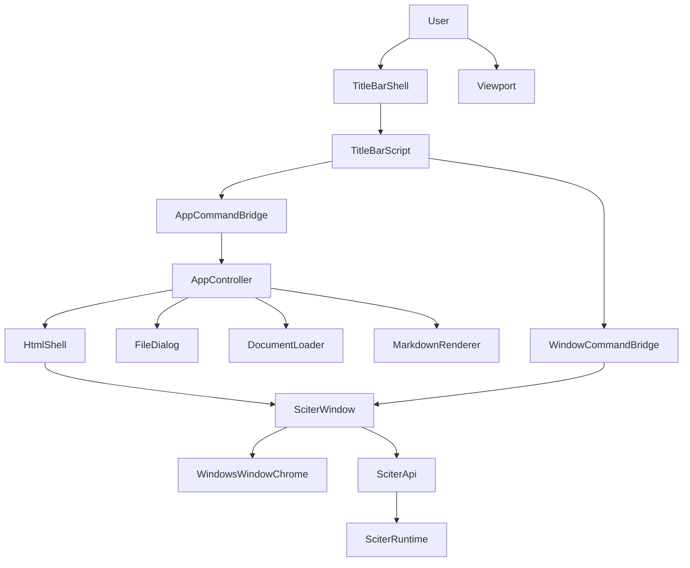
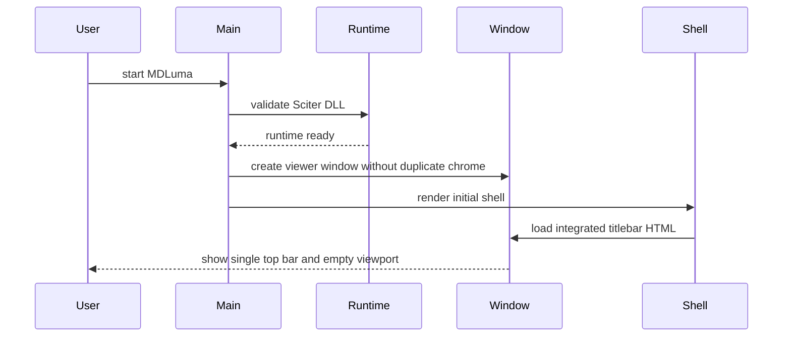
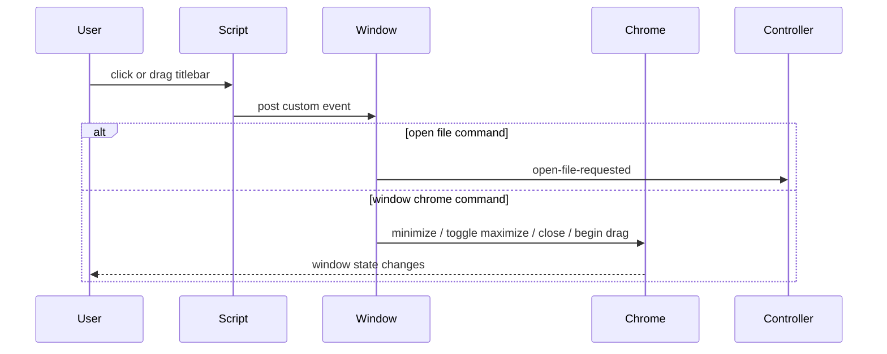
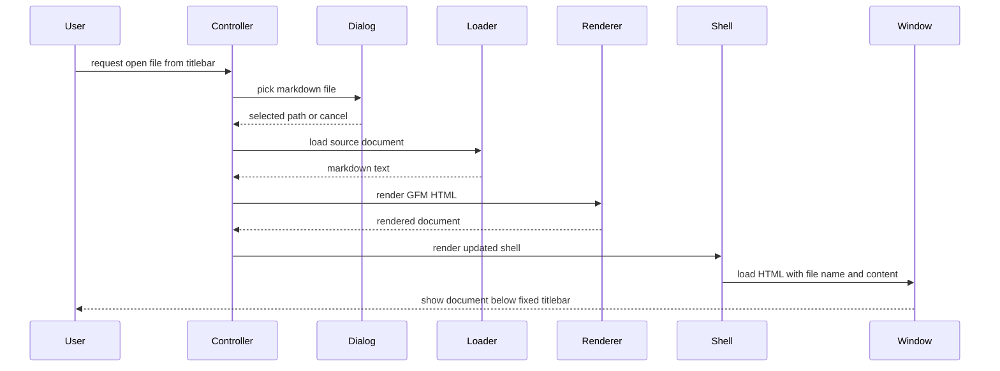

# Design Document

## Overview
この feature は、既存の MDLuma viewer を「Windows 標準タイトルバー」と「本文内ヘッダー」が分離した状態から、単一の統合タイトルバーを持つ viewer へ拡張する。ユーザーが見る上端 UI は 1 本だけとし、そこへアプリ識別、現在ファイル名、将来コマンドのプレースホルダー、ウィンドウ操作を集約する。

既存の document pipeline は維持し、変更は titlebar shell、scroll layout、window command routing、Windows host adapter に集中させる。open file は従来どおり `AppController` の責務に残し、最小化・最大化/元に戻す・終了・ドラッグ移動は `SciterWindow` と Windows 専用 adapter が処理する。

### Goals
- ユーザー可視な上部 UI を単一の統合タイトルバーにする。
- タイトルバーを固定し、本文とエラー表示だけをその下でスクロールさせる。
- open file と window chrome の責務を分離しつつ、既存の viewer-only 境界を保つ。
- 新しい dependency を追加せず、Rust + Sciter.js SDK + User32 の既存前提で完結させる。

### Non-Goals
- search、theme、more の機能実装。
- Markdown 編集、保存、複数文書、複数タブ。
- Windows snap layout、独自リサイズヒットテスト、複雑な non-client 再実装。
- packaging / installer / code signing / macOS / Linux 向け window chrome。

## Boundary Commitments

### This Spec Owns
- 統合タイトルバーの DOM、CSS、JS と、その下の scroll viewport 構造。
- アプリ名、ファイル名、利用不可コントロール、window control icon の表示契約。
- titlebar から発火する app command と window chrome command の routing。
- Windows 専用の `minimize`、`toggle maximize`、`close`、`begin drag` adapter。
- 二重の上部 UI を避けるための Sciter window creation mode 更新。

### Out of Boundary
- search/theme/more の active behavior。
- document pipeline の責務変更。
- 編集、保存、複数文書、外部アプリ連携。
- Windows 以外の OS に対する custom titlebar 実装。
- custom resize grip、system menu 拡張、snap assist 固有挙動。

### Allowed Dependencies
- 既存 `AppController`、`ViewerState`、`HtmlShell`、`UiAssets`、`SciterRuntime`。
- Sciter.js SDK と既存 `SciterWindowHandle`。
- Windows User32 API。ただし `src/platform/windows_window_chrome.rs` に閉じ込める。
- 既存 asset 群。window control icon は `assets/light/window-*.svg` を使う。
- 既存 Comrak / runtime packaging 前提。新しい crate は追加しない。

### Revalidation Triggers
- titlebar 上の search/theme/more が active command になる。
- single-document viewer から複数文書または複数 window に拡張する。
- Sciter window handle の前提、creation flags、runtime API が変わる。
- Windows 以外にも custom titlebar を同じ spec で持たせる。
- custom resize / snap / system menu まで responsibility を広げる。

## Architecture

### Existing Architecture Analysis
既存実装には `src/ui/index.html` の `.titlebar`、`src/ui/app.js` の `open-file-requested` dispatch、`src/sciter/window.rs` の event bridge、`src/app.rs` の `AppController` がある。つまり viewer shell と app command routing は既に存在する。

一方で `src/sciter/ffi.rs` の `SciterCreateWindow` は `SW_TITLEBAR | SW_CONTROLS` を使っており、OS 標準 chrome と HTML shell の titlebar が重なる。また `.titlebar` は通常フロー要素なので、長文表示時に本文と一緒に動く。この feature では「二重 chrome の解消」と「scroll container 分離」を同時に解決する。

### Architecture Pattern & Boundary Map



**Architecture Integration**:
- Selected pattern: 既存 viewer への拡張。document command と window command を分離した split routing を採用する。
- Domain/feature boundaries: 文書表示は `AppController`、shell composition は `HtmlShell`、native window 操作は `WindowsWindowChrome` が所有する。
- Existing patterns preserved: custom event bridge、single `ViewerState`、local-only asset policy、Rust 主導の runtime integration。
- New components rationale: `WindowsWindowChrome` は OS 固有責務を 1 箇所に閉じ込めるため、`viewer-viewport` は固定 titlebar と本文スクロールを分離するために必要。
- Steering compliance: lightweight、Windows-first、viewer-only、no new dependency を維持する。`.kiro/steering/` は未整備なので `design/initialdesign.md` と既存コードパターンを優先する。

### Technology Stack

| Layer | Choice / Version | Role in Feature | Notes |
|-------|------------------|-----------------|-------|
| Application | Rust stable / 2021 edition | command routing、state orchestration | 既存 codebase を継続 |
| Viewer Rendering | Comrak `0.52.x` | GFM Markdown to HTML | 変更なし |
| UI Shell | Sciter HTML/CSS/JS | 統合タイトルバーと scroll viewport | `index.html` / `styles.css` / `app.js` を更新 |
| Runtime | Sciter.js SDK public DLL | desktop window と HTML host | 二重 chrome を避ける window mode へ更新 |
| Platform | Windows User32 | minimize、maximize/restore、close、drag | 新規 `windows_window_chrome.rs` に隔離 |
| Assets | Existing SVG icons | app/open/search/more/window control icons | remote resource は禁止 |

## File Structure Plan

### Directory Structure
```text
Cargo.toml                              # 既存 dependencies。新規 crate は追加しない
src/
├── main.rs                             # 起動と runtime prerequisite failure の最終表示
├── app.rs                              # AppController。open-file 系 command のみを処理
├── document.rs                         # read-only Markdown file loading
├── markdown.rs                         # Comrak GFM rendering
├── errors.rs                           # ViewerError と user/operator diagnostics
├── html_shell.rs                       # 統合タイトルバー shell と viewport DOM を組み立てる
├── platform/
│   ├── mod.rs                          # Windows platform helpers の export
│   ├── windows_file_dialog.rs          # 既存 file picker
│   └── windows_window_chrome.rs        # 新規。HWND に対する drag/minimize/maximize/close
├── sciter/
│   ├── ffi.rs                          # Sciter window creation flags と raw API boundary
│   ├── runtime.rs                      # Sciter DLL validation
│   └── window.rs                       # event bridge、window command routing、HTML load
└── ui/
    ├── mod.rs                          # icon asset 名と local file URL 解決
    ├── index.html                      # 単一 titlebar と viewport shell
    ├── styles.css                      # fixed titlebar / viewport scroll / button affordance
    └── app.js                          # open-file と window chrome event dispatch
```

### Modified Files
- `src/html_shell.rs` — window control icons、viewport wrapper、titlebar 表示項目の placeholder を追加する。
- `src/ui/mod.rs` — `window-minimize`、`window-maximize`、`window-close` icon を local asset として解決できるようにする。
- `src/ui/index.html` — タイトルバーを唯一の上部 UI とし、drag region と利用不可コントロールの状態を明示する。
- `src/ui/styles.css` — body scroll を止め、titlebar 固定と viewport scroll の責務を分ける。
- `src/ui/app.js` — `open-file-requested` に加えて `window-minimize-requested`、`window-toggle-maximize-requested`、`window-close-requested`、`window-drag-requested` を発火する。
- `src/sciter/window.rs` — app command と window command を振り分け、window command は内部処理する。
- `src/sciter/ffi.rs` — duplicated chrome を避ける create-window 設定へ更新する。
- `src/platform/mod.rs` — 新規 window chrome adapter を export する。
- `src/platform/windows_window_chrome.rs` — HWND ベースの native window 操作を実装する。

## System Flows

### 起動と統合タイトルバー表示


起動失敗時の prerequisite 診断は既存 `main.rs` / `SciterRuntime` の責務を維持する。titlebar 固定は runtime 後の shell layout で成立させる。

### タイトルバー操作 routing


この flow の要点は、window state を変える command が `AppController` に入らないことにある。viewer state と OS window state を混ぜない。

### Markdown ファイル表示更新


cancel は現在表示を保持し、read/render 失敗は既存 shell か error view へ落とす。titlebar 自体は維持される。

## Requirements Traceability

| Requirement | Summary | Components | Interfaces | Flows |
|-------------|---------|------------|------------|-------|
| 1.1 | 単一の統合タイトルバーを表示 | `DefaultHtmlShell`, `ui/index.html`, `SciterWindow` | `HtmlShell::render_shell` | 起動と統合タイトルバー表示 |
| 1.2 | タイトルバー内に app icon / app name を表示 | `DefaultHtmlShell`, `UiAssets`, `ui/index.html` | `ShellModel.app_name`, `UiAssets::icon_url` | 起動と統合タイトルバー表示 |
| 1.3 | 別の可視タイトル行やメニュー行を追加表示しない | `SciterWindow`, `SciterApi`, `ui/index.html` | `SciterApi::create_window` | 起動と統合タイトルバー表示 |
| 1.4 | タイトルバーから最小化 | `TitleBarInteractionScript`, `SciterWindow`, `WindowsWindowChrome` | `window-minimize-requested`, `WindowChromeAction::Minimize` | タイトルバー操作 routing |
| 1.5 | タイトルバーから最大化/元に戻す | `TitleBarInteractionScript`, `SciterWindow`, `WindowsWindowChrome` | `window-toggle-maximize-requested`, `WindowChromeAction::ToggleMaximize` | タイトルバー操作 routing |
| 1.6 | タイトルバーから閉じる | `TitleBarInteractionScript`, `SciterWindow`, `WindowsWindowChrome` | `window-close-requested`, `WindowChromeAction::Close` | タイトルバー操作 routing |
| 1.7 | タイトルバー非ボタン領域でドラッグ移動 | `TitleBarInteractionScript`, `SciterWindow`, `WindowsWindowChrome` | `window-drag-requested`, `WindowChromeAction::BeginDrag` | タイトルバー操作 routing |
| 2.1 | タイトルバーを上端に表示し続ける | `ui/index.html`, `ui/styles.css` | shell layout contract | 起動と統合タイトルバー表示 |
| 2.2 | 文書表示領域のみスクロール | `ui/index.html`, `ui/styles.css` | `viewer-viewport` layout contract | 起動と統合タイトルバー表示 |
| 2.3 | error/content を titlebar 下に置く | `DefaultHtmlShell`, `ui/index.html`, `ui/styles.css` | `ShellModel.state` | 起動と統合タイトルバー表示 |
| 3.1 | 未読込時でも open control を表示 | `DefaultHtmlShell`, `ui/index.html` | `ViewerState::NoDocument` | 起動と統合タイトルバー表示 |
| 3.2 | タイトルバーから file selection flow 開始 | `TitleBarInteractionScript`, `SciterWindow`, `AppController` | `open-file-requested`, `AppController::open_file_requested` | タイトルバー操作 routing |
| 3.3 | 読み込んだ file name を titlebar に表示 | `DefaultHtmlShell`, `ViewerState`, `ui/index.html` | `ViewerState::current_document` | Markdown ファイル表示更新 |
| 3.4 | file dialog cancel で状態保持 | `AppController`, `WindowsFileDialog` | `OpenFileResult::Cancelled` | Markdown ファイル表示更新 |
| 3.5 | 読み込み失敗を window 内に表示 | `AppController`, `ViewerError`, `SciterWindow` | `ViewerError::file_read`, `ViewerUi::show_error` | Markdown ファイル表示更新 |
| 4.1 | 整形済み文書を titlebar 下へ表示 | `ComrakMarkdownRenderer`, `DefaultHtmlShell`, `SciterWindow` | `MarkdownRenderer::render`, `ViewerUi::show_document` | Markdown ファイル表示更新 |
| 4.2 | GFM 構文を読み取り可能に表示 | `ComrakMarkdownRenderer` | `MarkdownOptions::gfm_viewer` | Markdown ファイル表示更新 |
| 4.3 | 未対応/不正構文でも best-effort 表示 | `ComrakMarkdownRenderer`, `ViewerError` | `MarkdownRenderer::render` | Markdown ファイル表示更新 |
| 4.4 | ネットワーク接続を要求しない | `DefaultHtmlShell`, `UiAssets`, `ResourcePolicy` | `ensure_local_only`, `UiAssets::icon_url` | 起動と統合タイトルバー表示 |
| 5.1 | 読み取り専用表示 | `AppController`, `FileDocumentLoader`, `ui/index.html` | `DocumentLoader::load` | Markdown ファイル表示更新 |
| 5.2 | 編集操作を提供しない | `ui/index.html`, `TitleBarInteractionScript` | titlebar control manifest | 起動と統合タイトルバー表示 |
| 5.3 | 保存/上書きを提供しない | `ui/index.html`, `TitleBarInteractionScript` | titlebar control manifest | 起動と統合タイトルバー表示 |
| 5.4 | 閲覧操作で source file を変更しない | `FileDocumentLoader`, `AppController` | read-only load path | Markdown ファイル表示更新 |
| 6.1 | 単一ローカル Markdown file に限定 | `ViewerState`, `AppController` | `ViewerState::document_count` | Markdown ファイル表示更新 |
| 6.2 | 未提供 control を利用不可状態で表示 | `ui/index.html`, `ui/styles.css`, `TitleBarInteractionScript` | disabled control contract | 起動と統合タイトルバー表示 |
| 6.3 | 未提供 control を選択しても表示と window state を保持 | `TitleBarInteractionScript`, `SciterWindow` | disabled action guard | タイトルバー操作 routing |
| 6.4 | search/theme/tabs/multi-doc を提供しない | `AppController`, `ViewerState`, `ui/index.html` | single document command set | 起動と統合タイトルバー表示 |
| 7.1 | 開発環境なしで起動 | `SciterRuntime`, `SciterWindow`, `main.rs` | runtime prerequisite check | 起動と統合タイトルバー表示 |
| 7.2 | 実行時ファイルを配布物に含める | `SciterRuntime`, `UiAssets` | runtime asset lookup contract | 起動と統合タイトルバー表示 |
| 7.3 | prerequisite failure を確認可能な状態で示す | `SciterRuntime`, `ViewerError`, `main.rs` | `ViewerError::ui`, operator diagnostics | 起動と統合タイトルバー表示 |

## Components and Interfaces

| Component | Domain/Layer | Intent | Req Coverage | Key Dependencies | Contracts |
|-----------|--------------|--------|--------------|------------------|-----------|
| `AppController` | Application | open-file 系 viewer flow を調停する | 3.2, 3.4, 3.5, 5.1, 5.4, 6.1, 6.4 | `WindowsFileDialog` P0, `FileDocumentLoader` P0, `ComrakMarkdownRenderer` P0, `DefaultHtmlShell` P0, `SciterWindow` P0 | Service, State |
| `DefaultHtmlShell` | UI Composition | 統合タイトルバー shell と viewport を HTML 化する | 1.1, 1.2, 2.3, 3.1, 3.3, 4.1, 4.4, 6.2 | `UiAssets` P0, `ViewerState` P0 | Service |
| `TitleBarInteractionScript` | UI Behavior | titlebar DOM event を app/window command に変換する | 1.4, 1.5, 1.6, 1.7, 3.2, 6.2, 6.3 | `ui/index.html` P0 | Service |
| `UiAssets` | UI Assets | local shell / icon asset を解決する | 1.2, 4.4, 7.2 | runtime directory P1 | Service |
| `SciterWindow` | Runtime UI | HTML load、event bridge、window command routing を担う | 1.3, 1.4, 1.5, 1.6, 1.7, 3.2, 3.5, 7.1, 7.3 | `SciterApi` P0, `WindowsWindowChrome` P0 | Service |
| `WindowsWindowChrome` | Platform | HWND に対する native window 操作を提供する | 1.4, 1.5, 1.6, 1.7 | User32 P0 | Service |
| `SciterRuntime` | Runtime | DLL presence と API availability を検証する | 7.1, 7.2, 7.3 | Sciter DLL P0 | Service |
| `WindowsFileDialog` | Platform | ローカル Markdown file selection / cancel を返す | 3.2, 3.4 | User32 / dialog API P0 | Service |
| `FileDocumentLoader` | File IO | Markdown source と file metadata を読み出す | 3.5, 5.1, 5.4 | filesystem P0 | Service |
| `ComrakMarkdownRenderer` | Rendering | GFM Markdown を HTML fragment へ変換する | 4.1, 4.2, 4.3 | Comrak P0 | Service |

### UI Composition Layer

#### DefaultHtmlShell

| Field | Detail |
|-------|--------|
| Intent | titlebar、viewport、error/content を含む単一 shell document を生成する |
| Requirements | 1.1, 1.2, 2.3, 3.1, 3.3, 4.1, 4.4, 6.2 |

**Responsibilities & Constraints**
- タイトルバーと本文 viewport の sibling 構造を定義する。
- 既存 `ViewerState` から app name、file name、error、content を導出する。
- すべての icon / template / script / style を local-only resource として注入する。
- disabled control は shell 側で可視状態を固定し、active behavior は持たない。

**Dependencies**
- Inbound: `AppController` — current state rendering (P0)
- Outbound: `UiAssets` — template / icon resolution (P0)

**Contracts**: Service [x] / API [ ] / Event [ ] / Batch [ ] / State [ ]

##### Service Interface
```rust
pub trait HtmlShell {
    fn render_shell(&self, model: ShellModel<'_>) -> Result<String, ViewerError>;
}
```
- Preconditions: `ShellModel.state` は `ViewerState` のいずれかの正当値である。
- Postconditions: 戻り値 HTML は統合タイトルバーと viewport 構造を必ず含む。
- Invariants: remote URL は shell 内へ入れない。

**Implementation Notes**
- Integration: `src/ui/index.html` / `styles.css` / `app.js` と `UiAssets::icon_url()` を束ねる。
- Validation: shell tests で `data-current-file`、`data-error-area`、viewport 構造、window icon placeholder を検証する。
- Risks: icon 追加時に `ensure_local_only()` を通さないと policy drift を起こす。

#### TitleBarInteractionScript

| Field | Detail |
|-------|--------|
| Intent | titlebar 上の click / drag を custom event に変換する |
| Requirements | 1.4, 1.5, 1.6, 1.7, 3.2, 6.2, 6.3 |

**Responsibilities & Constraints**
- `open-file-requested` と window chrome request 群だけを発火する。
- disabled control への入力は swallow し、viewer state も window state も変更しない。
- drag request は titlebar 非ボタン領域だけから発火する。
- 編集、保存、search、theme 実行 command は追加しない。

**Dependencies**
- Inbound: `src/ui/index.html` — DOM action markers (P0)
- Outbound: `SciterWindow` event bridge — custom event delivery (P0)

**Contracts**: Service [x] / API [ ] / Event [x] / Batch [ ] / State [ ]

##### Event Contract
- Published events:
  - `open-file-requested`
  - `window-minimize-requested`
  - `window-toggle-maximize-requested`
  - `window-close-requested`
  - `window-drag-requested`
- Subscribed events: DOM `click` / `mousedown` on titlebar controls
- Ordering / delivery guarantees: 単一ユーザー入力につき最大 1 command を post する。disabled control では event を publish しない。

**Implementation Notes**
- Integration: `data-action` と `data-drag-region` を HTML 側で明示する。
- Validation: JS asset tests で command 名、disabled guard、drag button 除外を検証する。
- Risks: event 名 drift があると `SciterWindow` 側の parser と不整合になる。

### Runtime Layer

#### SciterWindow

| Field | Detail |
|-------|--------|
| Intent | HTML 表示と titlebar event bridge を管理し、window command を native adapter へ渡す |
| Requirements | 1.3, 1.4, 1.5, 1.6, 1.7, 3.2, 3.5, 7.1, 7.3 |

**Responsibilities & Constraints**
- duplicated chrome を避ける window 作成設定を使う。
- `open-file-requested` だけを `ViewerCommandHandler` へ forward する。
- minimize / maximize / close / drag は `WindowsWindowChrome` へ委譲する。
- window command は document state を変更しない。

**Dependencies**
- Inbound: `main.rs` — window construction (P0)
- Inbound: `DefaultHtmlShell` — HTML payload (P0)
- Outbound: `SciterApi` — create/load/attach event handler (P0)
- Outbound: `WindowsWindowChrome` — native window action execution (P0)
- Outbound: `ViewerCommandHandler` — open-file dispatch only (P0)

**Contracts**: Service [x] / API [ ] / Event [x] / Batch [ ] / State [ ]

##### Service Interface
```rust
pub trait ViewerUi {
    fn show_initial(&mut self, html: &str) -> Result<(), ViewerError>;
    fn show_document(&mut self, html: &str) -> Result<(), ViewerError>;
    fn show_error(&mut self, error: &ViewerError) -> Result<(), ViewerError>;
    fn run_event_loop(&mut self) -> Result<(), ViewerError>;
}

enum WindowChromeAction {
    BeginDrag,
    Minimize,
    ToggleMaximize,
    Close,
}
```
- Preconditions: `SciterRuntime` が DLL と API を検証済みである。
- Postconditions: app command は handler に 1 回だけ伝わり、window command は native adapter で完結する。
- Invariants: `SciterWindow` は raw HWND を直接 app layer へ公開しない。

**Implementation Notes**
- Integration: `viewer_command_event_proc` は command 名により forward / native execute を分ける。
- Validation: parser tests と dispatch tests で `open-file` と `window-*` の routing を固定する。
- Risks: creation flags 変更時に既存 `ffi.rs` テスト期待値が古くなる。

#### WindowsWindowChrome

| Field | Detail |
|-------|--------|
| Intent | HWND に対する最小の Windows 標準 window 操作を提供する |
| Requirements | 1.4, 1.5, 1.6, 1.7 |

**Responsibilities & Constraints**
- `minimize`、`toggle_maximize`、`close`、`begin_drag` だけを持つ。
- User32 呼び出しと HWND 前提を platform file に閉じ込める。
- viewer state、HTML、document pipeline には触れない。
- custom resize hit-test や独自 system menu は扱わない。

**Dependencies**
- Inbound: `SciterWindow` — action dispatch (P0)
- External: User32 — `ShowWindow`、drag 開始、window close (P0)

**Contracts**: Service [x] / API [ ] / Event [ ] / Batch [ ] / State [ ]

##### Service Interface
```rust
pub struct WindowChromeState {
    pub maximized: bool,
}

pub trait WindowChromeController {
    fn minimize(&self, hwnd: SciterWindowHandle) -> Result<(), ViewerError>;
    fn toggle_maximize(&self, hwnd: SciterWindowHandle) -> Result<WindowChromeState, ViewerError>;
    fn close(&self, hwnd: SciterWindowHandle) -> Result<(), ViewerError>;
    fn begin_drag(&self, hwnd: SciterWindowHandle) -> Result<(), ViewerError>;
}
```
- Preconditions: `hwnd` は live な top-level viewer window を指す。
- Postconditions: action 成功時、OS window state は要求どおりに遷移する。
- Invariants: file system や `ViewerState` は変更しない。

**Implementation Notes**
- Integration: maximize toggle は現在状態を問い合わせて maximize / restore を切り替える。
- Validation: Win32 wrapper seams を fake 化して minimize/maximize/restore/close/drag の分岐を unit test 化する。
- Risks: Windows 専用 module のため cross-platform implementation は別 spec で再評価が必要。

### Existing Viewer Pipeline

`AppController`、`WindowsFileDialog`、`FileDocumentLoader`、`ComrakMarkdownRenderer`、`SciterRuntime` は summary table の責務を維持し、今回の変更で ownership は増やさない。特に `AppController` は open-file flow と `ViewerState` 更新に限定し、window chrome command は受け取らない。

## Data Models

### Domain Model
- `ViewerState`
  - `NoDocument`
  - `DocumentLoaded(RenderedDocument)`
  - `ErrorVisible { previous, error }`
- `WindowChromeAction`
  - `BeginDrag`
  - `Minimize`
  - `ToggleMaximize`
  - `Close`

`ViewerState` は既存の single-document model を維持する。統合タイトルバー導入のために新しい永続 state は追加しない。

### Logical Data Model
- titlebar 表示は `ViewerState.current_document()` と固定 control manifest から導出する。
- disabled control の状態は shell markup の責務であり、persist しない。
- `WindowChromeState` は maximize toggle 判定のための一時情報で、viewer model には保存しない。

## Error Handling

### Error Strategy
- file dialog cancel は error ではなく no-op として扱う。
- file read / render failure は既存の `ViewerError` に乗せ、window 内表示へ落とす。
- window chrome action failure は document state を変えず、operator diagnostic を持つ `ViewerError::ui(...)` に変換する。
- runtime prerequisite failure は event loop 開始前に surface する。

### Error Categories and Responses
- User Errors: file open cancel → 状態保持、無効 control 操作 → no-op
- System Errors: Sciter DLL 欠落 / native window action failure → 診断可能な UI failure
- Business Logic Errors: 該当なし。viewer-only scope のため window chrome に business rule は持たない

### Monitoring
- 新しい telemetry は追加しない。
- unit / integration tests と operator diagnostic text を主な検証手段とする。

## Testing Strategy

### Unit Tests
- `src/ui/app.js`: `open-file`、`window-minimize`、`window-toggle-maximize`、`window-close`、`window-drag` の event 名と disabled guard を確認する。対象要件: 1.4, 1.5, 1.6, 1.7, 6.3
- `src/ui/mod.rs` / `src/html_shell.rs`: window control icon が local-only URL として注入されること、shell が titlebar + viewport sibling 構造を持つことを確認する。対象要件: 1.1, 1.2, 2.3, 4.4
- `src/sciter/window.rs`: `open-file-requested` だけが app handler に流れ、`window-*` は native path に流れることを確認する。対象要件: 1.4, 1.5, 1.6, 1.7, 3.2
- `src/platform/windows_window_chrome.rs`: minimize、toggle maximize/restore、close、begin drag の分岐を fake Win32 seam で確認する。対象要件: 1.4, 1.5, 1.6, 1.7

### Integration Tests
- `src/sciter/ffi.rs`: duplicated chrome を避ける window creation mode と main-window visibility を確認する。対象要件: 1.3, 7.1
- `src/html_shell.rs` + `src/ui/index.html`: initial shell が open control、disabled future controls、window controls、file name placeholder を含むことを確認する。対象要件: 3.1, 3.3, 6.2
- `src/app.rs`: open-file success で titlebar file name が更新され、cancel で state が維持され、failure で error view へ落ちることを確認する。対象要件: 3.3, 3.4, 3.5, 4.1, 5.4

### E2E / UI Tests
- 起動直後に単一の上部バーだけが表示され、標準タイトルバー由来の追加行が見えないことを確認する。対象要件: 1.1, 1.2, 1.3
- 長い Markdown を表示してスクロールしたとき、titlebar は固定され、本文だけが動くことを確認する。対象要件: 2.1, 2.2, 2.3
- titlebar の minimize / maximize / close / drag が viewer content を壊さず動作することを確認する。対象要件: 1.4, 1.5, 1.6, 1.7, 5.4
