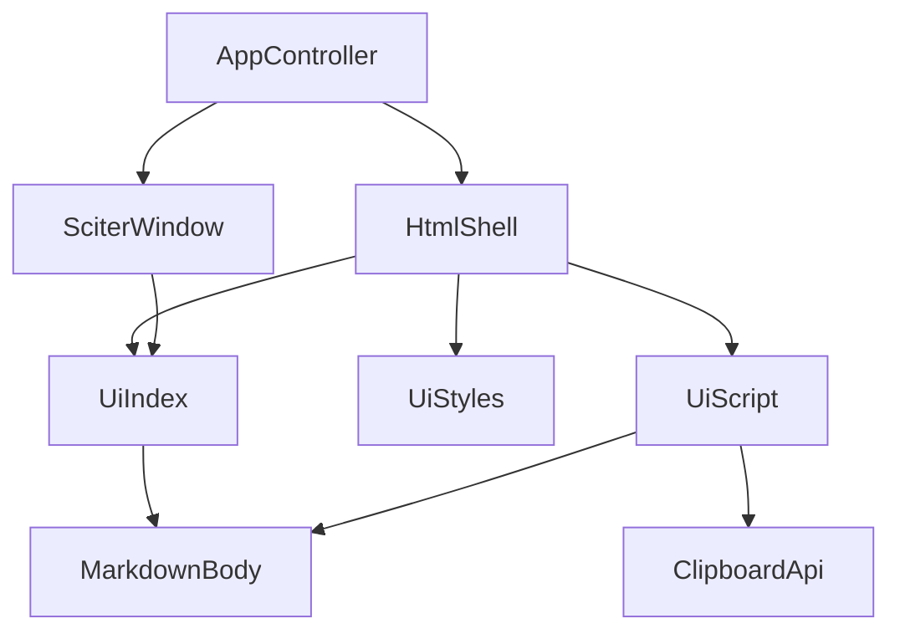
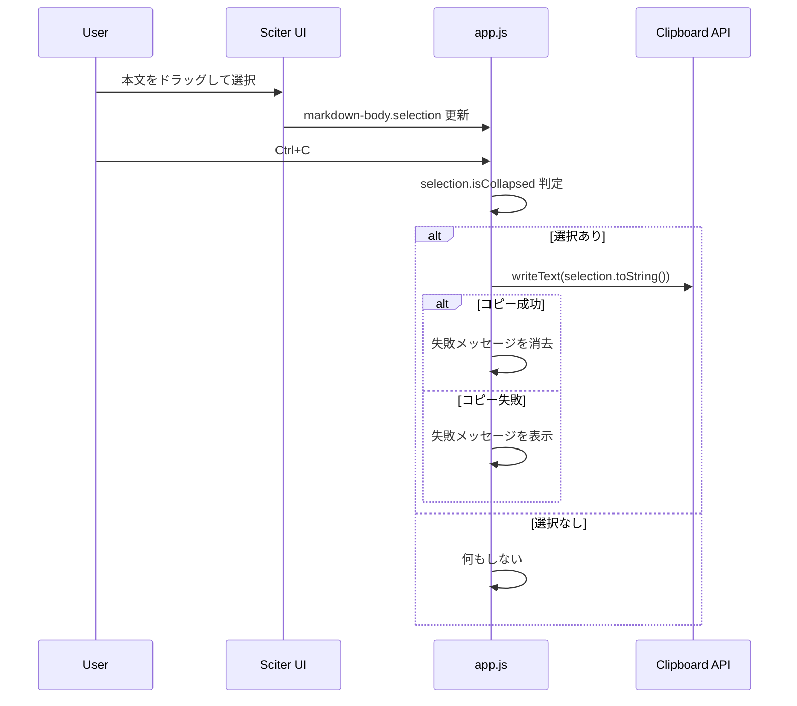

# Design Document

## Overview
この feature は、MDLuma の読み取り専用 Markdown 表示に対して、本文テキストの選択とコピーを追加する。対象は表示済み HTML 本文のみであり、Markdown ソース編集、保存、タイトルバー操作部の選択は扱わない。

既存アーキテクチャは `Markdown -> HTML -> Sciter window` の責務分離を採っているため、本 feature もその境界を保つ。選択とコピーは Sciter DOM と JS runtime の標準機能を使って UI 資産側へ閉じ込め、Rust 側のアプリ制御や FFI 層へ新しい責務を持ち込まない。

### Goals
- Markdown 本文上で連続テキストを複数行にわたって選択できるようにする。
- 選択中の表示テキストを `Ctrl+C` 相当の一般的なコピー操作で OS クリップボードへ送る。
- コピー失敗時も文書表示と読み取り専用状態を保ったまま、失敗をユーザーへ可視化する。

### Non-Goals
- Markdown 編集、保存、クリップボード履歴、複数選択の追加
- タイトルバー、ファイル名表示、ボタン群など本文外 UI の選択可能化
- 新しい Rust FFI、Windows 直叩きクリップボード実装、コンテキストメニュー追加

## Boundary Commitments

### This Spec Owns
- `article.markdown-body` を選択可能な本文領域として定義すること
- 本文選択の有無判定、選択文字列の抽出、コピーショートカット処理
- コピー失敗時の UI メッセージ表示と、文書切り替え時のそのリセット

### Out of Boundary
- Markdown ソースデータの変更、保存、編集モード遷移
- 本文外 UI テキストの選択とコピー
- 検索、テーマ切替、右クリックメニュー、アプリメニューとの統合

### Allowed Dependencies
- `src/html_shell.rs` による本文 `article` 出力
- `src/ui/index.html`、`src/ui/styles.css`、`src/ui/app.js` の UI 資産
- Sciter 公式 DOM 選択 API と `Clipboard` namespace
- 既存の `SciterLoadHtml` ベース文書差し替え挙動

### Revalidation Triggers
- `html_shell.rs` が本文ラッパーのタグ名、属性、クラス名を変更する
- `src/ui/app.js` にグローバルキーボードショートカットが追加される
- Sciter runtime 更新で `Element.Selection` または `Clipboard.writeText()` の契約が変わる
- `ViewerState` の表示差し替え方式が全文再読み込みから部分更新へ変わる

## Architecture

### Existing Architecture Analysis
- 現在の本文表示は `AppController` が Markdown を HTML 化し、`DefaultHtmlShell` が `{{CONTENT}}` へ埋め込んだ 1 枚の HTML を `SciterWindow::load_html()` へ渡す。
- UI 固有操作のうち Rust に渡す必要があるものは `Window.this.xcall()` と `ViewerCommand` で扱うが、本 feature の選択とクリップボード連携は Sciter JS runtime 内で完結できる。
- エラー表示は `data-error-area` に描画済みのロード系メッセージがあるため、コピー失敗はそこへ局所メッセージを追加・更新する形が最小である。

### Architecture Pattern & Boundary Map


**Architecture Integration**:
- Selected pattern: 既存 UI 資産拡張。本文選択とコピーを DOM/JS 層へ閉じ込め、Rust は文書供給だけを継続する。
- Domain/feature boundaries: Rust は文書生成と表示切替、UI 資産は選択・コピー・一時メッセージを担当する。
- Existing patterns preserved: `HtmlShell` による単一 HTML 生成、`ViewerState` による読み取り専用表示、`xcall()` の最小利用。
- New components rationale: 新規モジュールは増やさず、本文選択ハンドラとコピー失敗メッセージ制御を `app.js` に追加する。
- Steering compliance: 軽量性、単純さ、読み取り専用境界を維持する。

### Technology Stack

| Layer | Choice / Version | Role in Feature | Notes |
|-------|------------------|-----------------|-------|
| Frontend / CLI | Sciter.js SDK DOM/Event/Clipboard | 本文選択、ショートカット、クリップボード連携 | 新規依存追加なし |
| Backend / Services | Rust 2021 existing app/controller | 文書 HTML を再生成して UI へ供給 | 新規責務追加なし |
| Data / Storage | なし | 永続データなし | クリップボードは OS 所有 |
| Messaging / Events | Sciter `keydown` and DOM selection state | コピー操作と状態更新 | `xcall()` 不要 |
| Infrastructure / Runtime | Sciter runtime packaged DLL | HTML 表示と OS クリップボード橋渡し | 既存前提を維持 |

## File Structure Plan

### Directory Structure
```text
src/
├── app.rs                 # 既存の文書切り替え制御。選択リセットはこの再描画境界に依存する
├── html_shell.rs          # 本文 article の属性とエラー領域を組み立てる
├── sciter/
│   └── window.rs          # 既存の HTML 全文読み込み窓口。文書差し替え時に旧 selection を破棄する
└── ui/
    ├── index.html         # 本文選択対象とコピー失敗メッセージの DOM アンカー
    ├── styles.css         # 本文選択可視化とコピー状態メッセージの見た目
    ├── app.js             # 選択判定、Ctrl+C 処理、クリップボード書き込み、UI メッセージ更新
    └── mod.rs             # UI 資産契約テスト
```

### Modified Files
- `src/html_shell.rs` — `article.markdown-body` を本文選択境界として識別できる属性を追加し、コピー失敗メッセージのアンカーを壊さない HTML 契約を固定する。
- `src/ui/index.html` — 本文選択対象要素と、ロード系エラーとは別に使えるコピー状態メッセージ領域を定義する。
- `src/ui/styles.css` — タイトルバーの `user-select: none` を維持しつつ、本文では選択可能状態と選択ハイライトを明示する。
- `src/ui/app.js` — 本文要素の取得、選択文字列抽出、`Ctrl+C` / `Meta+C` 処理、`Clipboard.writeText()` 結果に応じたメッセージ表示/クリアを追加する。
- `src/ui/mod.rs` — 追加された UI 資産契約とコピー関連スクリプト断片をテストで固定する。

## System Flows



文書切り替えは既存どおり `show_document()` による全文再読み込みで行う。この再描画時点で旧 DOM の selection は破棄され、新しい本文と空のコピー状態メッセージから始まる。

## Requirements Traceability

| Requirement | Summary | Components | Interfaces | Flows |
|-------------|---------|------------|------------|-------|
| 1.1 | 本文内で選択開始できる | `html_shell.rs`, `index.html`, `app.js` | 本文選択境界契約 | 本文選択とコピー |
| 1.2 | 複数行の連続テキストを選択できる | `index.html`, `styles.css` | Sciter `Element.Selection` | 本文選択とコピー |
| 1.3 | 選択範囲を視覚的に判別できる | `styles.css` | CSS selection styling | 本文選択とコピー |
| 1.4 | 本文外ドラッグを本文選択扱いしない | `index.html`, `styles.css` | 本文 DOM 境界 | 本文選択とコピー |
| 2.1 | 選択済み本文をクリップボードへコピーする | `app.js` | `Clipboard.writeText()` | 本文選択とコピー |
| 2.2 | Markdown 記法ではなく表示テキストをコピーする | `app.js` | `selection.toString()` | 本文選択とコピー |
| 2.3 | 改行をまたぐ順序を保ってコピーする | `app.js` | `selection.toString()` | 本文選択とコピー |
| 2.4 | 選択なしコピーで表示を維持する | `app.js` | keydown handler | 本文選択とコピー |
| 3.1 | 選択中も読み取り専用を維持する | `html_shell.rs`, `index.html` | `data-viewer-mode="read-only"` | 本文選択とコピー |
| 3.2 | 再選択で選択範囲が更新される | `app.js` | Sciter selection state | 本文選択とコピー |
| 3.3 | 文書切り替え時に旧選択を引き継がない | `AppController`, `SciterWindow`, `html_shell.rs` | `show_document()` 全文再描画 | 文書切り替え |
| 3.4 | 選択やコピーで元 Markdown を変更しない | Rust 読み取り専用経路全体, `app.js` | クリップボード書き込みのみ | 本文選択とコピー |
| 4.1 | コピー失敗を終了せず可視化する | `app.js`, `index.html`, `styles.css` | コピー状態メッセージ契約 | 本文選択とコピー |
| 4.2 | コピー失敗でも文書内容とウィンドウ状態を保持する | `app.js` | UI 局所メッセージ更新 | 本文選択とコピー |
| 4.3 | scope を選択とコピーに限定する | `design` 境界全体 | UI-only feature boundary | 全体 |

## Components and Interfaces

| Component | Domain/Layer | Intent | Req Coverage | Key Dependencies (P0/P1) | Contracts |
|-----------|--------------|--------|--------------|--------------------------|-----------|
| `DefaultHtmlShell` extension | Rust UI shell | 本文 `article` に選択境界属性を与える | 1.1, 1.4, 3.1, 3.3 | `ViewerState` (P0), UI assets (P1) | State |
| `MarkdownBody DOM contract` | HTML | 本文のみを選択対象として固定する | 1.1, 1.2, 1.4, 3.1 | `html_shell.rs` (P0), CSS/JS (P0) | State |
| `CopyInteractionController` | Sciter JS | 選択判定、コピーショートカット、失敗表示を扱う | 2.1, 2.2, 2.3, 2.4, 3.2, 4.1, 4.2 | `Clipboard` (P0), `markdown-body` DOM (P0) | Service, State |
| `SelectionPresentation` | CSS | 本文選択の可視化と失敗メッセージの見た目 | 1.3, 4.1 | DOM contract (P0) | State |
| `EmbeddedUiAssets` tests | Rust test support | UI 資産契約を固定する | 1.1, 2.1, 4.1 | `src/ui/*` (P1) | State |

### Rust UI Shell

#### DefaultHtmlShell extension

| Field | Detail |
|-------|--------|
| Intent | 本文 `article` を選択可能 feature の境界として出力する |
| Requirements | 1.1, 1.4, 3.1, 3.3 |

**Responsibilities & Constraints**
- `ViewerState` から生成する本文ラッパーに、UI スクリプトが安定して参照できる属性を与える。
- 読み取り専用属性 `data-viewer-mode="read-only"` を保持する。
- コピー失敗はロード系 `ViewerError` へ昇格させない。

**Dependencies**
- Inbound: `AppController` — 文書状態供給 (P0)
- Outbound: `src/ui/index.html` — DOM 契約適用先 (P0)
- Outbound: `src/ui/app.js` — 選択対象参照先 (P0)

**Contracts**: Service [ ] / API [ ] / Event [ ] / Batch [ ] / State [x]

##### State Management
- State model: 文書内容は既存 `ViewerState`、コピー失敗表示は UI 局所状態
- Persistence & consistency: 文書切り替え時は新 HTML に置き換え、旧選択を持ち越さない
- Concurrency strategy: 単一ウィンドウ・単一 DOM 前提

**Implementation Notes**
- Integration: `content_html()` が出力する `article.markdown-body` に選択境界属性を付与する。
- Validation: 生成 HTML 断片テストで属性と読み取り専用マーカーを確認する。
- Risks: クラス名や属性名を後で変えると `app.js` の参照が壊れる。

### Sciter UI Assets

#### MarkdownBody DOM contract

| Field | Detail |
|-------|--------|
| Intent | 本文だけを選択対象にする DOM 契約を固定する |
| Requirements | 1.1, 1.2, 1.4, 3.1 |

**Responsibilities & Constraints**
- 本文ラッパーは Sciter の選択対象として扱えること。
- タイトルバーやボタン群は `user-select: none` を維持すること。
- 失敗メッセージ領域は本文 DOM とは独立して更新できること。

**Dependencies**
- Inbound: `html_shell.rs` — 本文 HTML 注入 (P0)
- Outbound: `styles.css` — 選択可視化 (P1)
- Outbound: `app.js` — DOM 参照とメッセージ更新 (P0)

**Contracts**: Service [ ] / API [ ] / Event [ ] / Batch [ ] / State [x]

##### State Management
- State model: `data-markdown-body` とコピー状態メッセージ要素の DOM 状態
- Persistence & consistency: HTML 再読み込みで毎回初期化される
- Concurrency strategy: なし

**Implementation Notes**
- Integration: `selectable` 属性とコピー状態表示用 `data-copy-status` 要素を置く。
- Validation: DOM 契約テストで属性名とアンカーを固定する。
- Risks: error area の構造を変えすぎると既存ロード系エラー表示と競合する。

#### CopyInteractionController

| Field | Detail |
|-------|--------|
| Intent | 選択文字列の抽出とクリップボードコピーを扱う |
| Requirements | 2.1, 2.2, 2.3, 2.4, 3.2, 4.1, 4.2 |

**Responsibilities & Constraints**
- `Ctrl+C` / `Meta+C` を検知し、本文選択があるときだけコピーする。
- コピー対象は表示テキストであり、Markdown ソースではない。
- コピー失敗は UI メッセージへ変換し、アプリ終了や文書再描画を引き起こさない。

**Dependencies**
- Inbound: `document` keyboard events — コピー操作起点 (P0)
- Outbound: `Clipboard.writeText()` — OS クリップボード書き込み (P0)
- Outbound: `markdown-body.selection` — 選択状態取得 (P0)
- Outbound: `data-copy-status` — 失敗表示更新 (P1)

**Contracts**: Service [x] / API [ ] / Event [ ] / Batch [ ] / State [x]

##### Service Interface
```typescript
interface CopyInteractionController {
  initialize(): void;
  selectedText(): string;
  handleCopyShortcut(event: KeyboardEvent): void;
  showCopyFailure(message: string): void;
  clearCopyStatus(): void;
}
```
- Preconditions:
  - `document` が ready である。
  - `data-markdown-body` 要素が存在する場合のみ本文コピーを扱う。
- Postconditions:
  - 選択あり成功時はクリップボードへ表示テキストが書き込まれる。
  - 選択なし時は DOM とウィンドウ状態を変更しない。
  - 失敗時はユーザー可視メッセージが更新される。
- Invariants:
  - Markdown ファイル内容は変更しない。
  - Rust 側の `ViewerCommand` は増やさない。

##### State Management
- State model: `copyStatusMessage: string | null` を DOM に反映
- Persistence & consistency: 文書再読み込みまたは成功コピー時にクリア
- Concurrency strategy: 同期ハンドラで逐次処理

**Implementation Notes**
- Integration: 既存 `initializeInteractions()` にコピー初期化を追加し、open-file ハンドラと同じライフサイクルに乗せる。
- Validation: Node ベースの UI 資産テストへ、選択あり成功・選択なし・失敗時表示を追加する。
- Risks: Sciter の `KeyboardEvent` 差異を吸収するため `ctrlKey` と `metaKey` の両方を見る必要がある。

#### SelectionPresentation

| Field | Detail |
|-------|--------|
| Intent | 選択範囲とコピー失敗を視覚的に判別できるようにする |
| Requirements | 1.3, 4.1 |

**Responsibilities & Constraints**
- 本文の選択ハイライトを背景と十分なコントラストで表現する。
- 失敗メッセージは既存ロードエラーと混同しない位置・スタイルにする。

**Dependencies**
- Inbound: `index.html` DOM アンカー (P0)
- Outbound: Sciter selection paint and CSS pseudo selection (P1)

**Contracts**: Service [ ] / API [ ] / Event [ ] / Batch [ ] / State [x]

##### State Management
- State model: CSS による選択ハイライトとメッセージ可視状態
- Persistence & consistency: DOM 状態に追従
- Concurrency strategy: なし

**Implementation Notes**
- Integration: `.titlebar` の選択禁止は維持し、`.markdown-body` には選択を阻害しない宣言を与える。
- Validation: 埋め込み CSS テストで関連セレクタが残ることを確認する。
- Risks: Sciter の `::selection` 解釈差異がある場合はデフォルト選択色にフォールバックする。

## Data Models

### Domain Model
- 永続データモデルの追加はない。
- この feature の状態は 2 つだけで十分である。
  - 本文選択状態: Sciter DOM が所有する一時状態
  - コピー失敗表示状態: UI DOM が所有する一時状態
- Markdown ソース、レンダリング結果、ウィンドウ状態の所有者は既存コンポーネントのまま変えない。

### Logical Data Model
- `selectedText: string`
  - 由来: `markdownBody.selection.toString()`
  - 用途: `Clipboard.writeText()` 入力
  - 制約: 空文字列または collapsed selection の場合はコピー実行しない
- `copyStatus: { kind: "idle" | "failure"; message?: string }`
  - 由来: `app.js` 内部判定
  - 用途: `data-copy-status` 要素への反映
  - 制約: 文書切り替え時は `idle`

### Data Contracts & Integration
- Clipboard write input:
  - type: `string`
  - source: 表示中本文の選択文字列
  - success: `boolean true`
  - failure: `boolean false` または例外

## Error Handling

### Error Strategy
- ロード・変換・ウィンドウ更新失敗は既存どおり Rust の `ViewerError` が扱う。
- コピー失敗は UI 局所エラーとして扱い、文書再描画やアプリ終了を起こさない。
- 選択なしでのコピー操作はエラーにせず no-op とする。

### Error Categories and Responses
- User Errors: 選択なしで `Ctrl+C` — 何も変更しない。
- System Errors: `Clipboard.writeText()` 失敗または例外 — 失敗メッセージを表示し、文書表示は維持する。
- Business Logic Errors: なし。feature は読み取り専用境界を超えない。

### Monitoring
- この feature では新規ロギングは追加しない。
- 実装時のテストで失敗可視化と無終了性を保証する。

## Testing Strategy

### Unit Tests
- `src/ui/mod.rs`: `index.html` に本文選択境界属性とコピー状態アンカーが含まれることを確認する。
- `src/ui/mod.rs`: `app.js` が `Clipboard.writeText`、`ctrlKey` / `metaKey`、選択文字列抽出ロジックを含むことを確認する。
- `src/html_shell.rs`: 文書表示時の `article.markdown-body` が読み取り専用属性と選択境界属性を維持することを確認する。

### Integration Tests
- `src/ui/mod.rs` の Node 実行テストで、選択あり `Ctrl+C` が `Clipboard.writeText` を 1 回だけ呼ぶことを確認する。
- 同テストで、選択なし `Ctrl+C` がコピーもエラー表示も発生させないことを確認する。
- 同テストで、`Clipboard.writeText` が `false` または例外を返した場合に失敗メッセージが更新されることを確認する。

### E2E/UI Tests
- 実機または Sciter 統合検証で、本文を複数行選択して `Ctrl+C` した文字列が順序どおり貼り付けられることを確認する。
- 文書 A の選択後に文書 B を開き、A の選択ハイライトとコピー状態が引き継がれないことを確認する。
- コピー失敗を意図的にモックした環境で、失敗後もウィンドウが閉じず本文表示を維持することを確認する。

## Supporting References
- 詳細な調査根拠と Sciter API の採否は `research.md` を参照する。
