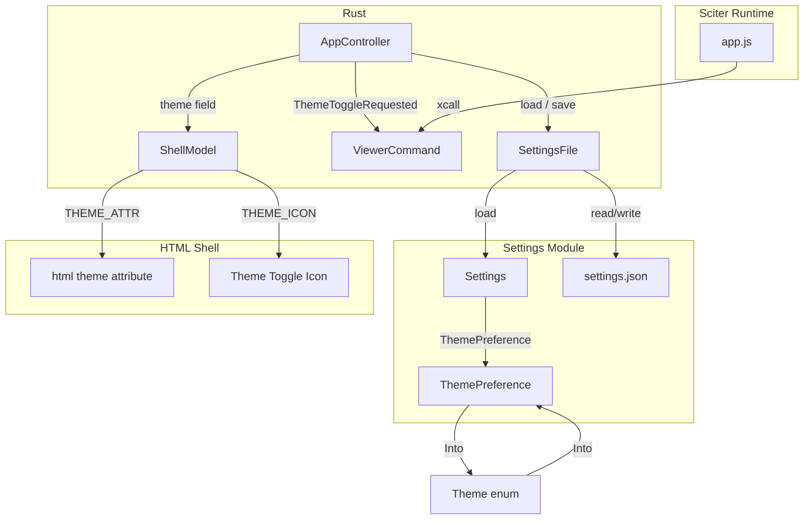
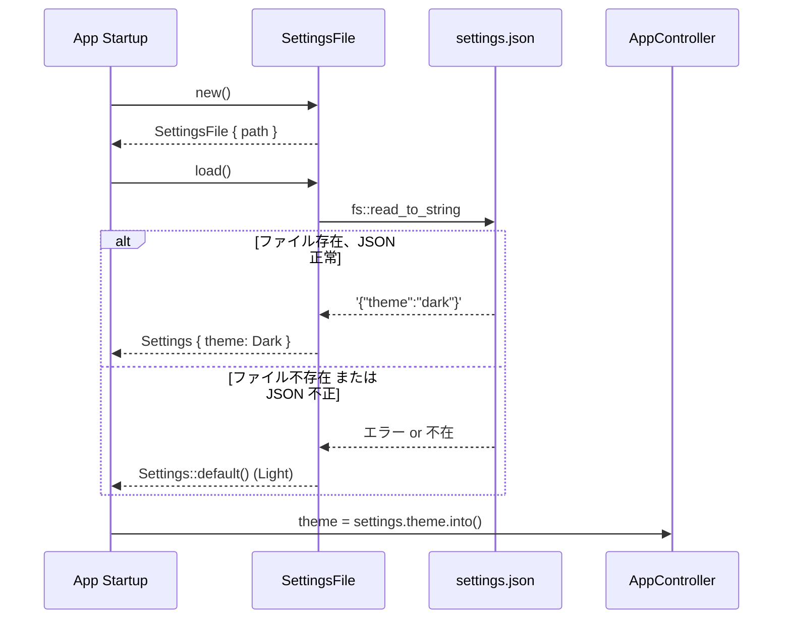
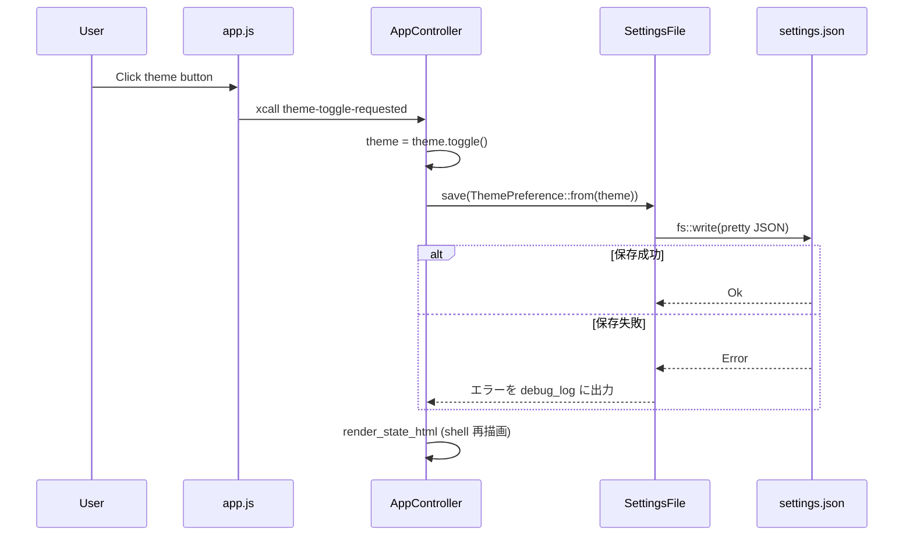

# Design Document

## Overview

theme-toggle spec へ設定ファイル永続化を追加する拡張設計。ユーザーが選択したテーマ（light/dark）は JSON 形式の設定ファイルに保存され、次回起動時に自動的に復元される。設定の保存はテーマ切り替え時に即座に行い、クラッシュや電源断でも最新のテーマ選択が失われない堅牢な設計とする。

設定ファイルは `%LOCALAPPDATA%\MDLuma\settings.json` に配置し、既存の `debug_log.rs` のディレクトリパターンを再利用する。JSON シリアライズには `serde` + `serde_json` を採用し、将来の設定項目追加を容易にする。新しい `src/settings.rs` モジュールに永続化ロジックをカプセル化し、既存のテーマ切り替えフローへの影響を最小限に抑える。

### Goals
- テーマ選択を設定ファイルに永続化し、起動時に復元する
- 設定ファイルは JSON 形式で OS 標準ディレクトリに保存する
- 設定ファイルの読み書きエラー時にアプリケーションをクラッシュさせない
- 将来の設定項目追加に対応できる拡張可能な構造を用意する

### Non-Goals
- カスタムテーマやテーマエディタ
- OS の dark mode 設定との連動
- テーマ以外の設定項目の追加（構造のみ用意）
- リアルタイムの設定ファイル監視（外部プロセスによる変更検知）

## Boundary Commitments

### This Spec Owns
- テーマ設定の永続化（設定ファイルへの読み書き）
- 設定ファイルの形式定義（JSON スキーマ）
- 設定ファイルの配置場所（`%LOCALAPPDATA%\MDLuma\settings.json`）
- 読み書きエラー時のグレースフルデグラデーション
- 既存のテーマ切り替え UI 操作、表示変更、テーマ維持（実装済み）

### Out of Boundary
- カスタムテーマやテーマエディタ
- OS dark mode 検出
- テーマ切り替えアニメーション
- 設定 UI（設定画面やメニュー）
- 複数インスタンス間の設定同期

### Allowed Dependencies
- `serde` / `serde_json` crates — JSON シリアライゼーション
- `std::fs` / `std::path` — ファイル I/O
- `std::env` — 環境変数（`LOCALAPPDATA`）
- 既存の `debug_log!` マクロ — 診断ログ出力
- 既存の `Theme` 列挙体（`src/ui/mod.rs`）— テーマ値の変換先

### Revalidation Triggers
- `Settings` 構造体のフィールド追加・削除時に、読み込み互換性を再確認
- `Theme` 列挙体のバリアント変更時に、`ThemePreference` 変換を再確認
- 設定ファイルパス変更時に、既存ユーザーのマイグレーションを検討
- `serde` のバージョンアップ時に、シリアライズ形式の互換性を再確認

## Architecture

### Existing Architecture Analysis

実装済みのテーマ切り替え機能では、`AppController` が `Theme` フィールドを保持し、テーマ切り替え時に `ShellModel` 経由で HTML テンプレートに反映する。起動時は `Theme::default()`（= `Light`）で初期化され、永続化は行わない。

`debug_log.rs` で `%LOCALAPPDATA%\MDLuma\` ディレクトリパターンが確立されており、ディレクトリ不在時の `fs::create_dir_all` と `eprintln!` によるエラー報告パターンが存在する。アプリケーション終了時の明示的なシャットダウンフックはなく、イベントループ終了後にリソースが `Drop` で解放される。

### Architecture Pattern & Boundary Map



**Architecture Integration**:
- Selected pattern: Save-on-change — テーマ切り替え時に設定を即座に保存。シャットダウンフック不要で、クラッシュ時にも最新状態が保持される
- Domain/feature boundaries: `settings` モジュールは自己完結型。Sciter や UI に依存せず、`Theme` 列挙体への変換のみを担当
- Existing patterns preserved: `ViewerCommand` パターン、ShellModel テンプレート置換、`LOCALAPPDATA` ディレクトリパターン
- New components rationale: `src/settings.rs` は永続化を UI/Sciter から分離し、テスト容易性を向上
- Steering compliance: Rust 側でファイル I/O を担当し、UI はテンプレートと CSS で表現する責務分離を維持

### Technology Stack

| Layer | Choice / Version | Role in Feature | Notes |
|-------|------------------|-----------------|-------|
| JSON Serialization | `serde` + `serde_json` | 設定の読み書き | `#[serde(default)]` で未知フィールドに寛容 |
| File I/O | `std::fs` / `std::path` | 設定ファイルの読み書き | `create_dir_all` + `read_to_string` / `write` |
| Directory Location | `%LOCALAPPDATA%\MDLuma\` | 設定ファイル配置 | `debug_log.rs` のパターンを再利用 |
| CSS Variables | Sciter native | テーマカラー定義 | 既存実装（変更なし） |
| Sciter :theme() | Sciter SDK | テーマ切替の CSS トリガー | 既存実装（変更なし） |

## File Structure Plan

### New Files
- `src/settings.rs` — `Settings` 構造体、`ThemePreference` 列挙体、`SettingsFile`（読み込み/書き込み）、エラー型。UI や Sciter に依存しない自己完結型モジュール

### Modified Files
- `src/lib.rs` — `mod settings;` を追加しモジュールを公開
- `src/app.rs` — `AppController` に `SettingsFile` フィールドを追加。`new()` / `with_launcher()` で設定を読み込みテーマを初期化。`toggle_theme()` で設定を保存
- `Cargo.toml` — `serde`（derive feature付き）と `serde_json` を dependencies に追加

## System Flows





テーマ切替後の設定保存は非同期ではなく同期的に行う。設定ファイルは小さく（数十バイト）、保存頻度も低いため、ブロッキング I/O でもユーザー体感に影響しない。

## Requirements Traceability

| Requirement | Summary | Components | Interfaces | Flows |
|-------------|---------|------------|------------|-------|
| 1.1 | テーマ切り替えボタンクリックで light/dark 切替 | AppController, app.js, styles.css | ViewerCommand::ThemeToggleRequested | Theme Toggle Sequence |
| 1.2 | light 時は dark への切替を示すアイコン | index.html, html_shell.rs | ShellModel.theme, IconName::Moon | Theme Icon Selection |
| 1.3 | dark 時は light への切替を示すアイコン | index.html, html_shell.rs | ShellModel.theme, IconName::Sun | Theme Icon Selection |
| 2.1 | light→dark 切替で配色が変更される | styles.css | CSS Variables on :theme(dark) | — |
| 2.2 | dark→light 切替で配色が変更される | styles.css | CSS Variables on :not(:theme(dark)) | — |
| 2.3 | テーマ切替でツールバーアイコンも変更 | html_shell.rs | IconTheme selection logic | Theme Toggle Sequence |
| 2.4 | すべての表示領域で読みやすさを保つ | styles.css | Dark color palette | — |
| 3.1 | 起動時に設定ファイルからテーマを読み込み適用 | AppController, SettingsFile | SettingsFile::load(), Into<Theme> | Settings Load Sequence |
| 3.2 | 設定ファイル不存在時に light を適用 | SettingsFile | Settings::default() | Settings Load Sequence |
| 3.3 | テーマ設定不在時に light を適用 | Settings, serde | #[serde(default)] | Settings Load Sequence |
| 3.4 | 読み込み済みテーマに対応するアイコンを表示 | AppController, ShellModel | theme.toggle_icon() | — |
| 4.1 | ファイルオープン時にテーマを維持 | AppController, html_shell.rs | ShellModel.theme | — |
| 4.2 | 検索時にテーマを維持 | AppController, html_shell.rs | ShellModel.theme | — |
| 5.1 | 終了時にテーマ設定を保存 | AppController, SettingsFile | SettingsFile::save() | Theme Toggle Sequence (save-on-change) |
| 5.2 | ディレクトリ不在時に作成して保存 | SettingsFile | fs::create_dir_all | Settings Save Flow |
| 5.3 | 書き込み失敗時に終了を継続しログ出力 | SettingsFile, debug_log | debug_log! | Settings Save Flow |
| 6.1 | JSON 形式で保存 | SettingsFile, serde_json | serde_json::to_string_pretty | — |
| 6.2 | OS アプリデータディレクトリに配置 | SettingsFile | LOCALAPPDATA env var | — |
| 6.3 | 不正 JSON 時に既定値で起動 | SettingsFile | serde_json::from_str | Settings Load Sequence |

## Components and Interfaces

| Component | Domain/Layer | Intent | Req Coverage | Key Dependencies | Contracts |
|-----------|--------------|--------|--------------|------------------|-----------|
| Settings | Application Config | 設定値を保持する構造体 | 3.1, 3.3, 6.1 | serde (P0) | State |
| ThemePreference | Application Config | 設定用テーマ列挙体（serde 対応） | 3.1, 5.1, 6.1 | serde (P0) | State |
| SettingsFile | Application Config | 設定ファイルの読み書き | 3.1, 3.2, 5.1, 5.2, 5.3, 6.2, 6.3 | std::fs (P0), serde_json (P0) | Service |
| AppController (modified) | Application Control | 設定読み込みとテーマ初期化、切替時の保存 | 3.1, 3.4, 5.1 | SettingsFile (P0) | State |

### Application Config

#### Settings (new type)

| Field | Detail |
|-------|--------|
| Intent | アプリケーション設定を保持する。`#[serde(default)]` により未知フィールドを無視し、欠落フィールドには既定値を使用 |
| Requirements | 3.1, 3.3, 6.1 |

```rust
#[derive(Serialize, Deserialize)]
#[serde(default)]
pub struct Settings {
    pub theme: ThemePreference,
}

impl Default for Settings {
    fn default() -> Self {
        Self {
            theme: ThemePreference::default(),
        }
    }
}
```

**State Management**:
- State model: 値型。`AppController` で `SettingsFile::load()` から取得し、テーマ値を抽出して使用
- Persistence: `SettingsFile::save()` で JSON ファイルに書き込み
- Concurrency: シングルスレッドイベントループ内でのみアクセス

#### ThemePreference (new type)

| Field | Detail |
|-------|--------|
| Intent | 設定ファイル内のテーマ値を表す列挙体。`ui::Theme` とは独立し、serde 属性のみを持つ |
| Requirements | 3.1, 5.1, 6.1 |

```rust
#[derive(Serialize, Deserialize, Clone, Copy, PartialEq, Eq, Debug)]
#[serde(rename_all = "lowercase")]
pub enum ThemePreference {
    Light,
    Dark,
}

impl Default for ThemePreference {
    fn default() -> Self {
        Self::Light
    }
}

impl From<ThemePreference> for Theme {
    fn from(preference: ThemePreference) -> Self {
        match preference {
            ThemePreference::Light => Theme::Light,
            ThemePreference::Dark => Theme::Dark,
        }
    }
}

impl From<Theme> for ThemePreference {
    fn from(theme: Theme) -> Self {
        match theme {
            Theme::Light => ThemePreference::Light,
            Theme::Dark => ThemePreference::Dark,
        }
    }
}
```

#### SettingsFile (new type)

| Field | Detail |
|-------|--------|
| Intent | 設定ファイルのパス管理、読み込み、書き込みを担当。エラー時はグレースフルにデグラデーション |
| Requirements | 3.1, 3.2, 5.1, 5.2, 5.3, 6.2, 6.3 |

**Responsibilities & Constraints**:
- ファイルパスは `%LOCALAPPDATA%\MDLuma\settings.json`（`debug_log.rs` パターンを再利用）
- `LOCALAPPDATA` 環境変数が未設定の場合はテンポラリディレクトリにフォールバック
- `load()`: ファイル不在・読み込み失敗・JSON パースエラーのいずれも `Settings::default()` を返す
- `save()`: 親ディレクトリが存在しない場合は `create_dir_all` で作成
- すべてのエラーは `debug_log!` で出力し、呼び出し元には伝播させない

**Dependencies**:
- Inbound: AppController — 設定の読み込み・書き込み (Criticality: P0)
- External: std::fs, std::path, std::env — ファイル I/O (Criticality: P0)
- External: serde_json — JSON シリアライゼーション (Criticality: P0)

**Contracts**: Service [x] / State [x]

##### Service Interface

```rust
pub struct SettingsFile {
    path: PathBuf,
}

impl SettingsFile {
    pub fn new() -> Self;
    pub fn with_path(path: PathBuf) -> Self;
    pub fn load(&self) -> Settings;
    pub fn save(&self, settings: &Settings);
}
```

- Preconditions: なし（ファイル不在や不正内容はハンドリング済み）
- Postconditions: `load()` は常に有効な `Settings` を返す。`save()` はベストエフォートで書き込み、失敗してもパニックしない
- Invariants: `load()` が返す `Settings` は `Default` 互換

##### State Management

- State model: `Settings` はファイルとの間で双方向に変換される値型
- Persistence: JSON ファイル（`to_string_pretty` で整形出力）
- Concurrency: シングルスレッドイベントループでのみ使用

**Implementation Notes**:
- `with_path()` はテスト用コンストラクタ。テストで一時ディレクトリに設定ファイルを配置するために使用
- `save()` の戻り値は `()`（エラーは内部で消化）。呼び出し元がエラー処理をする必要がない設計
- JSON ファイルの例: `{"theme": "light"}`

### Application Control

#### AppController (modified)

| Field | Detail |
|-------|--------|
| Intent | 起動時に設定を読み込みテーマを初期化。テーマ切替時に設定を保存 |
| Requirements | 3.1, 3.4, 5.1 |

**Responsibilities & Constraints**:
- `settings_file: SettingsFile` フィールドを追加
- `new()` / `with_launcher()` で `SettingsFile::load()` を呼び出し、テーマを初期化
- `toggle_theme()` でテーマ切替後に `SettingsFile::save()` を呼び出して設定を永続化
- `#[cfg(test)]` メソッド `with_settings_file()` を追加してテストからカスタム `SettingsFile` を注入可能にする

**Dependencies**:
- Inbound: ViewerCommand::ThemeToggleRequested (P0)
- Outbound: SettingsFile — 設定の保存 (P0), ShellModel — テーマ情報の受け渡し (P0)

## Data Models

### Logical Data Model

**Settings JSON Schema**:

```json
{
  "theme": "light"
}
```

| Field | Type | Default | Description |
|-------|------|---------|-------------|
| theme | string (`"light"` / `"dark"`) | `"light"` | 現在のテーマ設定 |

**Consistency & Integrity**:
- `#[serde(default)]` により、未知のフィールドは無視、欠落フィールドは既定値
- ファイル全体が不正な JSON の場合は `Settings::default()` を使用
- 書き込みはアトミックではない（`fs::write` で上書き）。ファイル破損リスクは低い（小サイズ・低頻度）

## Error Handling

### Error Strategy

設定ファイル操作のエラーはすべて非致命的として扱う。ユーザー体験を中断させず、問題を診断ログに記録する。

### Error Categories and Responses

| Error Type | Trigger | Response | Diagnostic |
|------------|---------|----------|------------|
| ファイル不在 | `read_to_string` が `NotFound` | `Settings::default()` を使用 | debug_log（debug ビルドのみ） |
| パーミッションエラー（読み） | `read_to_string` が `PermissionDenied` | `Settings::default()` を使用 | debug_log |
| JSON パースエラー | `serde_json::from_str` が失敗 | `Settings::default()` を使用 | debug_log |
| パーミッションエラー（書き） | `write` が失敗 | 操作を継続、テーマ切替は完了 | debug_log |
| ディレクトリ作成失敗 | `create_dir_all` が失敗 | 保存をスキップ、操作を継続 | debug_log |
| ディスク容量不足 | `write` が失敗 | 保存をスキップ、操作を継続 | debug_log |

**Implementation Notes**:
- エラーの伝播は `SettingsFile` 内で止める。`save()` の戻り値は `()` で、呼び出し元はエラーを意識しない
- `debug_log!` マクロを使用。release ビルドではログ出力なし（tech.md 方針に従う）

## Testing Strategy

### Unit Tests

- `ThemePreference::default()` が `Light` を返すこと
- `ThemePreference` ↔ `Theme` の `From` 変換が双方向で正しいこと
- `ThemePreference` の serde シリアライズが `"light"` / `"dark"` を出力すること
- `ThemePreference` の serde デシリアライズが `"light"` / `"dark"` を正しくパースすること
- `Settings::default()` の `theme` が `Light` であること
- `SettingsFile::load()` がファイル不存在時に `Settings::default()` を返すこと
- `SettingsFile::load()` が不正 JSON に対して `Settings::default()` を返すこと
- `SettingsFile::load()` が正常 JSON を正しくパースすること
- `SettingsFile::load()` が `theme` キー不在時に `Light` を返すこと（`#[serde(default)]`）
- `SettingsFile::save()` が正しい JSON を書き込むこと
- `SettingsFile::save()` が親ディレクトリ不在時に自動作成すること

### Integration Tests

- `AppController` が起動時に設定から dark テーマを読み込み適用すること
- `AppController` が起動時に設定ファイル不存在で light テーマを適用すること
- テーマ切替後に設定ファイルが更新されること
- 連続切替（light → dark → light）後に正しいテーマが保存されること
