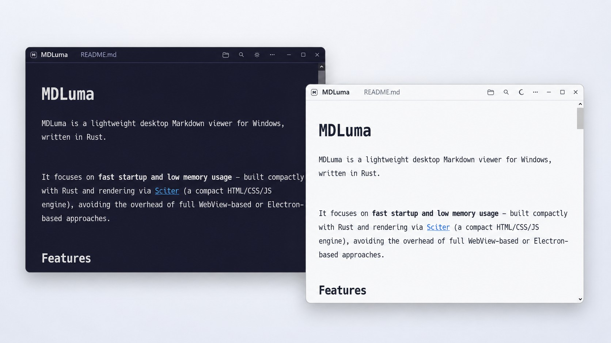

# MDLuma

MDLuma is a lightweight desktop Markdown viewer for Windows, written in Rust.


It focuses on **fast startup and low memory usage** — built compactly with Rust and rendering via [Sciter](https://sciter.com) (a compact HTML/CSS/JS engine), avoiding the overhead of full WebView-based or Electron-based approaches.



## Features

- Renders basic Markdown syntax including tables and hyperlinks
- Dark/Light theme switching
- External editor integration
- Font customization and other display settings

## Planned

- Broader Markdown support (GFM extensions, task lists, footnotes, etc.)

## Building

MDLuma currently targets `x86_64-pc-windows-msvc`.

Requirements:

- Rust toolchain (edition 2021, rust-version 1.80+)
- Windows build tools
- Sciter.js SDK (see [Developer Resources](#developer-resources))

Build:

```bash
cargo build --release --target x86_64-pc-windows-msvc
```

Test:

```bash
cargo test
```

## Developer Resources

This project uses [Sciter.js SDK](https://gitlab.com/sciter-engine/sciter-js-sdk) for its desktop UI.

To set up the development environment:

1. Download the Sciter.js SDK from the [official download page](https://sciter.com/download/)
2. Extract the contents into `vendor/sciter-js-sdk-main/` so that the runtime DLL is at `vendor/sciter-js-sdk-main/bin/windows/x64/sciter.dll`

The Sciter SDK documentation (`docs/` folder) can also be placed at `vendor/sciter-js-sdk-main/docs/` for offline reference on Sciter's APIs, behaviors, and specifics.

> **Note:** Only `sciter.dll` is tracked in this repository. The full SDK must be obtained separately in compliance with Sciter's license terms.

### Updating sciter.dll

When updating `sciter.dll` to a new version, the Rust bindings must be regenerated using bindgen. See `tools/bindgen/README.md` for instructions.

## Runtime Notes

MDLuma uses the Sciter runtime for its embedded desktop UI.

At runtime, the application expects the required Sciter files and UI assets to be available alongside the packaged application.

### Sciter DLL Version Checking

MDLuma performs version checking on the Sciter DLL at startup to ensure compatibility with the API used during build.

- The full DLL version (e.g., `6.0.3.18`) is queried and logged for debugging purposes
- Compatibility is verified against the major and minor version numbers only (e.g., `6.0`)
- If the major or minor version does not match the expected version, MDLuma will fail fast with a user-friendly error message

This approach allows for patch and build number differences while ensuring API-level compatibility.

## Tech Stack

- Rust
- [Comrak](https://github.com/kivikakk/comrak) for Markdown to HTML conversion
- [Sciter.js SDK](https://gitlab.com/sciter-engine/sciter-js-sdk) for HTML/CSS/JS-based desktop UI rendering

## License

The MDLuma project source code is dual-licensed under:

- MIT
- Apache License 2.0

You may use this project under either license at your option. See `LICENSE-MIT` and `LICENSE-APACHE` for details.

## Third-Party Runtime: Sciter

MDLuma uses Sciter.js SDK internally for rendering the desktop UI.

Sciter is a third-party component and is not covered by the MDLuma project license. Any Sciter runtime files, SDK files, or related binaries are subject to Sciter's own license and redistribution terms.

If you distribute MDLuma with Sciter runtime files, you are responsible for complying with the applicable Sciter license terms.

For reference, the Sciter SDK distribution includes separate license documents for different parts of Sciter:

- `LICENSE` — Sciter SDK source distribution license (BSD 3-Clause)
- `SCITER-ENGINE-EULA.md` — Sciter Engine runtime license terms for engine binaries such as `sciter.dll`

Refer to the official Sciter SDK download page for the SDK package and its accompanying license files:

- [https://sciter.com/download/](https://sciter.com/download/)

When evaluating redistribution, packaging, or commercial/non-commercial usage conditions, review the Sciter Engine EULA carefully, especially for the runtime binary that is shipped with the application.
